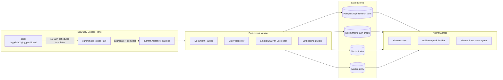

# GDELT GKG Narrative Signal Architecture (Summit Runtime Contract)

## Summit Readiness Assertion

This architecture asserts present-state readiness for governed narrative sensing while dictating the
future-state path to production enforcement. All components must remain compliant with
`docs/SUMMIT_READINESS_ASSERTION.md` and governance gates before deployment.

## MAESTRO Security Alignment

- **MAESTRO Layers**: Foundation, Data, Agents, Tools, Infra, Observability, Security.
- **Threats Considered**: prompt injection in retrieval context, query abuse in BigQuery,
  unbounded graph traversals, embedding data exfiltration, and poisoning via malformed entity rows.
- **Mitigations**: parameterized and allowlisted SQL templates, evidence-budgeted graph intents,
  scoped workload identities, signed batch manifests, and anomaly telemetry at ingest/enrich/serve
  boundaries.

## 1) Operating Model

- **Primary compute surface**: BigQuery public GKG partitioned table.
- **Derived data principle**: export only compact, governed feature slices downstream.
- **Time discipline**: every operation uses explicit window start/end and partition pruning.
- **Determinism**: all ranking and graph reads are ordered and bounded.

## 2) Reference Architecture



## 3) BigQuery Narrative Slice Contract

Required source fields:

- `DATE`
- `DocumentIdentifier`
- `SourceCommonName`
- `V2Themes`
- `V2Persons`
- `V2Organizations`
- `V2Locations`
- `V2Tone`
- `V2GCAM`

Each scheduled template writes compact records into `summit.gkg_slices_raw`, then a batch compactor
writes one record per slice window into `summit.narrative_batches`.

## 4) Data Contracts

### `summit.narrative_batches`

```json
{
  "batch_id": "string",
  "slice_id": "string",
  "window_start": "timestamp",
  "window_end": "timestamp",
  "doc_ids": ["string"],
  "theme_terms": ["string"],
  "person_terms": ["string"],
  "org_terms": ["string"],
  "location_terms": ["string"],
  "emotion_aggregate": {
    "anxiety": "number",
    "fear": "number",
    "anger": "number",
    "trust": "number"
  },
  "batch_manifest_sha256": "string"
}
```

### `summit.narrative_alerts`

```json
{
  "alert_id": "string",
  "batch_id": "string",
  "slice_id": "string",
  "alert_type": "volume|emotion|network",
  "magnitude": "number",
  "baseline_window": "string",
  "supporting_doc_ids": ["string"],
  "graph_snapshot_ref": "string",
  "created_at": "timestamp"
}
```

## 5) Graph Model Contract

- **Nodes**: `Document`, `Theme`, `Person`, `Organization`, `Location`, `Source`.
- **Edges**:
  - `(:Entity)-[:MENTIONED_IN]->(:Document)`
  - `(:Theme)-[:DESCRIBED_BY]->(:Document)`
  - `(:Document)-[:LOCATED_IN]->(:Location)`
  - `(:Entity)-[:CO_MENTION {window_start, window_end, tone, anxiety}]->(:Entity)`
- **Query constraints**:
  - use `ORDER BY` and `LIMIT` in every retrieval path.
  - compile retrieval via IntentCompiler; no raw user-to-Cypher pass-through.

## 6) Embeddings Contract

Generate two embeddings per ranked document:

1. **Document text embedding** for semantic retrieval.
2. **Narrative synopsis embedding** (themes + entities + emotion) for anomaly clustering.

Store metadata dimensions: `slice_id`, `geo_scope`, `source`, `window_start`, `window_end`.

## 7) Signal Logic (Tier C baseline)

- **Volume signal**: per-slice term frequency z-score vs trailing baseline.
- **Emotion signal**: GCAM dimension deltas (`anxiety`, `fear`, `trust`) against trailing mean.
- **Network signal**: centrality delta for top entities between adjacent windows.

Persist each signal as an alert object with evidence references.

## 8) Agent Retrieval Surface

Input intent maps to: `slice filters + horizon + geo + source constraints`.

Output evidence bundle contains:

1. top alerts ranked by severity,
2. top entities with centrality deltas,
3. representative docs (URL + summary + score),
4. bounded ego-graph subcomponent,
5. emotion trend snippet with sigma notation.

## 9) Governed Exceptions and Reversibility

- Legacy bypasses are explicitly tracked as **Governed Exceptions** with expiry.
- Every slice template version has a rollback instruction and previous hash.
- Batch/job failures must emit a failure artifact and preserve last-good serving state.

## 10) First Deployable Slice

Deploy slice: `cyber + finance`, English, rolling 60-minute windows, top-50 docs.

- Enabled templates: topic, geo, source, emotion.
- Alert thresholds: z-score `>= 2.0` for volume/emotion, centrality delta `>= 1.5σ`.
- Agent context budget: max 10 representative docs, max 40 graph nodes.


Implementation assets:

- Deploy guide: `docs/architecture/gdelt/gdelt-gkg-first-slice-deploy.md`
- SQL templates: `narratives/gdelt/sql/`
- Data schemas: `schemas/osint/gdelt-narrative-batch.schema.json`, `schemas/osint/gdelt-narrative-alert.schema.json`

## 11) Forward-Leaning Enhancement

Adopt **multi-view prompt-conditioned embeddings**: predefine a compact prompt basis
(`risk-escalation`, `state-actor`, `market-impact`) and embed each document under each view.
The resulting tensorized profile improves novelty detection and retrieval precision without
expanding raw text retention.
