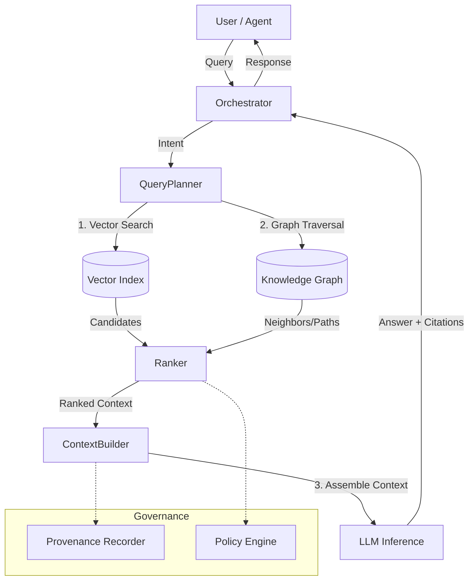

# GraphRAG Reference Architecture

## Overview
GraphRAG (Graph Retrieval-Augmented Generation) combines the explicit knowledge representation of Knowledge Graphs with the semantic search capabilities of vector databases to provide grounded, explainable, and multi-hop reasoning for AI agents.

## Architecture Diagram

## Core Components

### 1. Query Planner
*   Analyzes user intent to determine retrieval strategy (Vector-only, Graph-only, or Hybrid).
*   Generates Cypher queries for structured retrieval.

### 2. Retrieval Engine
*   **Vector Search**: Finds nodes semantically similar to the query.
*   **Graph Traversal**: Explores the neighborhood of initial candidates to find related concepts (multi-hop).
*   **Determinism**: Enforces strict sorting on all retrieved sets to ensure reproducibility.

### 3. Context Builder
*   Aggregates retrieved data into a linear text prompt.
*   Sanitizes input to prevent injection attacks.
*   Formats citations for explainability.

### 4. Governance & Provenance
*   Captures every step of the process in a `provenance` artifact.
*   Enforces access control policies (e.g., tenant isolation).

## Data Flow
1.  **Ingestion**: Documents are chunked, embedded, and linked in the graph.
2.  **Query**: User submits a natural language query.
3.  **Retrieval**: System retrieves relevant nodes and edges.
4.  **Ranking**: Candidates are re-ranked based on relevance and trust.
5.  **Assembly**: Context is assembled deterministically.
6.  **Generation**: LLM generates answer using the context.
7.  **Audit**: Provenance record is saved.
