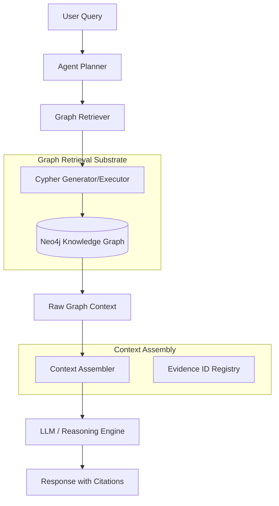

# Summit GraphRAG Reference Architecture

**Owner:** Intelligence Architecture
**Last-Reviewed:** 2026-01-24
**Evidence-IDs:** none
**Status:** active

## Overview

Summit GraphRAG (Retrieval-Augmented Generation) leverages the Knowledge Graph as the primary retrieval substrate, ensuring that AI reasoning is grounded in structured evidence, relationships, and provenance rather than just semantic similarity.

By combining the strengths of property graphs (Neo4j) with vector-based augmentation, Summit achieves:
- **Multi-hop reasoning**: Traversal of complex relationships (e.g., Actor -> Campaign -> Malware -> Target).
- **Explainability**: Every retrieved fact is linked to a Graph Node with a persistent Evidence ID.
- **Determinism**: Graph traversals provide stable retrieval sets compared to non-deterministic vector-only top-k results.

## Architecture

### Component Diagram

### Retrieval Flow

1.  **Query Decomposition**: The Agent Planner identifies the structural entities and relationship types required to answer the query.
2.  **Multi-hop Traversal**: Instead of a flat vector search, GraphRAG executes multi-hop Cypher queries to assemble a local subgraph around the entities of interest.
3.  **Vector Augmentation**: (Optional) Nodes identified in the graph can be further enriched by retrieving related document chunks from the Vector Store using semantic similarity.
4.  **Context Assembly**: The retrieved subgraph (Nodes + Edges) is serialized into a deterministic text format, ensuring Evidence IDs are preserved as citations.

## Mapping to Summit Domains

| Summit Domain | GraphRAG Integration |
| :--- | :--- |
| **Evidence IDs** | Every node in the Knowledge Graph must contain an `evidence_id` property, which is included in the RAG context. |
| **Governance Artifacts** | Governance policies are represented as nodes, allowing the LLM to reason about compliance during retrieval. |
| **CI Signals** | CI failures and deployment events are linked to code artifacts, enabling "root cause" GraphRAG over infrastructure state. |
| **Narrative Intelligence** | Narrative objects (Actor profiles, Campaign timelines) form the high-level clusters that guide multi-hop traversal. |

## Explainability Guarantees

Summit GraphRAG enforces **Traceability-by-Design**:
- **Source Attribution**: Every claim in the LLM response must map to a specific Evidence ID retrieved from the graph.
- **Path Evidence**: If the LLM reasons across multiple hops, the specific Cypher path used to find that connection is recorded in the execution trace.
- **Auditability**: Post-hoc reviewers can replay the exact Cypher query against a specific graph snapshot to verify the context provided to the LLM.
