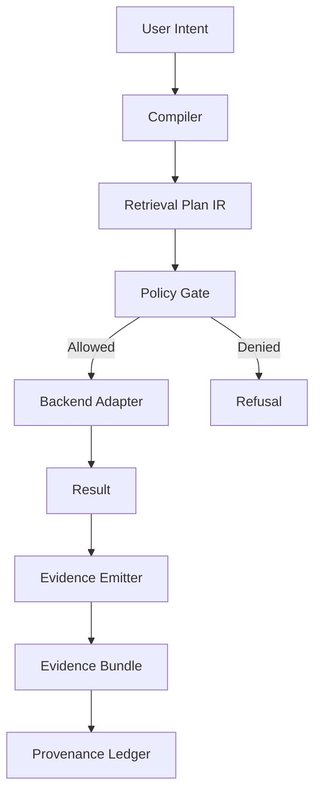

# Governed Retrieval Substrate (GraphRAG/Hybrid)

## Overview

The Governed Retrieval Substrate is a foundational layer for Summit's AI retrieval capabilities. It provides a backend-agnostic Retrieval Plan Intermediate Representation (IR), a strict Policy Gate system, and a deterministic Evidence Emitter.

## Architecture



### Components

1.  **Retrieval Plan IR**: A canonical JSON structure defining the query, constraints, and target backend.
2.  **Policy Gates**: A schema-driven validation layer (`policies/retrieval.gates.yaml`) that checks ingest, execution, and evidence requirements.
3.  **Evidence Emitter**: A deterministic artifact generator that produces `plan.json`, `policy.json`, `sources.json`, and `retrieval.json` with stable hashing.
4.  **Adapters**: (Future) Connectors for AWS Neptune, TigerGraph, and other backends.

## Threat Model & Mitigations

| Threat | Mitigation | Evidence |
|---|---|---|
| **PII Leakage** | Ingest gates check PII classification before embedding. | `policy.json` (decision trace) |
| **Cross-Tenant Access** | Execution gates enforce tenancy scope in the plan. | `plan.json` (constraints) |
| **Graph Poisoning** | Source provenance is hashed and linked. | `sources.json` (hashes) |
| **Non-Deterministic Output** | Canonicalization of all artifacts + fixed seeds (future). | `retrieval.json` (content hashes) |

## Usage

```bash
# Generate a plan and execute against local stub
pnpm retrieval:plan --query "Hello World"
```

## Governance

- **Evidence IDs**: `retrieval_plan`, `retrieval_evidence`.
- **Policy**: `policies/retrieval.gates.yaml`.
- **Ledger**: See `docs/governance/SECURITY_LEDGER.md`.
