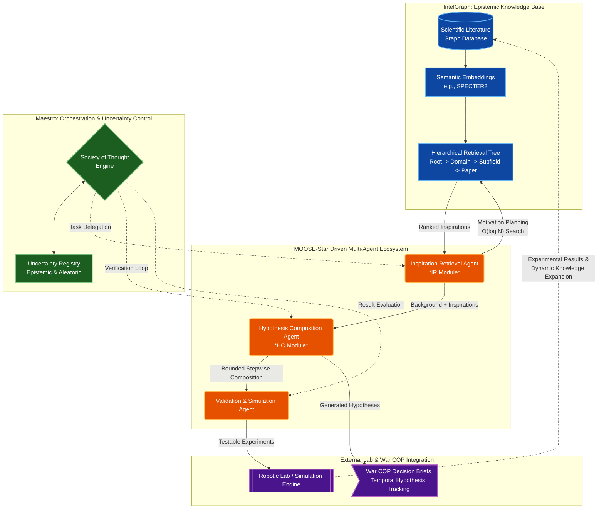

# MOOSE-Star mapped to Summit Autonomous Research Pipeline

This architecture maps the concepts from the **MOOSE-Star** paper (*Unlocking Tractable Training for Scientific Discovery by Breaking the Complexity Barrier*) onto the **Summit** multi-agent ecosystem. It illustrates how hierarchical literature retrieval and bounded hypothesis composition can drive a fully autonomous research system.

## Architecture Diagram

## Subsystem Mapping

### 1. IntelGraph (Knowledge Foundation)
In MOOSE-Star, directly composing hypotheses from all papers is $O(N^k)$ and intractable. IntelGraph solves this by acting as the **Hierarchical Retrieval Tree**, reducing search space to $O(\log N)$.
- **Implementation**: Uses Qdrant for semantic vector retrieval and Neo4j for graph-based taxonomy (Root $\rightarrow$ Domain $\rightarrow$ Subfield $\rightarrow$ Paper).

### 2. Maestro Orchestrator (Cognitive Control)
The orchestrator manages the **Motivation Planning** step. Before searching, it defines the scientific field and constraints, pruning irrelevant branches. It also integrates with Summit's **Uncertainty Control Plane** to measure epistemic uncertainty (missing literature) and aleatoric uncertainty (noisy experimental data).

### 3. Core Agents (The MOOSE-Star Engine)
- **Inspiration Retrieval (IR) Agent**: Takes the research question and background, navigating IntelGraph to retrieve the most pertinent inspirations.
- **Hypothesis Composition (HC) Agent**: Takes the retrieved inspirations and incrementally composes the new hypothesis ($H_1 = \text{compose}(H_0 + \text{inspiration}_1)$). Trained to be robust to imperfect retrieval.
- **Validation Agent**: Translates the composed hypothesis into testable parameters or simulation configurations.

### 4. Lab Integration & War COP (The Autonomous Loop)
- **Lab Simulation / Automation**: Executes the experiments proposed by the Validation Agent. Crucially, the results from these experiments flow back into IntelGraph, providing **Dynamic Knowledge Expansion**.
- **War COP**: Generates deterministic, time-versioned decision briefs (`report.json`, `brief.md`) containing the tracked hypotheses, their provenance, and associated metrics. Human-in-the-loop operators review these artifacts within the War Room.

## Evolution toward 2026 Autonomous Research
By isolating **retrieval** from **composition**, this architecture prevents LLM context-collapse. As new robotic lab APIs become available, the loop closes completely: the system reads literature, deduces novel combinations, tests them empirically, and writes its findings back into its own graph memory, establishing a continuous cycle of scientific discovery.
