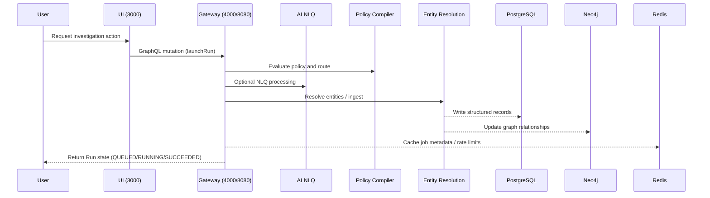

# Architecture

## Component diagram

```mermaid
graph LR
  subgraph Client
    UI[UI (port 3000)]
  end

  subgraph Gateway
    GW[Gateway (policy-lac)]
  end

  subgraph Services
    PC[Policy Compiler]
    NLQ[AI NLQ]
    ER[Entity Resolution]
    ING[Ingest]
    ZK[ZK-TX]
    PL[Prov Ledger]
    PRED[Predictd]
  end

  subgraph DataStores
    PG[(PostgreSQL)]
    NEO[(Neo4j)]
    REDIS[(Redis)]
  end

  UI --> GW
  GW --> PC
  GW --> NLQ
  GW --> ER
  GW --> ING
  GW --> ZK
  GW --> PL
  GW --> PRED

  GW --> PG
  GW --> NEO
  GW --> REDIS
```

## Data flow



## Next steps

- Operate the stack using the [runbook](../operations/README.md).
- Explore the [API reference](../reference/api.md) for GraphQL interactions.
