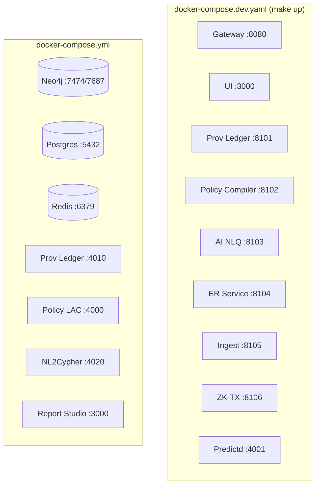
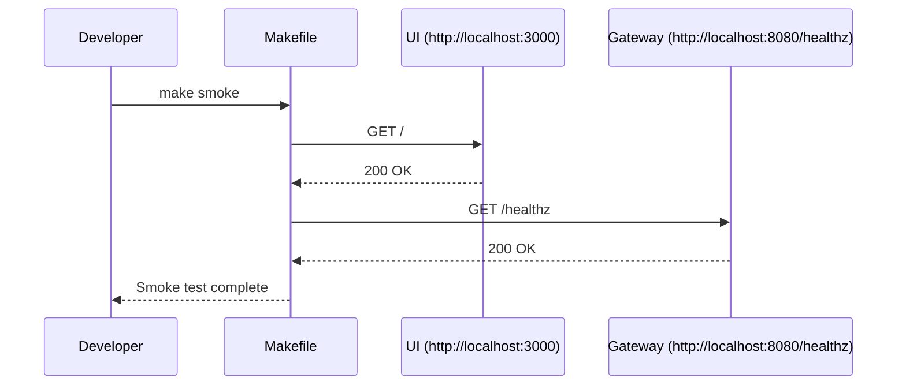

# Architecture

## Component diagram

The diagram above reflects the services enumerated in `docker-compose.dev.yaml` (used by `make up`) and `docker-compose.yml` (base services).

## Data flow

## Next steps

- Operate the stack using the [runbook](../operations/README.md).
- Explore the [API reference](../reference/api.md) for GraphQL interactions.
