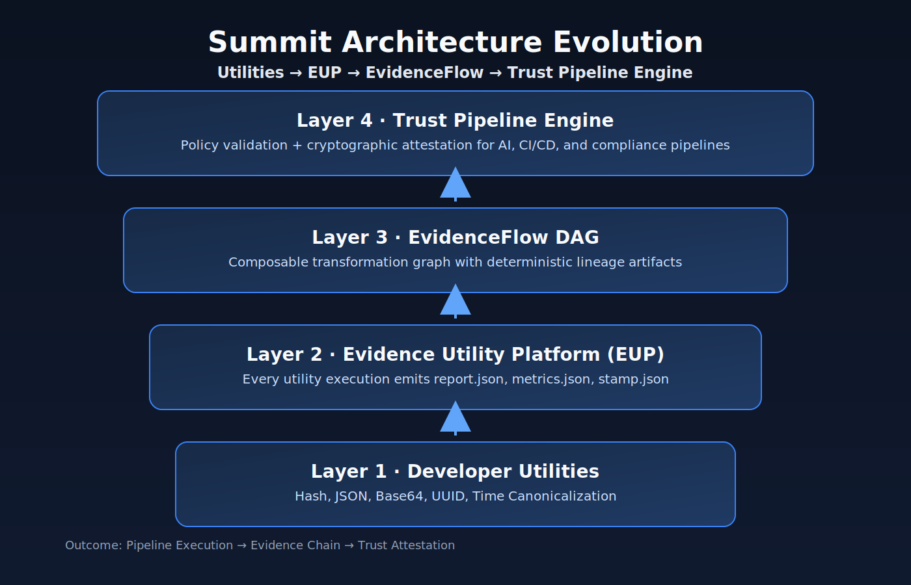
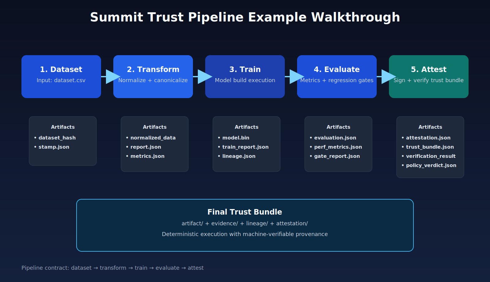
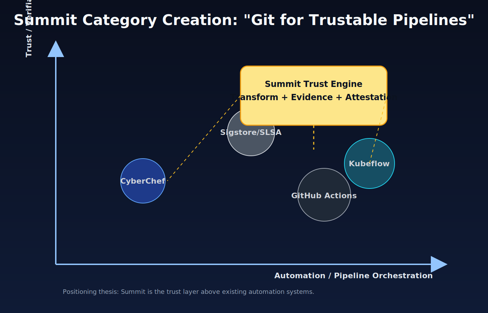

# Summit Architecture Overview

Summit turns routine pipeline execution into **provable execution**. The platform is structured as a
progressive trust stack: each layer increases determinism, evidence quality, and verifiability.

## 1) Four-Layer Evolution



Summit progresses through four composable layers:

1. **Developer Utilities**: deterministic primitives (hash, UUID, JSON normalize, Base64, time).
2. **Evidence Utility Platform (EUP)**: each utility run emits standard evidence artifacts.
3. **EvidenceFlow DAG**: utilities compose into deterministic transformation graphs.
4. **Trust Pipeline Engine**: policy evaluation + cryptographic attestation for final trust verdicts.

## 2) Trust Pipeline Walkthrough



Reference flow:

```text
dataset → transform → train → evaluate → attest
```

Each stage emits machine-verifiable outputs that roll up into a final trust bundle:

- `artifact/` (build and data artifacts)
- `evidence/` (`report.json`, `metrics.json`, `stamp.json`)
- `lineage/` (`lineage.json`, graph references)
- `attestation/` (`attestation.json`, verification output)

## 3) Category Positioning



Summit is positioned as a **trust layer above automation systems**:

- CyberChef: transformation utility depth.
- GitHub Actions: CI/CD orchestration depth.
- Kubeflow: ML workflow orchestration.
- Sigstore/SLSA: artifact assurance primitives.
- **Summit**: transformation + evidence + policy + attestation.

## 4) Architecture Claim

Summit does not replace CI/CD or ML orchestration systems. Summit attaches a trust substrate to those
systems so that execution outcomes are reproducible, auditable, and policy-verifiable by default.

## 5) README Integration Snippet

```md
## Architecture

For the full architecture narrative and diagrams, see
[`docs/architecture/overview.md`](docs/architecture/overview.md).
```
