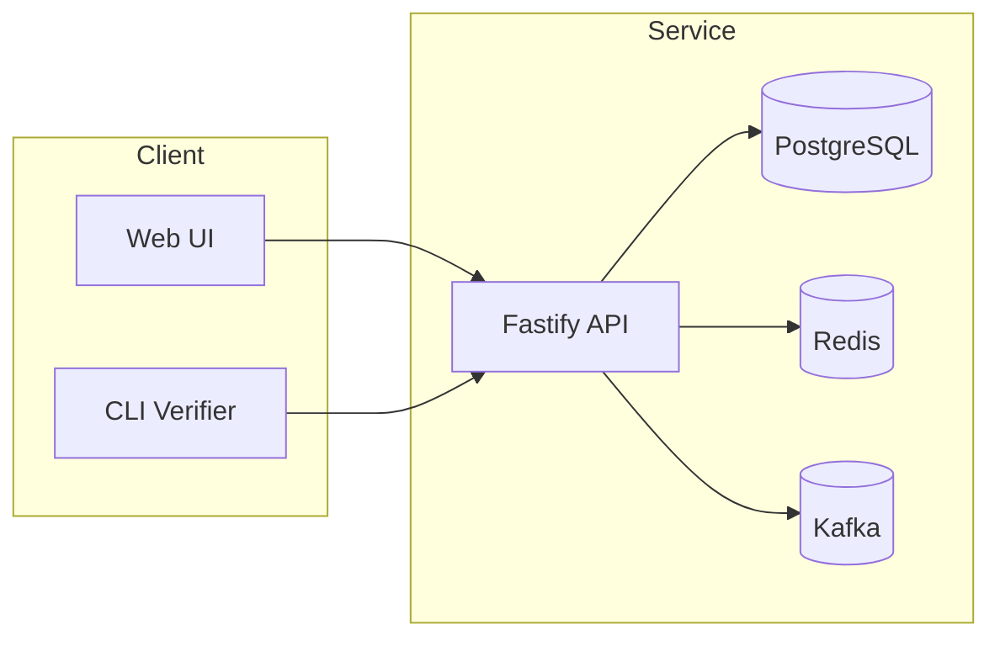

# Provenance Ledger Service Architecture

This document outlines a proposed architecture for the provenance ledger microservice used by IntelGraph.

## Goals
- Attach provenance, licensing and transformation metadata to every assertion.
- Record immutable evidence and claim chains for audit and disclosure.
- Provide verifiable export bundles with Merkle root and signatures.

## High-Level Architecture


## Components
- **Evidence Registration**: Stores checksum, source, license and transform chain.
- **Claim Model**: Normalises natural language into structured nodes and links to supporting evidence. Contradictions recorded in an append-only graph.
- **Disclosure Bundles**: Builds a Merkle tree manifest of all referenced artefacts and signs it with the tenant's Ed25519 key.
- **Tenant Isolation**: Namespaced storage and keys per tenant with ABAC hooks on every request.
- **Events**: Emits `claim.created` and `disclosure.created` to Kafka for downstream consumers.

## APIs
| Method | Endpoint | Description |
| --- | --- | --- |
| POST | `/evidence` | Register evidence and return its identifier. |
| POST | `/claim` | Create a claim referencing evidence. |
| GET | `/claims/:id` | Retrieve a claim with provenance chain. |
| POST | `/disclosures` | Produce a disclosure bundle for a set of claims. |
| GET | `/disclosures/:id/manifest` | Fetch the signed manifest for a disclosure. |
| GET | `/health` | Liveness and readiness probe. |

## Example Manifest
```json
{
  "merkleRoot": "<sha256-root>",
  "items": [
    {
      "id": "claim-123",
      "hash": "<sha256>",
      "license": "CC-BY-4.0",
      "transforms": ["ocr", "translate:en"]
    }
  ],
  "signer": "tenant-ed25519-pubkey",
  "signature": "<ed25519-signature>"
}
```

## Verification CLI
```
prov-ledger verify bundle.json
```
The CLI recomputes file hashes, verifies the Merkle root and checks the Ed25519 signature against the tenant public key.

## Future Work
- Full ABAC integration and policy enforcement.
- Expanded contradiction graph analytics.
- OpenAPI, gRPC and GraphQL gateway specifications.
