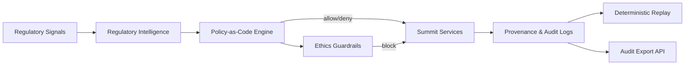
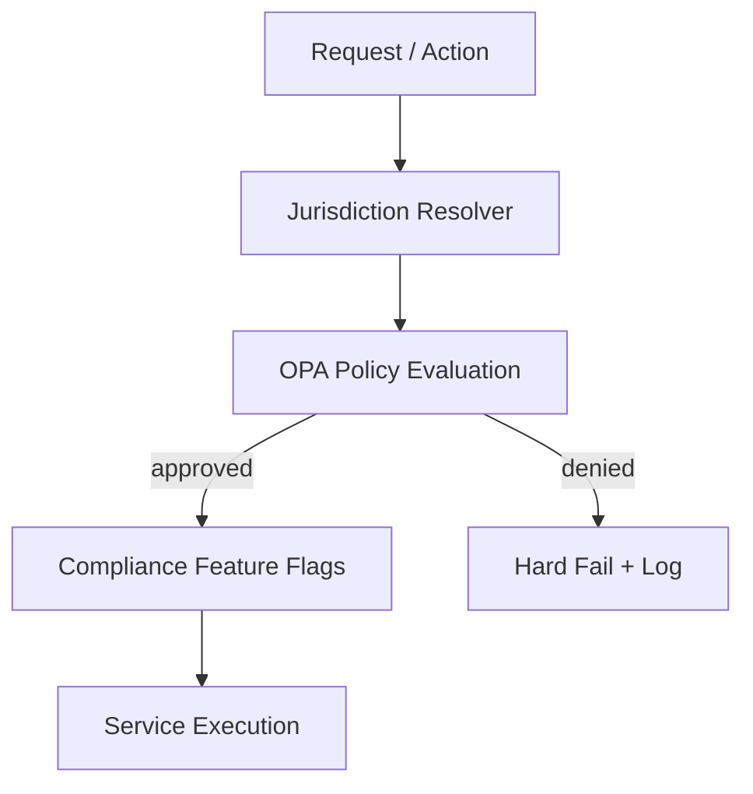
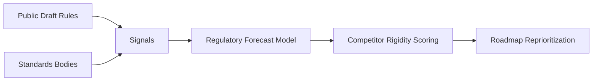
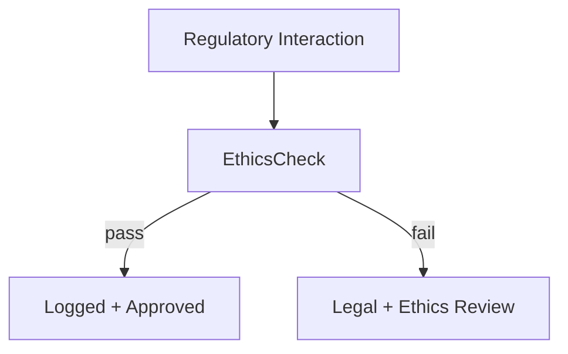

# Regulatory Advantage Architecture

## 1. System View

## 2. Control Plane (Regulation as Configuration)

## 3. Intelligence Plane (Capture-Shadow Exploitation)

## 4. Ethics Enforcement (Clean-Hands Guarantee)

## 5. Board Presentation Narrative

### Slide 1: Regulatory Risk vs Architecture

**Title:** Why Regulation Increases Our Advantage

**Key Message:**
* Regulation increases system rigidity for the market.
* Our architecture (Policy-as-Code) converts this rigidity into leverage.

**Visual Concept:**
* X-axis: Regulatory Intensity ↑
* Y-axis: Architectural Flexibility ↑
* Competitors drift bottom-right (High Regulation, Low Flexibility)
* Summit remains top-right (High Regulation, High Flexibility)

### Slide 2: Ethics & Reputation Risk

**Title:** Clean Hands Are a Strategic Asset

**Key Points:**
* All regulator interactions logged.
* No private rule drafting.
* No opaque compliance claims.

**Board Assurance:**
> There is no latent reputational or enforcement risk embedded in our strategy.

### Slide 3: Competitive Outcome (12–36 Months)

**Title:** Capture Is a Dead End

**Outcomes:**
* Competitors slow with each new rule.
* Summit ships continuously.
* Compliance cost asymmetry compounds.

**Board KPI:**
> Regulatory change correlates with *market share gain*, not drag.
