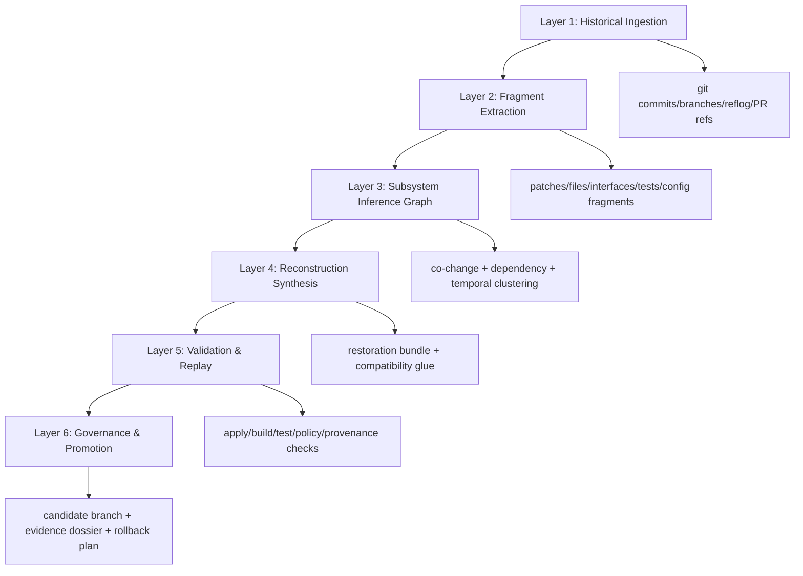

# Repository Archaeology Engine

## Summit Readiness Assertion

This design defines a policy-governed, evidence-first system that upgrades historical patch resurrection into full subsystem reconstruction from repository history. The design is intentionally constrained to deterministic, reversible operations and explicit confidence scoring so that reconstructed artifacts are auditable before promotion.

## Objective

Build a **Repository Archaeology Engine (RAE)** that reconstructs abandoned subsystems from fragmented historical evidence (commits, branches, tests, docs, CI residue), validates reconstruction candidates against current HEAD, and emits governed restoration bundles.

## Scope

- In scope:
  - Historical ingestion from git + repository metadata artifacts.
  - Fragment extraction and subsystem inference.
  - Confidence-weighted reconstruction plans.
  - Deterministic validation harness and governed promotion outputs.
- Out of scope (deferred pending countersign):
  - Autonomous merge to protected branches.
  - Policy gate weakening or exception bypass.
  - Secret material recovery from historical blobs.

## MAESTRO Security Alignment

- **MAESTRO Layers:** Foundation, Data, Agents, Tools, Observability, Security.
- **Threats Considered:** prompt injection via commit text, malicious patch fragments, tool abuse in apply/checkout flows, provenance tampering, confidence inflation.
- **Mitigations:** policy-as-code enforcement, deterministic replay, cryptographic artifact stamping, bounded traversal/evidence budgets, signed promotion receipts, immutable audit ledger entries.

## Architecture Overview

## Data Model

### Core Entities

- `EvidenceFragment`
  - `id`, `sourceType` (`commit|file|test|doc|ci`), `sourceRef`, `contentHash`, `capturedAt`.
- `SubsystemCandidate`
  - `id`, `name`, `timeWindow`, `fragmentIds[]`, `boundaryScore`, `existenceScore`.
- `RestorationBundle`
  - `id`, `candidateId`, `filesRecovered[]`, `filesInferred[]`, `compatibilityPatch`, `rollbackSteps[]`.
- `ValidationRun`
  - `id`, `bundleId`, `checks[]`, `result`, `artifacts[]`, `executedAt`.
- `PromotionDecision`
  - `id`, `bundleId`, `decision`, `confidenceVector`, `policyTrace`, `approver`.

### Confidence Vector

Each reconstruction is scored on a normalized vector `[0..1]`:

- `existenceConfidence`
- `boundaryConfidence`
- `interfaceConfidence`
- `behaviorConfidence`
- `compatibilityConfidence`
- `mergeReadinessConfidence`

The vector is mandatory and cannot be collapsed into a single scalar for promotion decisions.

## Pipeline Design

### Layer 1: Historical Ingestion

Inputs:

- commit graph, branch refs, optional reflog snapshots
- PR metadata mirrors
- CI logs + workflow references
- docs/ADR references

Outputs:

- normalized event stream (`HistoryEvent`)
- immutable manifest with source hashes

Guardrails:

- deny unsafe refs via allowlist policy
- fixed traversal budget and deterministic ordering

### Layer 2: Fragment Extraction

Derives canonical fragments:

- patch hunks
- file snapshots
- interface signatures
- test behavior descriptors
- config/build residues

Guardrails:

- redact secrets by policy
- reject malformed/non-deterministic fragment encodings

### Layer 3: Subsystem Inference Graph

Creates a weighted graph where nodes are fragments and edges are evidence relationships:

- co-change frequency
- import/reference linkage
- shared naming ontology
- temporal overlap
- doc/test corroboration

Output is a ranked list of `SubsystemCandidate` nodes with explainable edge weights.

### Layer 4: Reconstruction Synthesis

For each candidate:

1. Select maximal consistent fragment set.
2. Rebuild file tree at candidate peak completeness.
3. Synthesize minimal compatibility glue (typed, isolated).
4. Generate restoration branch patchset.

All synthesized files are machine-labeled as `inferred` and never mixed with directly recovered fragments.

### Layer 5: Validation & Replay

Deterministic checks run in order:

1. `git apply --check`
2. build/typecheck
3. unit/integration tests (scoped)
4. policy gates
5. provenance/evidence completeness checks

Result is a `ValidationRun` dossier with reproducible command log and artifact hashes.

### Layer 6: Governance & Promotion

No silent merge path.

Promotion options:

- `candidate-only`
- `human-review-required`
- `approved-for-integration`

Every decision includes:

- confidence vector
- rollback trigger + steps
- accountability window metrics
- decision ledger record

## Validation Contract

Required pass criteria before any integration recommendation:

- patch applicability above policy threshold
- no critical security/policy regressions
- provenance bundle complete
- rollback plan verified in dry-run mode

If any criterion fails: emit `Intentionally constrained` status and preserve artifacts for manual triage.

## Evidence Bundle Specification

Each run writes:

- `artifacts/archaeology/<task-id>/manifest.json`
- `artifacts/archaeology/<task-id>/confidence.json`
- `artifacts/archaeology/<task-id>/validation.json`
- `artifacts/archaeology/<task-id>/restoration.patch`
- `artifacts/archaeology/<task-id>/rollback.md`

All artifacts are content-addressed and referenced in governance receipts.

## Rollback Strategy

Rollback is mandatory and precomputed per bundle:

1. hard reset to pre-restore commit.
2. remove generated branch/worktree.
3. invalidate promotion receipt.
4. append rollback outcome to decision ledger.

Rollback triggers:

- post-merge test regression
- security gate drift
- observability anomaly against baseline

## Phased Implementation Roadmap

1. **Phase A — Patch Resurrection Hardening**
   - Normalize extraction manifests and deterministic replay logs.
2. **Phase B — Fragment Inventory Index**
   - Persist typed fragment catalog and confidence primitives.
3. **Phase C — Subsystem Inference Graph**
   - Introduce weighted clustering and explainability outputs.
4. **Phase D — Reconstruction Synthesizer**
   - Generate restoration bundles with inferred-vs-recovered labels.
5. **Phase E — Governance Promotion Flow**
   - Integrate policy receipts, decision ledger, rollback attestations.
6. **Phase F — Archaeology Workbench UX**
   - Timeline, evidence graph, candidate compare, promotion controls.

## State-of-the-Art Enhancement

Adopt **counterfactual reconstruction ranking**:

- For each subsystem candidate, generate multiple reconstruction variants.
- Evaluate variant viability against the same deterministic validation harness.
- Select Pareto-optimal candidates on `(compatibility, behavioral fidelity, rollback complexity)`.

This reduces single-path bias and increases restoration robustness without relaxing policy gates.

## Non-Negotiable Constraints

- No policy bypass.
- No confidence claims without evidence receipts.
- No autonomous production promotion.
- No unresolved ambiguity hidden from operator outputs.

## Success Criteria

- Reconstruction candidates are reproducible by third parties from recorded artifacts.
- Confidence vectors correlate with observed validation outcomes.
- Promotion decisions are fully auditable and reversible.
- Recovery throughput improves without regression in governance gate pass rates.
