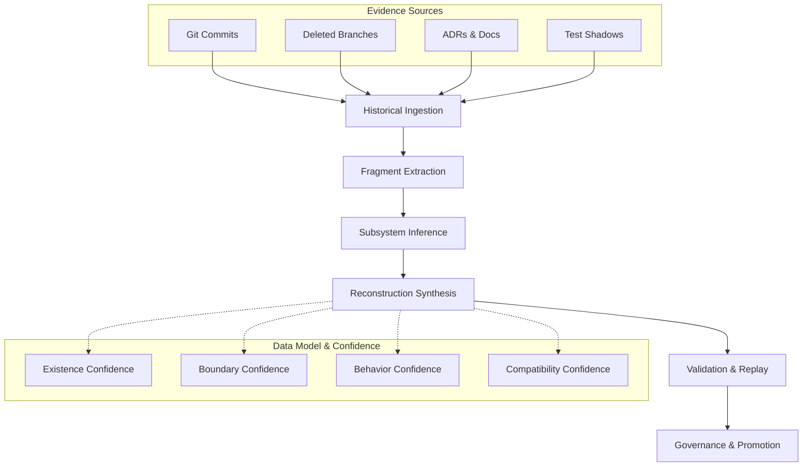

# Repository Archaeology Engine

## System Goals

The Repository Archaeology Engine represents an evolution from simple patch resurrection to full subsystem reconstruction. Its goals are to:

* Recover abandoned architectural intent from historical git data.
* Cluster evidence (commits, deleted files, interfaces, tests, ADRs) into cohesive subsystem models.
* Synthesize missing glue code and infer missing pieces based on structural co-change topology.
* Validate candidate restorations against the current HEAD using build, test, and policy gates.
* Provide a confidence-weighted dossier for governed promotion of recovered subsystems.

## Data Model

The data model treats software history as a reconstructable knowledge graph.

* **Evidence Fragments**: Discrete historical units, including file versions, interface signatures, tests, configurations, and documentation.
* **Subsystem Clusters**: Groupings of fragments inferred via temporal overlap, co-change frequency, import graphs, and shared naming patterns.
* **Reconstruction Bundles**: Candidate file sets, inferred interfaces, and compatibility patch plans representing a restorable subsystem.
* **Restoration Dossiers**: The final artifacts containing the subsystem description, evidence sources, validation outcomes, and confidence scores.

## Pipeline

The archaeology engine operates in six layers:

1. **Historical Ingestion**: Scans git history, deleted branches, commit messages, PR remnants, and CI logs to output normalized events.
2. **Fragment Extraction**: Breaks history into reusable fragments (interfaces, tests, config surfaces).
3. **Subsystem Inference**: Clusters fragments into probable subsystems based on co-change and references.
4. **Reconstruction Synthesis**: Generates candidate restoration bundles and compatibility plans.
5. **Validation and Replay**: Validates bundles via apply checks, typechecks, unit/contract tests, and policy gates.
6. **Governance and Promotion**: Attaches provenance and confidence scores, allowing for signed override or promotion.

## Confidence Model

To avoid hallucination, every reconstructed subsystem must carry explicit confidence dimensions:

* **Existence Confidence**: Likelihood that the subsystem truly existed as a cohesive unit.
* **Boundary Confidence**: Certainty regarding which files and interfaces belong to the subsystem.
* **Behavior Confidence**: Degree to which surviving tests and documentation support the expected runtime behavior.
* **Compatibility Confidence**: Probability of successful integration and operation within the current HEAD.

## Promotion Workflow

Restored systems are not blindly merged. They follow Summit's standard policy-governed promotion:

1. **Candidate Generation**: A restoration dossier is generated and marked as a candidate.
2. **Review Phase**: Human operators or designated agents review the dossier, focusing on evidence graphs and confidence meters.
3. **Provenance Attachment**: Cryptographic receipts and epistemic weights are attached to the bundle.
4. **Promotion Decision**: The subsystem is either promoted to an active branch, quarantined for further refinement, or rejected.

## Phased Implementation Roadmap

* **Phase 1: Patch Resurrection**: Recover valid historical patches (currently implemented).
* **Phase 2: Fragment Inventory**: Index deleted and partial artifacts across the repository.
* **Phase 3: Subsystem Clustering**: Infer likely modules from co-change and reference topologies.
* **Phase 4: Candidate Reconstruction**: Generate restoration bundles and detailed confidence reports.
* **Phase 5: Validation Harness**: Automatically run build, test, and policy gates against reconstructed bundles.
* **Phase 6: Archaeology UI**: Develop a timeline view of subsystem evolution, evidence graphs, and candidate comparisons.
* **Phase 7: Autonomous Restoration Advisor**: Implement an agentic advisor to suggest safe restoration paths for partially deleted subsystems.

## Architecture Diagram

