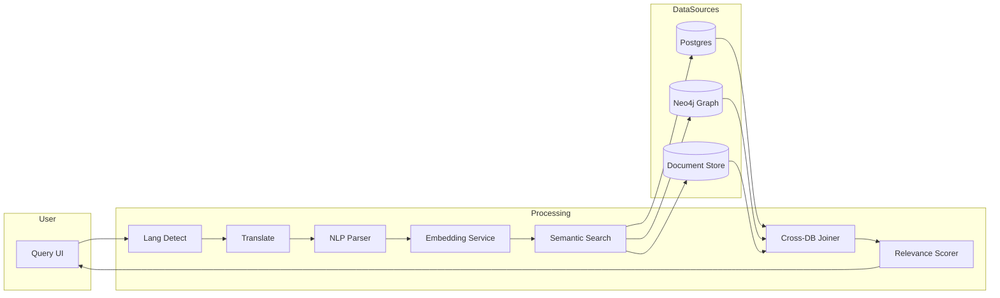

# Semantic Search System Architecture

This document outlines an architecture for a semantic search capability that enables natural language queries across structured and unstructured datasets from multiple intelligence systems. The system supports cross-database joins, AI-driven relevance scoring, and multi-lingual understanding.

## Goals

- Provide a single query interface for analysts to search across graph, relational, and document stores.
- Interpret natural language questions in multiple languages and map them to domain concepts.
- Rank results using AI models that understand semantic similarity, context, and user intent.
- Join entities and relationships across disparate databases while preserving security boundaries.

## High-Level Architecture

## Components

- **Language Detection & Translation**: Detects input language and translates queries into a pivot language when cross-lingual embeddings are unavailable. Translation can leverage open-source models (e.g., Marian) or cloud APIs.
- **NLP Parser**: Performs entity and intent extraction to map natural language to domain ontology concepts.
- **Embedding Service**: Generates vector embeddings for queries and documents using transformer models. Supports multilingual embeddings to allow direct comparison across languages.
- **Semantic Search**: Uses a vector database (e.g., Faiss, Milvus) and keyword index (e.g., Elasticsearch) to retrieve candidate records from structured and unstructured sources.
- **Cross-DB Joiner**: Performs join operations across heterogeneous databases by resolving entity identifiers and applying graph joins or relational joins as needed. Results are normalized into a common schema before ranking.
- **Relevance Scorer**: Applies a hybrid ranker combining vector similarity, metadata filters, and cross-encoder reranking to produce final relevance scores.

## Multi-Lingual Support

- Utilize multilingual embeddings or on-the-fly translation for both queries and indexed content.
- Store language metadata with documents to enable language-specific ranking adjustments.
- Allow users to request results in their preferred language via translation of snippets.

## Security & Governance

- Each connector enforces source system access controls and logs queries for audit.
- Cross-database joins occur in a controlled sandbox to prevent data leakage between compartments.

## Future Enhancements

- Personalized ranking based on analyst feedback.
- Federated learning to improve embeddings without centralizing sensitive data.
