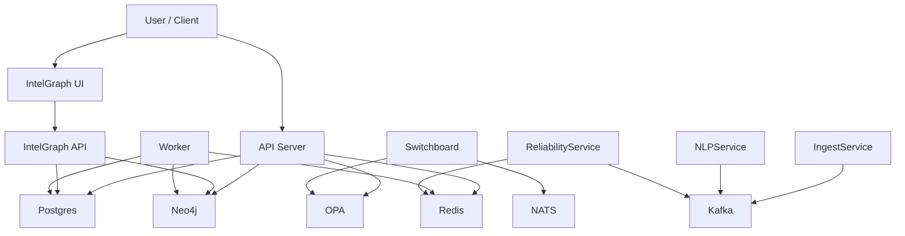

# Service Dependency Map

This document outlines the dependencies between the various services in the Summit / IntelGraph / CompanyOS platform. It is intended to help with incident triage, understanding failure domains, and planning maintenance.

## Services Overview

| Service                   | Description                                | Location                            |
| :------------------------ | :----------------------------------------- | :---------------------------------- |
| **API Server**            | Main backend API (Node.js/Express/GraphQL) | `server/src`                        |
| **Worker**                | Background job processor (Node.js)         | `server/src`                        |
| **UI (Client)**           | Main web frontend (React)                  | `client/`                           |
| **IntelGraph API**        | MVP Graph API (Python FastAPI)             | `intelgraph-mvp/api`                |
| **IntelGraph UI**         | MVP Graph UI (React)                       | `intelgraph-mvp/ui`                 |
| **CompanyOS Switchboard** | Real-time comms & policy routing           | `october2025/companyos-switchboard` |
| **Ingestion Service**     | Kafka-based data ingestion (Python)        | `ingestion/`                        |
| **NLP Service**           | NLP processing worker (Python)             | `nlp-service/`                      |
| **Reliability Service**   | Reliability/Chaos engineering (Python)     | `reliability-service/`              |

---

## Detailed Dependency Maps

### 1. API Server (`server/src`)

The core application backend.

**Critical Dependencies:**

- **Postgres**: Primary relational data store (Users, Auth, structured data).
- **Neo4j**: Graph database (Knowledge Graph, Relationships).
- **Redis**: Caching, Session store, Rate limiting, Job queues (BullMQ).
- **OPA (Open Policy Agent)**: Authorization and Policy decisions.

**Optional / Degraded-Mode Dependencies:**

- **Elasticsearch** (Implicit): Search fallback. If down, search may be slow or limited to DB.
- **LLM Providers**: For AI features. If down, AI copilot features fail, but core CRUD works.
- **Telemetry (Otel/Jaeger)**: Observability. Application works without it.

**Upstream:**

- Used by: `UI (Client)`, `Worker` (implicitly via DBs).

### 2. Worker (`server/src`)

Background job processing.

**Critical Dependencies:**

- **Redis**: Job queue source (BullMQ/pg-boss).
- **Postgres**: Data persistence.
- **Neo4j**: Graph updates.

**Upstream:**

- Jobs enqueued by: `API Server`.

### 3. IntelGraph MVP API (`intelgraph-mvp/api`)

Standalone MVP for graph intelligence.

**Critical Dependencies:**

- **Postgres**: Provenance store.
- **Neo4j**: Graph store.

**Upstream:**

- Used by: `IntelGraph UI`.

### 4. CompanyOS Switchboard

Real-time communication and orchestration layer.

**Critical Dependencies:**

- **NATS**: Message broker / Event bus.
- **OPA**: Policy enforcement.
- **Redis**: Ephemeral state (likely).

**Upstream:**

- Used by: `apps/web` (CompanyOS frontend components).

### 5. Ingestion / NLP / Reliability Services

Python-based microservices architecture (Kafka-centric).

**Critical Dependencies:**

- **Kafka**: Event streaming and message passing.
- **Zookeeper**: Kafka coordination.
- **Redis**: State/Cache (Reliability service).

**Data Flow:**

- Producers -> **Kafka** -> **Ingestion Service** / **NLP Service**.

---

## Dependency Graph (Conceptual)

## Known Cycles

- No explicit hard cycles detected in the critical path.
- **Note**: The API server enqueues jobs to Redis, which the Worker consumes. The Worker updates Postgres/Neo4j, which the API reads. This is a standard async cycle but not a deadlock risk unless queues fill up or DB locks occur.
