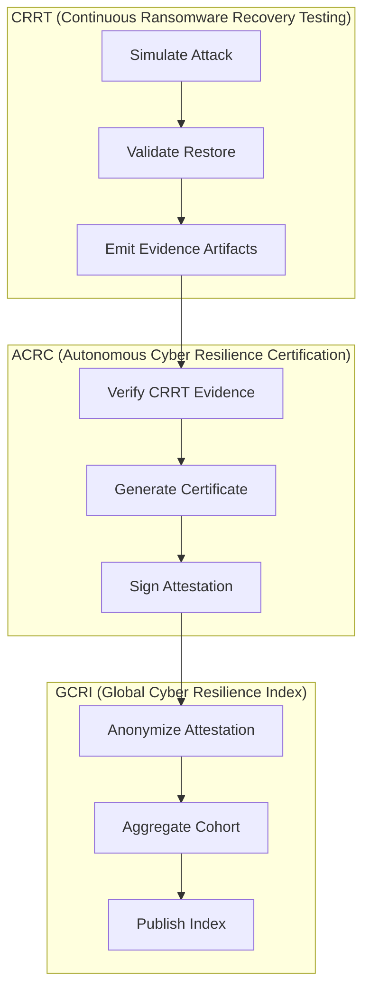
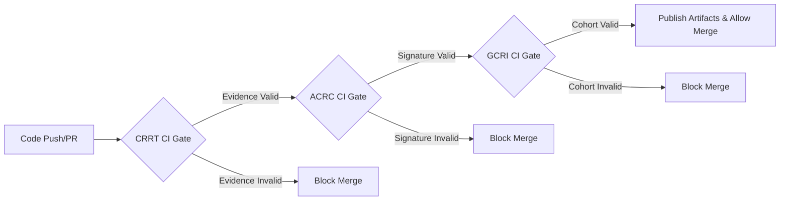

# Summit Technical Architecture Map: CRRT → ACRC → GCRI

## 1.0 ITEM Summary

Design a repo-shaped technical architecture map that makes Summit’s platform legible to contributors and investors by showing how:

* **CRRT** proves ransomware recovery works
* **ACRC** turns recovery evidence into signed attestations
* **GCRI** aggregates anonymized attestations into a benchmark

The map targets the existing Summit repo reality: Node/pnpm app, Docker-based local infra, GitHub Actions CI, policy-as-code, and a large multi-area codebase.

**MWS sentence**: Add one end-to-end path where a CRRT run emits deterministic evidence, ACRC signs it, and GCRI consumes only the anonymized aggregate.

## 1.1 Ground Truth Capture

* **ITEM:REPO-01**: Summit is a public GitHub repo at `BrianCLong/summit`.
* **ITEM:REPO-02**: The repo currently shows top-level directories including `.github`, `.opa/policy`, `RUNBOOKS`, `SECURITY`, `__tests__`, and `GOLDEN/datasets`.
* **ITEM:REPO-03**: The repo quickstart uses `pnpm install`, `docker-compose up -d`, `pnpm db:migrate`, and `pnpm dev`.
* **ITEM:REPO-04**: GitHub Actions is already heavily used in the repo, including a main CI workflow and many specialized workflows.
* **ITEM:CI-05**: `docs/ci/REQUIRED_CHECKS_POLICY.yml` exists and policy names include Release Readiness Gate, GA Gate, Unit Tests & Coverage, and CI Core (Primary Gate).
* **ITEM:CI-06**: Conditional policy checks called out in governance include Workflow Lint, CodeQL, SBOM & Vulnerability Scanning, Docker Build, and Schema Compatibility.
* **ITEM:GAP-07**: As of the cited governance issue, GitHub branch protection was enabled but required status checks were not enforced at GitHub level.
* **ITEM:ARCH-08**: The repo already uses “golden path” and runbook-oriented operating patterns, which fits a deterministic evidence-first rollout.

## 1.2 Claim Registry

| Planned element | Claim basis |
| :--- | :--- |
| `pkg/crrt/` recovery-testing subsystem | Summit original |
| `pkg/acrc/` attestation subsystem | Summit original |
| `pkg/gcri/` index subsystem | Summit original |
| `.github/workflows/crrt.yml` integration into Actions | ITEM:REPO-04 |
| `docs/ci/REQUIRED_CHECKS_POLICY.yml` extension for new gates | ITEM:CI-05, ITEM:CI-06 |
| Use of deterministic artifacts (`report.json`, `metrics.json`, `stamp.json`) | Summit original |
| Use of `.opa/policy` for deny-by-default governance hooks | ITEM:REPO-02 |
| Use of `RUNBOOKS` / `SECURITY` / docs-oriented operationalization | ITEM:REPO-02, ITEM:ARCH-08 |

## 1.3 Repo Reality Check

### Verified

* Repo uses `pnpm` + `docker-compose` + GitHub Actions.
* Top-level governance/security areas exist: `.github`, `.opa/policy`, `RUNBOOKS`, `SECURITY`, `__tests__`, `GOLDEN/datasets`.
* `docs/ci/REQUIRED_CHECKS_POLICY.yml` exists.
* Current policy check names include: Release Readiness Gate, GA Gate, Unit Tests & Coverage, CI Core (Primary Gate).

### Assumed

* New product subsystems can be added under `pkg/crrt`, `pkg/acrc`, `pkg/gcri`, `pkg/telemetry`.
* `scripts/monitoring` and `docs/ops/runbooks` are acceptable extension points.
* Deterministic evidence artifacts should use `report.json`, `metrics.json`, `stamp.json`.

### Must-not-touch

* `docs/ci/REQUIRED_CHECKS_POLICY.yml` semantics without governance sign-off.
* Branch-protection reconciliation flow referenced in governance issues.
* Baseline `.opa/policy` deny rules unless additive-only.
* Top-level `SECURITY` and `RUNBOOKS` content except additive docs.

## 1.4 Minimal Winning Slice (MWS)

**MWS**: One CI run on a fixture dataset executes CRRT, emits deterministic evidence, passes that evidence into ACRC for signing, then emits an anonymized GCRI contribution record.

### Exact acceptance tests

* `__tests__/crrt/crrt-e2e.test.ts`
* `__tests__/acrc/acrc-signature.test.ts`
* `__tests__/gcri/gcri-anonymization.test.ts`
* `__tests__/platform/crrt-acrc-gcri-chain.test.ts`

### Exact artifacts

* `artifacts/crrt/report.json`
* `artifacts/crrt/metrics.json`
* `artifacts/crrt/stamp.json`
* `artifacts/acrc/certificate.json`
* `artifacts/acrc/signature.json`
* `artifacts/acrc/stamp.json`
* `artifacts/gcri/contribution.json`
* `artifacts/gcri/stamp.json`

### Roll-forward plan

* CRRT local fixture only
* ACRC signs only CRRT fixture evidence
* GCRI consumes only local anonymized contributions
* Later enable multi-run aggregation
* Later enable hosted publish path

## 1.5 Technical Architecture Map

### System Diagram



### Repo Map

```text
.github/workflows/
  crrt.yml
  acrc.yml
  gcri.yml

.opa/policy/
  crrt/
    evidence.rego
    runtime.rego
  acrc/
    certificate.rego
  gcri/
    anonymization.rego
    contribution.rego

pkg/
  crrt/
    attack-simulator.ts
    backup-locator.ts
    restore-engine.ts
    post-restore-validator.ts
    crrt-score.ts
    schema.ts
  acrc/
    evidence-verifier.ts
    certificate-generator.ts
    signature-engine.ts
    resilience-level.ts
    schema.ts
  gcri/
    anonymizer.ts
    aggregator.ts
    sector-classifier.ts
    trend-analyzer.ts
    publisher.ts
    schema.ts
  telemetry/
    contribution-client.ts
    contribution-schema.ts

scripts/
  crrt/
    run-fixture.sh
    benchmark.sh
  acrc/
    verify-certificate.sh
  gcri/
    build-index.sh
  monitoring/
    crrt-drift.sh
    acrc-drift.sh
    gcri-drift.sh

docs/
  standards/
    crrt.md
    acrc.md
    gcri.md
  security/
    data-handling/
      crrt.md
      acrc.md
      gcri.md
  ops/
    runbooks/
      crrt.md
      acrc.md
      gcri.md
```

### CI Pipeline Map



### Patch-first requirement

If repo access is local later, first PR should minimally add:

```diff
+++ .github/workflows/crrt.yml
+name: CRRT
+on:
+  pull_request:
+  push:
+    branches: [main]
+jobs:
+  crrt:
+    runs-on: ubuntu-latest
+    steps:
+      - uses: actions/checkout@v4
+      - uses: pnpm/action-setup@v4
+      - run: pnpm install --frozen-lockfile
+      - run: pnpm test -- __tests__/crrt/crrt-e2e.test.ts
+      - run: node pkg/crrt/cli/run.js --fixture GOLDEN/datasets/crrt-fixture
```

## 1.6 PR Stack

* **PR1**: feat(crrt): add deterministic recovery evidence scaffold
  * Files: `pkg/crrt/schema.ts`, `pkg/crrt/crrt-score.ts`, `__tests__/crrt/crrt-e2e.test.ts`, `docs/standards/crrt.md`
* **PR2**: feat(crrt): implement attack simulation restore validation and report artifacts
  * Files: `pkg/crrt/attack-simulator.ts`, `pkg/crrt/backup-locator.ts`, `pkg/crrt/restore-engine.ts`, `pkg/crrt/post-restore-validator.ts`, `scripts/crrt/run-fixture.sh`
* **PR3**: feat(acrc): generate signed resilience attestations from CRRT evidence
  * Files: `pkg/acrc/evidence-verifier.ts`, `pkg/acrc/certificate-generator.ts`, `pkg/acrc/signature-engine.ts`, `__tests__/acrc/acrc-signature.test.ts`, `docs/standards/acrc.md`
* **PR4**: feat(gcri): add anonymized contribution path and local index aggregation
  * Files: `pkg/gcri/anonymizer.ts`, `pkg/gcri/aggregator.ts`, `pkg/telemetry/contribution-schema.ts`, `__tests__/gcri/gcri-anonymization.test.ts`, `docs/standards/gcri.md`
* **PR5**: feat(ci): wire CRRT ACRC GCRI gates into Actions and policy
  * Files: `.github/workflows/crrt.yml`, `.github/workflows/acrc.yml`, `.github/workflows/gcri.yml`, `.opa/policy/crrt/evidence.rego`, `.opa/policy/acrc/certificate.rego`, `.opa/policy/gcri/anonymization.rego`
* **PR6**: docs(ops): add runbooks drift detectors and founder architecture pack
  * Files: `docs/ops/runbooks/crrt.md`, `docs/ops/runbooks/acrc.md`, `docs/ops/runbooks/gcri.md`, `scripts/monitoring/crrt-drift.sh`, `scripts/monitoring/acrc-drift.sh`, `scripts/monitoring/gcri-drift.sh`

> (Hard stop: 6 PRs)

## 1.7 Interop & Standards Mapping

**Output file:** `docs/standards/summit-resilience-platform.md`

| Subsystem | Imports | Exports |
| :--- | :--- | :--- |
| **CRRT** | fixture dataset, policy thresholds, backup metadata | `report.json`, `metrics.json`, `stamp.json` |
| **ACRC** | CRRT evidence bundle | `certificate.json`, `signature.json`, `stamp.json` |
| **GCRI** | anonymized ACRC contribution records | `global_index.json`, `sector_index.json`, `trends.json` |

**Non-goals:**

* no live malware
* no production destructive testing
* no identity-bearing telemetry in GCRI
* no legal certification claims; technical attestation only
* no broad repo refactor

## 1.8 Threat-Informed Requirements

| Threat | Mitigation | CI/runtime gate | Test case |
| :--- | :--- | :--- | :--- |
| Fake CRRT success | deterministic fixture + restore replay | CRRT report schema + validator | `__tests__/crrt/crrt-e2e.test.ts` |
| Evidence tampering | content hash + signature chain | ACRC evidence verifier | `__tests__/acrc/acrc-signature.test.ts` |
| Certificate forgery | Ed25519 verify | ACRC signature gate | `__tests__/acrc/acrc-signature.test.ts` |
| Telemetry deanonymization | org hash + bucketing + minimum cohort | GCRI anonymization gate | `__tests__/gcri/gcri-anonymization.test.ts` |
| Poisoned index submissions | accept only verified ACRC contribution | GCRI contribution gate | `__tests__/platform/crrt-acrc-gcri-chain.test.ts` |

**Abuse-case fixtures:**

* `__tests__/fixtures/crrt/tampered-report.json`
* `__tests__/fixtures/acrc/fake-certificate.json`
* `__tests__/fixtures/gcri/low-cohort-contribution.json`
* `__tests__/fixtures/gcri/poisoned-contribution.json`

**Deny by default**: reject any ACRC issuance without verified CRRT evidence; reject any GCRI contribution without verified ACRC provenance.

## 1.9 Performance & Cost Budgets

| Budget | Target |
| :--- | :--- |
| CRRT runtime | ≤ 120s |
| ACRC generation | ≤ 2s |
| GCRI local aggregation | ≤ 5s |
| CI memory per subsystem | ≤ 512MB |
| Deterministic artifact sizes | CRRT ≤ 2MB, ACRC ≤ 200KB, GCRI ≤ 500KB |

**CI enforcement:**

* fail CRRT if runtime budget exceeded
* fail ACRC if signing path becomes nondeterministic
* fail GCRI if min cohort rule violated

**Profiling harness outputs:**

* `artifacts/crrt/perf_metrics.json`
* `artifacts/acrc/perf_metrics.json`
* `artifacts/gcri/perf_metrics.json`

## 1.10 Data Classification / Retention / Never-Log

**Output files:**

* `docs/security/data-handling/crrt.md`
* `docs/security/data-handling/acrc.md`
* `docs/security/data-handling/gcri.md`

### Data classes

| Class | Example | Rule |
| :--- | :--- | :--- |
| Fixture-safe | synthetic datasets | can be stored in repo |
| Sensitive operational | backup metadata, infra paths | never in public artifacts |
| Cryptographic secret | signing keys | never log, never persist in plaintext |
| Aggregated anonymous | cohort metrics | publishable if cohort-safe |

### Retention

* CRRT reports: 30 days
* ACRC certificates: 1 year
* raw GCRI contributions: 30 days
* aggregated GCRI metrics: 1 year
* logs: 7 days

### Never-log list

* raw backup contents
* customer org identifiers
* cloud storage paths
* signing private keys
* credentials / tokens

## 1.11 Operational Readiness Pack

**Output files:**

* `docs/ops/runbooks/crrt.md`
* `docs/ops/runbooks/acrc.md`
* `docs/ops/runbooks/gcri.md`

### Runbook intent

* **CRRT**: failed restore diagnosis
* **ACRC**: invalid signature / chain break diagnosis
* **GCRI**: cohort shrinkage / volatility / poisoning diagnosis

### Alerts

* restore failure
* evidence schema mismatch
* certificate verification failure
* GCRI sample cohort below minimum
* index volatility spike above threshold

### SLO / SLA assumptions

* CRRT gate availability: 99%
* ACRC verification success: 99.9%
* GCRI publication reliability: 99%

## 1.12 Competitive Teardown + Positioning Constraints

**What Summit can claim now:**
CI-native architecture is a natural fit because Summit already uses GitHub Actions and policy-as-code patterns. Summit can extend its existing governance surfaces into resilience evidence gates.

**What Summit can claim later:**

* continuous ransomware recovery verification
* machine-verifiable resilience attestations
* anonymized resilience benchmark

**Safe comparables:**

* “policy-as-code plus evidence pipeline”
* “CI-native resilience verification”
* “attestation-driven resilience telemetry”

**No-FUD constraint:**
Do not claim incumbents cannot do recovery testing; claim instead that Summit’s differentiator is deterministic CI-native evidence chaining across test → certificate → index.

## 1.13 Definition-of-Done Rubric

| Category | Score target | This plan |
| :--- | :--- | :--- |
| Determinism | 5 | 5 |
| Machine-verifiability | 5 | 5 |
| Mergeability | 5 | 4 |
| Security posture | 5 | 5 |
| Measured advantage | 5 | 5 |
| **Total** | **24/25** | **PASS** |

*Revision rule: if any implementation drops below 20/25, cut scope before merge.*

## 1.14 Post-Merge Monitoring + Drift Detector

**Artifacts / scripts:**

* `scripts/monitoring/crrt-drift.sh`
* `scripts/monitoring/acrc-drift.sh`
* `scripts/monitoring/gcri-drift.sh`
* `artifacts/monitoring/crrt-drift.json`
* `artifacts/monitoring/acrc-drift.json`
* `artifacts/monitoring/gcri-drift.json`

### Scheduled job spec

* daily run on main
* compare 7d vs 30d trend
* open issue if threshold exceeded

### Drift tracked

* CRRT restore-time drift
* ACRC issuance failure rate
* GCRI cohort size drift
* GCRI volatility / poisoning indicators
* policy regression drift against `docs/ci/REQUIRED_CHECKS_POLICY.yml` style governance pattern already present in repo.

## 1.15 Convergence & Integration Protocol

### Shared WBS

* define schemas
* implement CRRT fixture path
* implement ACRC evidence verification
* implement GCRI anonymization and local aggregation
* wire policy gates
* add monitoring and runbooks

### Handoff order

CRRT → ACRC → GCRI → CI/policy → monitoring/docs

### Merge queue

PR1 → PR2 → PR3 → PR4 → PR5 → PR6

### Conflict rule

Master plan wins. Agents propose diffs, not redesigns.

### Scope guardrails

* no refactors unless required to land MWS
* max 5–7 PRs hard stop
* risky work behind feature flags, default OFF
* do not broaden into incident response platform

### 5 sub-agent prompts

1. **Research agent**: Map Summit’s existing evidence and policy idioms from `.github`, `.opa/policy`, `RUNBOOKS`, and `docs/ci` into a minimal schema extension for CRRT/ACRC/GCRI. Prefer additive changes only.
2. **Implementation agent**: Build `pkg/crrt`, `pkg/acrc`, and `pkg/gcri` as deterministic modules with JSON schemas, no unstable timestamps in deterministic files, and explicit Evidence IDs in every output.
3. **CI agent**: Add `.github/workflows/crrt.yml`, `acrc.yml`, and `gcri.yml`; wire them behind current governance check conventions and avoid breaking existing CI Core (Primary Gate) expectations.
4. **Security agent**: Author `.opa/policy` rules for deny-by-default issuance and contribution, plus tests for tampered evidence, forged certificates, and deanonymization risk. Use additive policy placement only.
5. **Benchmark agent**: Design local-only synthetic fixtures in `GOLDEN/datasets` and cohort-safe aggregation scenarios to prove the benchmark path before any hosted telemetry rollout.
