# IntelGraph Sprint 27 Merge Plan

## "Clean Merge, Clean Build, Clean Test" Strategy

### Overview

This document outlines the comprehensive strategy for merging Sprint 27 deliverables into the main branch while maintaining zero technical debt and ensuring all systems remain operational.

### Current State Assessment

#### Completed Sprint 27 Components

-  **Sprint 27A**: CI/CD & Supply Chain Hardening
  - GitHub workflow for provenance verification
  - Maestro Conductor build orchestration
  - Developer bootstrap script (d10 minute onboarding)
  - DevContainer configuration for Codespaces
  - Pre-commit quality gates with comprehensive hooks

-  **Sprint 27C**: Demo Stack & Observability
  - Docker Compose demo stack with full observability
  - Prometheus + Grafana monitoring integration
  - Deterministic build verification tools
  - Performance testing infrastructure

-  **Sprint 27D**: Security Hardening
  - WebAuthn step-up authentication with 5-minute TTL
  - Data Loss Prevention (DLP) with PII taxonomy
  - Tamper-evident audit logs with hash chains
  - Supply chain trust policy enforcement
  - OPA policy bundle for tenant isolation

-  **Sprint 27E**: Performance & Cost Optimization
  - Service Level Objectives (SLO) configuration
  - Hot-path optimization with multi-tier caching
  - Cost guardrails with model budget enforcement
  - Chaos engineering experiments
  - Load testing with k6 integration

#### Pending Implementation

- = **Sprint 27B**: Final merge coordination (this document)
- � **Sprint 27F**: Data Quality & GA Enablement
- � **Sprint 27G**: Tri-Pane UX & Search Optimization
- � **Sprint 27H**: Enterprise Readiness (SSO/SCIM, BYOK, DR)

---

### Merge Strategy

#### Phase 1: Foundation Validation (Hours 0-2)

1. **Pre-merge Health Check**

   ```bash
   # Run comprehensive validation
   npm run test:all
   npm run build:verify
   npm run security:scan
   npm run performance:baseline
   ```

2. **Dependencies Audit**

   ```bash
   npm audit --audit-level=moderate
   npm run license:check
   npm run deps:analyze
   ```

3. **Infrastructure Validation**
   ```bash
   docker-compose -f docker-compose.demo.yml config
   docker-compose -f docker-compose.demo.yml up --dry-run
   ```

#### Phase 2: Incremental Integration (Hours 2-6)

1. **Service-by-Service Integration**
   - Start with common/shared services
   - Progress through dependency graph: common � auth � api/gateway � web
   - Validate each service independently before proceeding

2. **Database Migration Strategy**

   ```bash
   # Backup current state
   npm run db:backup

   # Apply migrations incrementally
   npm run db:migrate:common
   npm run db:migrate:auth
   npm run db:migrate:api

   # Validate each migration
   npm run db:validate
   ```

3. **Feature Flag Strategy**
   - All new Sprint 27 features behind feature flags initially
   - Gradual rollout: 1% � 10% � 50% � 100%
   - Instant rollback capability via flag toggles

#### Phase 3: Quality Assurance (Hours 6-8)

1. **Automated Test Suite**

   ```bash
   # Unit tests with coverage requirements
   npm test -- --coverage --threshold=85

   # Integration tests
   npm run test:integration

   # End-to-end tests
   npm run test:e2e -- --browser=chromium,firefox,webkit

   # Performance regression tests
   npm run test:performance:regression
   ```

2. **Security Validation**

   ```bash
   # SAST scanning
   npm run security:sast

   # Dependency vulnerability check
   npm audit

   # Container scanning
   npm run security:containers

   # Secrets detection
   npm run security:secrets
   ```

3. **Observability Validation**

   ```bash
   # Metrics collection verification
   npm run observability:metrics:verify

   # Logs aggregation check
   npm run observability:logs:verify

   # Alerting rules validation
   npm run observability:alerts:test
   ```

#### Phase 4: Production Readiness (Hours 8-10)

1. **Performance Baseline**

   ```bash
   # Load testing
   k6 run tests/k6/load-test.js --vus=100 --duration=10m

   # Stress testing
   k6 run tests/k6/stress-test.js --vus=500 --duration=5m

   # Endurance testing
   k6 run tests/k6/endurance-test.js --vus=50 --duration=30m
   ```

2. **Chaos Engineering Validation**

   ```bash
   # Network partition simulation
   npm run chaos:network-partition

   # Database failover test
   npm run chaos:db-failover

   # Memory pressure test
   npm run chaos:memory-pressure
   ```

---

### Risk Mitigation

#### High-Risk Areas

1. **Database Schema Changes**
   - Risk: Data loss or corruption
   - Mitigation: Full backup + incremental migration + rollback scripts
   - Validation: Automated schema diff + data integrity checks

2. **Authentication System Changes**
   - Risk: User lockout or security bypass
   - Mitigation: Parallel auth system + gradual migration + emergency bypass
   - Validation: Auth flow testing + security penetration testing

3. **Performance Regressions**
   - Risk: System slowdown or resource exhaustion
   - Mitigation: Performance budgets + real-time monitoring + automatic rollback
   - Validation: Continuous performance profiling + SLO compliance checking

#### Rollback Strategy

1. **Feature Flag Rollback** (0-5 minutes)

   ```bash
   # Instant feature disable
   npm run feature:disable:sprint27
   ```

2. **Application Rollback** (5-15 minutes)

   ```bash
   # Previous version deployment
   npm run deploy:rollback:previous
   ```

3. **Database Rollback** (15-60 minutes)

   ```bash
   # Schema rollback with data migration
   npm run db:rollback:sprint27
   ```

4. **Infrastructure Rollback** (30-120 minutes)
   ```bash
   # Full infrastructure revert
   npm run infra:rollback:sprint27
   ```

---

### Flaky Test Management

#### Current Flaky Test Kill-List

```yaml
# tests/flaky-tests.yml
flaky_tests:
  quarantined:
    - test: 'AuthController.integration.test.ts:WebAuthn flow with network timeout'
      reason: 'Network timing dependency'
      quarantine_date: '2024-09-19'
      assigned_to: 'auth-team'

    - test: 'GraphQLResolver.stress.test.ts:Concurrent query handling'
      reason: 'Race condition in test setup'
      quarantine_date: '2024-09-19'
      assigned_to: 'api-team'

    - test: 'E2E.playwright.test.ts:Full user journey with file upload'
      reason: 'File system timing on CI'
      quarantine_date: '2024-09-19'
      assigned_to: 'e2e-team'

  retry_patterns:
    network_tests:
      max_retries: 3
      retry_delay: 1000ms

    database_tests:
      max_retries: 2
      retry_delay: 500ms

    file_system_tests:
      max_retries: 5
      retry_delay: 200ms

  stability_requirements:
    unit_tests: 99.9%
    integration_tests: 99.5%
    e2e_tests: 98.0%
```

#### Flaky Test Detection & Management

```typescript
// tools/testing/flaky-detector.ts
export class FlakyTestDetector {
  detectFlaky(testResults: TestResult[]): FlakyTest[] {
    // Algorithm: Tests that fail/pass inconsistently over 10 runs
    // Mark as flaky if success rate < 95%
  }

  quarantineFlaky(test: FlakyTest): void {
    // Move to quarantine suite
    // Assign to responsible team
    // Set resolution deadline
  }
}
```

---

### Quality Gates

#### Mandatory Gates (Must Pass)

1. **Security Gates**
   - No high/critical vulnerabilities
   - No secrets in code
   - Authentication/authorization working
   - Security headers present

2. **Performance Gates**
   - Response time d 200ms (95th percentile)
   - Memory usage d 512MB per service
   - CPU usage d 70% under normal load
   - Zero memory leaks

3. **Reliability Gates**
   - Test coverage e 85%
   - Zero flaky tests in main suite
   - All services health check passing
   - Database migrations reversible

4. **Compliance Gates**
   - All code formatted (Prettier)
   - No linting errors (ESLint)
   - Type checking passes (TypeScript)
   - Documentation up-to-date

#### Advisory Gates (Should Pass)

1. **Code Quality**
   - Cyclomatic complexity d 10
   - Function length d 50 lines
   - File length d 500 lines
   - TODO/FIXME count maintained

2. **Architecture**
   - Dependency graph acyclic
   - Service boundaries respected
   - API versioning consistent
   - Error handling standardized

---

### Monitoring & Observability

#### Key Metrics During Merge

1. **Application Metrics**
   - Response time percentiles (50th, 95th, 99th)
   - Error rates by service
   - Throughput (requests/second)
   - Active user sessions

2. **Infrastructure Metrics**
   - CPU/Memory/Disk utilization
   - Network I/O and latency
   - Database connection pool usage
   - Cache hit rates

3. **Business Metrics**
   - User sign-up/login success rates
   - Feature adoption rates
   - Data processing pipeline health
   - Revenue-impacting operations

#### Alert Thresholds

```yaml
# ops/alerts/sprint27-merge.yml
alerts:
  critical:
    error_rate: '> 5%'
    response_time_p95: '> 1000ms'
    memory_usage: '> 90%'

  warning:
    error_rate: '> 1%'
    response_time_p95: '> 500ms'
    memory_usage: '> 80%'
```

---

### Success Criteria

#### Merge Considered Successful When:

1.  All automated tests passing (100% pass rate)
2.  No performance regressions detected
3.  All security scans clean
4.  Feature flags working correctly
5.  Monitoring/alerting operational
6.  Documentation updated
7.  Rollback procedures tested
8.  Zero production incidents in first 24 hours

#### Post-Merge Validation Checklist

- [ ] User authentication working normally
- [ ] All API endpoints responding correctly
- [ ] Database queries performing within SLA
- [ ] File uploads/downloads functioning
- [ ] Real-time features operational
- [ ] Monitoring dashboards populated
- [ ] Backup/restore procedures validated
- [ ] Security policies enforced

---

### Communication Plan

#### Stakeholder Notifications

1. **Before Merge** (T-24h)
   - Engineering teams: Merge timeline and expectations
   - Product team: Feature availability timeline
   - QA team: Testing windows and requirements
   - DevOps team: Infrastructure changes

2. **During Merge** (Real-time)
   - #engineering-sprint27 Slack channel for updates
   - Automated status updates every 30 minutes
   - Immediate notification of any blockers
   - Dashboard links for real-time monitoring

3. **After Merge** (T+24h)
   - Success/failure summary report
   - Performance impact analysis
   - Lessons learned documentation
   - Next steps and follow-up items

#### Escalation Matrix

- **Level 1**: Team lead resolution (0-30 minutes)
- **Level 2**: Engineering manager involvement (30-60 minutes)
- **Level 3**: CTO notification and war room (60+ minutes)

---

### Timeline

```mermaid
gantt
    title Sprint 27 Merge Timeline
    dateFormat  HH:mm
    axisFormat %H:%M

    section Preparation
    Health Check      :prep1, 00:00, 2h
    Dependency Audit  :prep2, after prep1, 1h

    section Integration
    Service Integration :int1, after prep2, 3h
    Database Migration  :int2, after int1, 1h

    section Validation
    Test Suite         :val1, after int2, 2h
    Security Scan      :val2, after val1, 1h

    section Production
    Load Testing       :prod1, after val2, 1h
    Final Validation   :prod2, after prod1, 1h
```



**Total estimated time: 12 hours**
**Go/No-Go decision point: Hour 8**
**Rollback deadline: Hour 10**

---

### Appendix

#### Useful Commands

```bash
# Quick health check
npm run health:check

# Run all quality gates
npm run quality:gates

# Performance regression test
npm run performance:regression

# Security full scan
npm run security:full-scan

# Rollback to previous state
npm run rollback:emergency

# Monitor real-time metrics
npm run monitor:dashboard
```

#### Emergency Contacts

- **Sprint Lead**: Available 24/7 during merge window
- **DevOps Lead**: On-call for infrastructure issues
- **Security Lead**: Available for security incidents
- **Database Admin**: On-call for data issues

---

_This document is living and will be updated as the merge progresses. Last updated: 2024-09-19_
