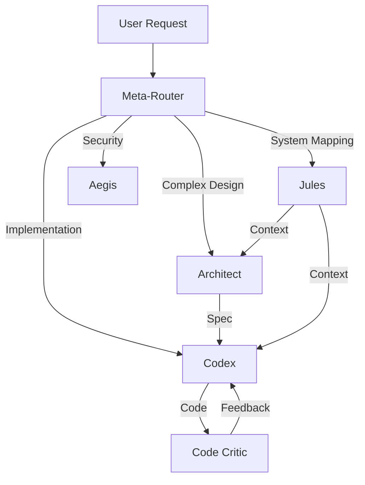

# 🗺️ Prompt Atlas

This atlas maps the prompt ecosystem, organizing system prompts, agent definitions, and workflow directives into a navigable topology.

## 🧭 Navigation Summary

| Layer | Description | Key Prompts |
|-------|-------------|-------------|
| **Core Identity** | Base personas and agent definitions | `jules-gemini`, `claude-code`, `codex` |
| **Orchestration** | Meta-routing and system governance | `meta-router`, `enterprise-4th-order` |
| **Functional Roles** | Specific capability implementations | `architect`, `ci-cd`, `summit-intelgraph` |
| **Workflows** | Structured task executions | `plan.feature-request`, `implement.fix-test` |
| **Specialists** | Domain-specific expert agents | `aegis`, `hermes`, `orion`, `elara` |

---

## 1. Core Identity Layer
*The foundational personas that drive the ecosystem.*

- **`jules-gemini.md`**
  - **Role:** Holistic Ecosystem Cartographer & Primary Interface.
  - **Focus:** Cross-file coherence, system mapping, schema harmonization.
  - **Interaction:** The user's primary "face" of the system.

- **`claude-code.md`**
  - **Role:** Deep Architectural Reasoner.
  - **Focus:** Third-order inference, complex refactoring, high-level design.
  - **Interaction:** Called for difficult architectural decisions.

- **`codex.md`**
  - **Role:** Deterministic Builder.
  - **Focus:** Zero-error implementation, build systems, rigid adherence to spec.
  - **Interaction:** Execution phase of approved designs.

---

## 2. Orchestration Layer
*The nervous system connecting agents and enforcing consistency.*

- **`meta-router.md`**
  - **Function:** Analyzes user requests to select the optimal agent or prompt.
  - **Logic:** Matches query complexity and domain to agent capabilities.

- **`enterprise-4th-order.md`**
  - **Function:** Governance and high-level strategy.
  - **Scope:** Ensures alignment with business goals and architectural purity.

- **`capability-matrix.md`**
  - **Function:** A registry of what each agent *can* do, used by the router.

- **`pmi-charter.md`**
  - **Function:** Project Management Institute charter, defining project standards.

---

## 3. Specialist Agents
*Domain experts deployed for specific subsystems.*

- **`aegis.md`** (Security & Defense)
  - Focus: Security hardening, threat modeling, vulnerability scanning.
- **`hermes.md`** (Communication & API)
  - Focus: Inter-service communication, API contracts, messaging.
- **`orion.md`** (Observability & Search)
  - Focus: Logging, metrics, tracing, search infrastructure.
- **`elara.md`** (Frontend & UX)
  - Focus: User interface, client-side state, user journey.

---

## 4. Functional Roles
*Task-oriented prompts that can be assumed by any capable agent.*

- **`architect.md`**: For designing new systems or refactoring old ones.
- **`ci-cd.md`**: For pipeline configuration and release automation.
- **`summit-intelgraph.md`**: Context injection for the specific "Summit IntelGraph" business logic.
- **`workflow-automation.md`**: Rules for automating repetitive dev tasks.
- **`cursor-warp.md`**: Integration guidelines for the Cursor IDE devloop.

---

## 5. Workflow Prompts (YAML)
*Structured, deterministic procedures for common tasks.*

- **`plan.feature-request@v1.yaml`**: Standard procedure for scoping a new feature.
- **`implement.fix-test@v1.yaml`**: TDD loop for fixing bugs.
- **`review.security-check@v1.yaml`**: Checklist for security review.
- **`code.critic@v1.yaml`**: Heuristics for code review and critique.

---

## 🗺️ Relationships & Flows

