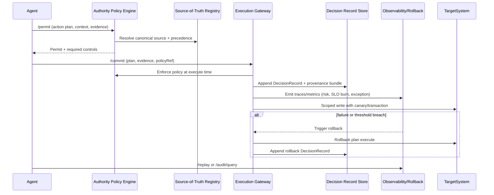

# Summit Authority Control Plane v0

> **Readiness alignment:** This design is governed by the Summit Readiness Assertion and the
> Constitution of the Ecosystem. Any implementation must remain compliant with those authority
> files and the GA guardrails described in `docs/ga/`. This document defines the present boundary
> and mandates the future execution posture for authoritative lanes.

## Grounding and principle

- **Thesis summary (Jamin Ball, "Authority Is the AI Bottleneck")**
  1. Model/cost selection matters less than deciding whether AI is **authoritative or assistive**.
  2. Assistive AI boosts local efficiency but keeps humans as the throughput bottleneck, capping ROI.
  3. Authoritative AI re-writes workflows so humans focus on exceptions; this is where step-change ROI appears.
  4. Making AI authoritative forces clarity on canonical truth, acceptable error, accountability, rollback, and observability.
  5. Trust is engineered: guardrails, provenance, monitoring, and rollback make partial authority safe—and authority must be real somewhere.
- **Summit product principle:** Summit/IntelGraph is the **Authority Control Plane** that makes
  agent actions safe, auditable, reversible, and policy-bounded so enterprises can grant real
  authority in narrow lanes.

## 23rd-order implications (compressed)

1. **Authority is an infrastructure primitive**: authority without a non-bypassable boundary is a
   UI illusion; the control plane must be the exclusive write path.
2. **Observability is a security control**: missing traces and Decision Records are treated as a
   policy violation, not a telemetry gap.
3. **Rollback is required for legitimacy**: a lane without rollback is not authoritative; it is
   experimental and must remain below L3.
4. **Policy-as-code is non-negotiable**: regulatory or compliance requirements must be expressed
   as policy to be enforceable; anything else is incomplete by definition.
5. **Sources of truth are contracts**: canonical truth must be explicit, versioned, and owned; if
   systems conflict, the resolution path must be encoded, not debated.
6. **Authority is earned**: L3/L4 lanes graduate only when error budgets, drift checks, and
   provenance completeness hold under sustained load.
7. **Governed Exceptions replace legacy bypasses**: any exception is documented, policy-bound, and
   observable or it is disallowed.

## Authority Ladder (policy-enforced)

| Level                           | Allowed actions                                                                         | Required proofs                                                                                 | Required controls                                                                                                   | Required audit artifacts                                                     |
| ------------------------------- | --------------------------------------------------------------------------------------- | ----------------------------------------------------------------------------------------------- | ------------------------------------------------------------------------------------------------------------------- | ---------------------------------------------------------------------------- |
| **L0 Observe**                  | Read-only; summarize, plan, forecast; no side effects                                   | Citations for inputs; plan rationale                                                            | No write tokens issued; strict rate limits; sandbox execution                                                       | Decision Record with inputs, citations, plan                                 |
| **L1 Recommend**                | Suggestions with rationale; propose tools/queries; no writes                            | Citations; policy lint results; SoT contract checks                                             | Same as L0 plus policy pre-checks; tool sandbox                                                                     | Decision Record + recommendation diff                                        |
| **L2 Draft**                    | Prepare drafts (tickets, PRs, emails); stage DB mutations in dry-run; humans send/merge | Citations; test/diff output; policy pre-check; validation suite for drafts                      | Staging environments; rate limits; manual approval gate; canary dry-run                                             | Decision Record + draft bundle (diff, tests)                                 |
| **L3 Execute-with-Guardrails**  | Perform scoped writes via Execution Gateway; human reviews exceptions only              | Citations; policy allow; automated tests; risk score; blast-radius analysis; error budget check | OPA permit; transactional writes; circuit-breakers; per-tenant rate limits; canary + rollback hooks; policy recheck | Decision Record + provenance bundle + policy version + changelog entry       |
| **L4 Autonomous Outcome Owner** | Owns end-to-end outcome in bounded lane; continuous execution and auto-rollback         | Same as L3 plus SLO conformance; error-budget burn rate; continuous verification                | Continuous monitors; auto-rollback; shadow deploys; chaos/resilience probes; automated downgrade paths              | Decision Record per action + runbook adherence + SLO reports + replay bundle |

## Authority Kernel (commit boundary)

**Goal:** No authoritative write occurs outside the Execution Gateway. Any bypass attempt is a
policy violation and triggers a security incident response.

**Components**

- **Authority Policy Engine (OPA-backed):** Evaluates
  `permit(subject, action, resource, context)` at decision and execute time; supports simulation,
  dry-run, and continuous verification.
- **Source-of-Truth Registry:** Catalog of canonical systems, owners, precedence/conflict rules, and
  allowed mutation paths.
- **Decision Record (append-only):** Sealed log containing inputs, retrieved evidence, model/tool
  outputs, policy version, risk score, action plan, predicted side effects, and execution results.
- **Execution Gateway:** Sole path for writes (tickets, CRM, DB, PR merge, email, deploy). Enforces
  policy, captures provenance, emits events to audit/metrics, and attaches rollback plans.
- **Rollback + Replay Service:** Stores reversible operations and deterministic inputs; supports
  automatic or operator-triggered rollback and deterministic replay with environmental deltas.

**Authority invariants**

1. **Single write path:** All authoritative writes must traverse the Execution Gateway.
2. **Policy double-check:** Policy evaluation occurs at plan time and execute time with version pin.
3. **Evidence-first:** Each action is anchored to evidence hashes, citations, and SoT contracts.
4. **Append-only truth:** Decision Records are tamper-evident; no deletions or edits are permitted.
5. **Rollback availability:** Every lane has a tested rollback plan before L3 promotion.
6. **Downgrade on burn:** Error budget breach automatically downgrades authority level.

**Sequence (L3/L4 lane)**



## Sources of truth, acceptable error, and accountability

- **Canonical Entity/Metric Contracts:** YAML/JSON schema capturing entity definitions, ownership,
  allowed mutations, validation rules, and evidence requirements.
- **Conflict Resolution:** Precedence rules (e.g., CRM > support queue for customer tier), freshness windows, confidence scores, and quorum policies. Registry encodes tie-breakers and fallback to human escalation.
- **Error Budgets for Automation:** Per-lane baseline error vs. human performance; budgets expressed
  as allowed failure rate, MTTR, and exception thresholds. Burn-rate alerts trigger auto-downgrade
  (e.g., L3 -> L2) and human takeover.
- **Accountability Model:** Every lane maps actions to accountable human role/owner; Decision
  Records carry `requester`, `approver`, `executor` (agent id), and `policy_version`. Escalation
  paths and paging rules are attached to lanes.

### Example SoT contract

```yaml
entity_contract: customer_tier
version: 1.0.0
owner: "Customer Success DRI"
canonical_system: "crm"
precedence_order: ["crm", "billing", "support"]
conflict_resolution:
  strategy: "precedence"
  tie_breaker: "freshest"
  escalation: "human-review"
allowed_mutations:
  - "crm.updateCustomerTier"
validation_rules:
  - "tier in ['Platinum','Gold','Silver','Bronze']"
evidence_requirements:
  - "crm.record.snapshot"
  - "billing.invoice.status"
freshness_sla: "24h"
```

### Data models (authoritative objects)

```yaml
AuthorityPolicy:
  id: string
  version: semver
  lane: string
  level: L0-L4
  subjects: [agent_id]
  actions: [string]
  resources: [string]
  conditions: opa:rego
  error_budget: { baseline_error: float, max_burn_rate: float, downgrade_level: string }
  required_controls: ["canary", "rollback", "sandbox", "rate_limit"]
  approvals: { required: bool, roles: [string] }
  observability: { traces: bool, metrics: [string], audit_fields: [string] }
  governed_exceptions: [{ id: string, scope: string, expiry: datetime, owner: string }]

DecisionRecord:
  id: uuid
  timestamp: datetime
  lane: string
  level: L0-L4
  requester: string
  executor: string
  approver: string | null
  policy_version: string
  inputs: [uri]
  evidence: [{ uri: string, hash: string, citation: string }]
  action_plan: string
  risk_score: float
  predicted_side_effects: [string]
  controls_applied: [string]
  execution_result: { status: string, artifacts: [uri], diff: string }
  rollback_plan_id: string
  provenance_bundle_uri: string
  policy_eval_trace_id: string
  governed_exception_ids: [string]

SoTRegistryEntry:
  id: string
  entity: string
  canonical_system: string
  precedence: [string]
  freshness_sla: string
  mutation_paths: [string]
  validation_rules: [string]
  owners: [string]
  conflict_resolution: { strategy: string, tie_breaker: string, escalation: string }

RollbackPlan:
  id: string
  lane: string
  preconditions: [string]
  actions: [{ type: string, target: string, parameters: object }]
  verification: [string]
  fallback: string
  reversible_until: datetime
  evidence_required: [string]
```

## API sketch (Authority Kernel)

- `POST /permit` — Request policy decision; returns permit/deny, required controls, error-budget
  context.
- `POST /commit` — Submit plan + evidence + policyRef; Execution Gateway performs action, enforces policy, emits DecisionRecord.
- `POST /rollback` — Execute rollbackPlan by id; records rollback DecisionRecord.
- `POST /replay` — Deterministic replay of DecisionRecord with captured inputs and policy version; reports drift.
- `GET /audit/query` — Query DecisionRecords by lane, subject, policy, risk, outcome; supports causality traces.
- `GET /sot/registry` — Retrieve canonical entity/metric contracts and conflict rules.

### Policy-as-code enforcement (OPA outline)

```rego
package summit.authority

default allow = false

allow {
  input.lane == "issue-triage"
  input.level >= 3
  input.policy_version == data.policies.issue_triage.version
  input.controls_applied["rollback"]
  input.controls_applied["rate_limit"]
  not input.error_budget.breached
}

deny_reason["missing_provenance"] {
  not input.provenance_bundle_hash
}
```

### Request/response contracts (outline)

- Every write endpoint requires: `lane`, `level`, `subject`, `policy_version`, `evidence[]`, `controls_applied[]`, `provenance_bundle` hash.
- Responses include: `decision_record_id`, `risk_score`, `controls_enforced`, `rollback_plan_id`, `trace_id`.

## Observability and SLOs

- **Traces:** Every action chain spans `/permit -> /commit -> target write -> rollback (if any)`,
  with span attributes: lane, level, risk_score, policy_version, controls_applied,
  rollback_plan_id.
- **Metrics:** action_success_rate, rollback_rate, human_escalation_rate, time_to_detect,
  time_to_recover, policy_denies, error_budget_burn.
- **Audit queries:** `why did agent do X?` (DecisionRecord + policy + evidence) and `what policy
allowed it?` (policy version + controls enforced).
- **Drift detection:** Rising exception rates, data-quality regressions, policy deny spikes, tool
  failure frequency; triggers downgrade and human takeover.

### Evidence artifacts (minimum set)

- DecisionRecord JSON and signature hash
- Policy bundle version + OPA evaluation trace
- Provenance bundle (inputs, citations, tool outputs)
- Rollback plan ID + verification outputs
- Observability trace ID + metric snapshot

## Authoritative lanes (initial targets)

1. **Issue triage and routing (L3 target)**
   - Outcome: auto-label, dedupe, route tickets; open/close duplicates; enforce templates.
   - Guardrails: scope limited to issue tracker API; allowed labels/templates list; similarity threshold for dedupe; rollback closes/opens reverted tickets.
   - Success metrics: precision/recall on routing, duplicate resolution accuracy, rollback rate <2%, MTTR for misroutes.
   - Migration: L1 recommendations -> L2 draft labels/comments -> L3 execution via Execution Gateway with rollback on exception spike.
2. **Document redaction/classification and routing (L3/L4 target)**
   - Outcome: classify docs, redact PII, route to correct queues/buckets.
   - Guardrails: policy-enforced PII patterns, sensitivity tiers; writes limited to storage buckets; canary on new policies; rollback restores pre-redaction copy.
   - Success metrics: false-positive/negative rates vs. baseline, policy deny rate, rollback triggers, time-to-approval for escalations.
   - Migration: L1 policy lint -> L2 draft redactions -> L3 guarded writes; graduate to L4 after sustained error-budget compliance.
3. **Controlled graph updates (merge/split) with provenance (L3 target)**
   - Outcome: safe entity merge/split with lineage preserved in provenance ledger.
   - Guardrails: SoT precedence rules; similarity thresholds; dual-write to shadow graph; rollback unmerges/reapplies splits.
   - Success metrics: merge precision, rollback MTTR, provenance completeness, policy deny spike detection.
   - Migration: L1 recommendations -> L2 draft Cypher/SQL changes -> L3 gateway-executed commits with automatic rollback on validation failure.

## Threat model (selected)

- **Bypass attempts:** Direct writes to systems bypassing Execution Gateway; mitigation: network and
  IAM controls, write tokens scoped to gateway service accounts, tamper-evident Decision Records.
- **Prompt injection/tool abuse:** Malicious inputs causing unsafe actions; mitigation: policy checks
  on tool outputs, content filters, allowlist tools per lane, simulation mode before commit.
- **Poisoned sources-of-truth:** Conflicting or manipulated data; mitigation: SoT precedence rules,
  data-integrity attestation, freshness checks, divergence alerts, manual quorum for high-risk
  lanes.
- **Rollback sabotage:** Removal of rollback artifacts; mitigation: append-only storage, cross-region
  copies, periodic drills, checksum verification.
- **Policy drift or stale approvals:** Using outdated policy versions; mitigation: policy version
  pinning per DecisionRecord, mandatory policy re-evaluation at execute time, expiry on approvals.
- **Decision laundering:** Mixing authoritative writes with assistive drafts; mitigation: execution
  gateway only, immutable DecisionRecord lineage linking drafts to commits, and policy deny on
  missing linkage.

## Sprint plan (atomic PRs)

1. **Authority Kernel skeleton** — Implement `/permit` and `/commit` scaffolding with DecisionRecord
   append-only store; tests cover deny/permit flows; evidence: unit tests + sample DecisionRecord.
2. **SoT Registry service** — CRUD for canonical entity/metric contracts and conflict rules;
   evidence: schema validation tests and sample registry entries.
3. **Execution Gateway write-path** — Enforce OPA policies, attach provenance bundle, integrate
   rollback plan references; evidence: integration test simulating scoped write + rollback stub.
4. **Observability pack v0** — Instrument traces/metrics on kernel endpoints; dashboards for action
   success/rollback/exception; evidence: exported metrics fixture + dashboard JSON.
5. **Rollback + replay MVP** — Store rollback plans, execute reversible operations, deterministic
   replay harness; evidence: replay of recorded DecisionRecord with diff output.
6. **Authority ladder policy packs** — Define OPA policies for L0-L3 lanes; evidence: policy tests
   and downgrade-on-burn-rate scenario.
7. **Authoritative lane: issue triage** — Configure lane definitions, policies, rollback hooks;
   evidence: end-to-end test from recommendation -> commit -> rollback on anomaly.
8. **Authoritative lane: doc redaction** — Add PII policy set, staging bucket canary, rollback
   copy/restore; evidence: redaction accuracy tests + canary rollback.
9. **Authoritative lane: graph merge/split** — SoT-based conflict resolution + provenance ledger
   write; evidence: merge precision tests + rollback unmerge test.
10. **Post-GA hardening** — Threat-model validation, chaos probes for rollback, policy drift alarms;
    evidence: chaos test report and alert configuration.

## Forward-leaning enhancement (state of the art)

**Deterministic execution attestations**: Integrate a deterministic execution layer for L3/L4
lanes where the Execution Gateway records container image digests, tool versions, and sandbox
snapshots. This enables cryptographic replay guarantees and minimizes nondeterminism variance in
Decision Records.

## Acceptance criteria (non-negotiable)

- No authoritative write occurs outside the Execution Gateway.
- Every write has a Decision Record with policy version and provenance bundle.
- Rollback is available for every authoritative lane (best-effort allowed initially).
- Dashboards track success, exception, and rollback rates with SLOs.
- Authority Ladder levels are enforced by policy, not UI toggles.
- Governed Exceptions are time-bound, owned, and recorded with Decision Records.
