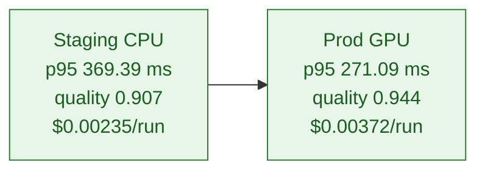

# Benchmark Report

The benchmark runner now exercises two environments with identical workloads, capturing quality, p95 latency, and per-run cost
outputs. Results are written to `benchmarks/runner/report-data/` and checked into the repository for traceability.

## How to run

```bash
node benchmarks/runner/environment-benchmarks.mjs
cat benchmarks/runner/report-data/environment-metrics.json
```

## Environment results (latest run)

| Environment                 | Quality (avg) | Quality pass rate | p95 latency (ms) | Throughput (rps) | Cost / run (USD) |
| --------------------------- | ------------- | ----------------- | ---------------- | ---------------- | ---------------- |
| Staging CPU (c6i.2xlarge)   | 0.907         | 0.754             | 369.39           | 4.03             | 0.00235          |
| Prod GPU (A100 shared pool) | 0.944         | 0.958             | 271.09           | 4.84             | 0.00372          |

## Pareto curves

The Pareto frontier connects the non-dominated environments where quality is maximized while latency and cost are minimized. The
same points are shown for both quality-vs-latency and quality-vs-cost perspectives.



**Curve coordinates**

- Quality vs p95 latency: (369.39 ms, 0.907) → (271.09 ms, 0.944)
- Quality vs cost per run: ($0.00235, 0.907) → ($0.00372, 0.944)

These coordinates come directly from the generated Pareto report in `benchmarks/runner/report-data/pareto.json` and allow easy
overlay onto dashboards or decision memos.
