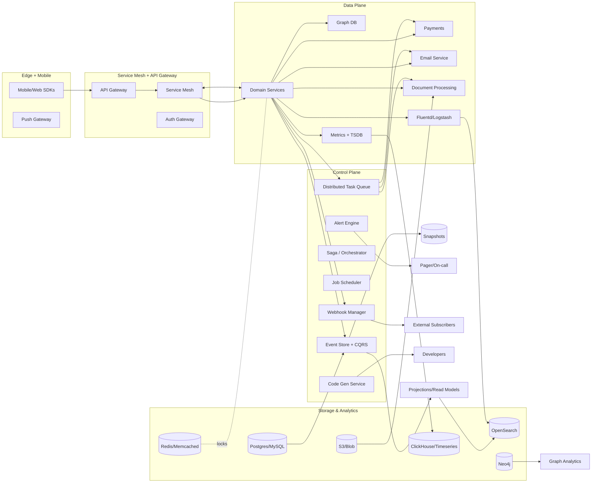

# Ultra Platform Blueprint: Unified Operations, Data, and Reliability Fabric

## High-level summary and 7th-order implications
- Deliver a single control plane that unifies logging, task orchestration, event sourcing, alerting, data replication, analytics, and governance so teams ship features safely while keeping compliance and cost in check.
- Federated observability (logs, metrics, traces) and workflow automation reduce MTTR and provide audit-ready evidence across tenants and regions.
- Event-driven architecture with CQRS and sagas ensures every subsystem (payments, email, document processing, mobile, AB testing, fraud, quotas) remains loosely coupled yet fully traceable.
- Security-first design (data anonymization, least privilege, PCI-ready payments, SPF/DKIM, OAuth/OIDC) minimizes breach impact and supports regional privacy rules.
- Multi-tenancy and per-tenant routing keep noisy neighbors isolated while enabling centralized operations, billing, and white-labeling.
- Forward-looking: add AI-assisted log anomaly detection and code generation to accelerate incident response and development velocity.

## Global architecture

## Domain blueprints
### Log aggregation and analytics
- **Ingestion:** Fluentd/Fluent Bit agents emit to Kafka; Logstash pipelines parse JSON/CEF/CSV with grok and dissect filters. Structured logging enforced in SDKs with request IDs, tenant IDs, and trace IDs.
- **Processing:** Dynamic pipelines select parsers via tag-based routing; GeoIP, PII scrubbing, and hash-based anonymization built-in. Pattern matching via OpenSearch query templates; anomaly detection via unsupervised models (isolation forest) refreshed nightly.
- **Retention & archival:** Hot (7–30 days) in OpenSearch; warm in ClickHouse; cold in S3 with Glacier transition. Compression via zstd; ILM policies per tenant. Index templates enforce mappings and routing shards by tenant.
- **Alerting:** Log-based alert rules feed the alert engine; correlation with metrics/traces using trace IDs.

### Distributed task queue
- **Tech:** Celery (Python) + BullMQ (Node) abstraction with common proto contracts.
- **Features:** Priority queues, scheduled/delayed jobs, chaining and groups, saga-aware callbacks, idempotency keys, exponential backoff with jitter, DLQ with poison pill detection, rate limiting by tenant and worker pool, autoscaling via KEDA (queue depth + CPU) on K8s.
- **Observability:** Prometheus exporters for queue depth, lag, retries; OpenTelemetry spans per task.

### Event sourcing & CQRS
- **Store:** Append-only event store in Postgres with logical replication to analytics; events versioned with upcasters. Snapshots every N events or time-based for large aggregates.
- **Replay:** On-demand replay to rebuild projections; temporal queries allow state reconstruction at time T. Conflict resolution via optimistic concurrency and schema evolution rules.
- **Projections/read models:** Materialize to Postgres read DBs, OpenSearch (search), and ClickHouse (analytics). Projections are deterministic, idempotent, and sharded by tenant.
- **Sagas:** Orchestrate long-running flows (payments, document enrichment, onboarding) using state machines stored in the event store.

### Alerting & incident response
- **Multi-condition rules:** Boolean expression builder across metrics, logs, traces, and business signals; sliding-window aggregation and percentile support.
- **Routing:** Destinations include PagerDuty, Slack, email, SMS; on-call schedules stored in a calendar service; escalation ladders with auto-ack/auto-escalate.
- **Suppression/maintenance:** Silence windows, noise reduction via alert grouping/deduplication, adaptive throttling to prevent fatigue.
- **Runbooks:** Attach playbooks and automation hooks (scripts, Terraform, Kubernetes) for self-healing.

### Data replication & consistency
- **Topologies:** Primary/replica with async replication; multi-primary for select services using CRDT-inspired conflict handlers. Cross-region replication via logical decoding + Debezium into Kafka.
- **Failover:** Automated via orchestrator (Patroni or Orchestrator) with witness nodes and fencing locks; lag monitors with alert thresholds.
- **Consistency checks:** Checksums, row counts, and sampling audits; repair jobs triggered via scheduler.

### Distributed locks & coordination
- **Mechanisms:** Redis Redlock for fast mutex, ZooKeeper for leases and leader election, Postgres advisory locks for coarse tasks. Leases carry TTL + fencing tokens to avoid split-brain. Read/write locks for shared resources; semaphores for concurrency pools.

### Graph database integration
- **Store:** Neo4j for relationship-heavy features (recommendations, fraud rings, service graph). Cypher query templates with schema constraints and indexes; APOC procedures for pathfinding and community detection.
- **Observability:** Query tracing via OpenTelemetry; slow query logs to centralized logging.

### Document processing
- **Pipeline:** Ingest PDFs/images to S3; tasks trigger OCR (Tesseract/Cloud OCR), text + metadata extraction, classification, redaction, versioning. Full-text indexing into OpenSearch; previews via headless Chromium; format conversion via LibreOffice.
- **Governance:** PII detection masks sensitive fields; audit trail via event store.

### Email service integration
- **Providers:** SMTP + SendGrid with provider failover. Templates in MJML/Handlebars; per-tenant branding. Bulk sending via task queue; scheduling with cron expressions.
- **Compliance:** SPF/DKIM/DMARC, bounce/unsubscribe tracking, reputation monitoring.

### Payment processing
- **Gateways:** Stripe + PayPal with webhooks; idempotent charge requests and ledger events. Supports subscriptions, invoices, refunds, retries, SCA flows, multi-currency, and reconciliation jobs.
- **Security:** PCI segmentation, tokenization, and vaulting; fraud hooks feed risk engine.

### Mobile backend services
- **Features:** Push notifications (APNs/FCM), deep links, feature flags, offline sync (conflict resolution via CRDT merges), crash reporting ingestion, receipt validation, device registry, mobile analytics events through event store.

### Social authentication
- **Providers:** Google, GitHub, Facebook via OAuth/OIDC; token refresh + fallback provider logic. Account linking merges profiles; consent tracking stored per tenant.

### A/B testing framework
- **Experiment engine:** Deterministic bucketing with hashing; variant configs via control plane; supports multivariate and personalization. Early stopping via sequential testing; holdouts and guardrail metrics tracked in ClickHouse.

### Job scheduler
- **Capabilities:** Cron-based and calendar-based scheduling; dependency graphs; retries with jitter; timeouts and circuit breakers; monitoring dashboards with execution history.

### Webhook management
- **Registration and delivery:** Secure endpoint registration with HMAC verification; templated payloads; filtering by event type; exponential backoff and DLQ. Webhook explorer for testing and analytics on latency/success.

### Code generation platform
- **Templates:** OpenAPI/GraphQL-driven client/server generators, migration scaffolds, test generators, docs emitters. Plug-in system for languages; integrates with CI to validate generated code freshness.

### Data anonymization & privacy
- **Detection:** PII classifiers for names/emails/IDs; entropy-based detection for secrets. Masking and tokenization pipelines; k-anonymity and differential privacy options for analytics exports.
- **Retention:** Data minimization rules with automatic TTL jobs and deletion certificates.

### Error tracking
- **Stack capture:** Sentry integration with source maps; error grouping/dedup; affected user tracing. Release health and performance monitoring; regression detection that feeds alert engine.

### Fraud detection
- **Signals:** Device fingerprinting, velocity checks, rule engine for thresholds, ML models (gradient boosting) for risk scoring; anomaly detection shared with logs. Feedback loop from payments and disputes.

### Throttling and quotas
- **Controls:** Token bucket and leaky bucket for per-tenant/user/service limits; bandwidth throttling via Envoy filters. Quota dashboards and alerting; override workflows with audit trails.

### Metrics aggregation
- **Stack:** Prometheus + Mimir/Thanos for long-term; histogram and percentile calculations; downsampling and rollups. Metric namespaces/tags enforce cardinality budgets; federation for edge clusters.

### Service registry and traffic resilience
- **Registry:** Consul/etcd-based registry with health checks; metadata-driven routing. Circuit breakers and retries via mesh (Envoy); version-aware routing and dependency catalog.

### Multi-tenancy
- **Isolation:** Tenant-aware DB schemas (schema-per-tenant or row-level security), per-tenant encryption keys, dedicated queues if needed. White-labeling of UI + emails; billing hooks.

### Advanced query builder
- **API:** Declarative JSON DSL mapping to SQL/NoSQL queries with filtering, sorting, pagination, projections, aggregation, and explain plans. Caching layer with ETag/If-None-Match; safety guards for cost-based limits.

### Service mesh observability
- **Telemetry:** Istio/Envoy metrics, distributed tracing, dependency graphs, golden signal dashboards, SLO/SLI definitions per service. Control-plane health alerts and configuration drift detection.

## Delivery and operational safeguards
- **Security:** mTLS in mesh, Vault-backed secrets, signed containers, SBOMs, image scanning, RBAC for control plane, CSP/HTTPS for web.
- **Resilience:** Chaos experiments on queues, databases, and mesh; game days with runbook validation; autoscaling policies tuned via historical data.
- **Testing:** Unit + integration suites, contract tests for APIs/webhooks, property tests for event sourcing invariants, load tests for queues and search, fuzzing for parsers.
- **Governance:** Audit trails via event store; policy-as-code (OPA) for deployment and access approvals; backup/restore runbooks.

## Phased implementation plan
1. **Foundations:** Stand up service mesh, registry, event store, metrics/logging stack, task queues, and baseline alerting; enforce structured logging and tracing.
2. **Workflows:** Implement sagas for payments, document enrichment, and onboarding; enable webhook manager and scheduler; integrate social auth and mobile features.
3. **Data & intelligence:** Activate fraud models, anomaly detection, A/B testing, and privacy pipelines; roll out multi-tenant billing and quota enforcement.
4. **Hardening:** DR drills, replication failovers, chaos testing, performance tuning, and automated runbook validation. Introduce AI-assisted codegen and auto-remediation.

## Forward-looking enhancements
- **Auto-tuning:** Use reinforcement learning to auto-tune queue concurrency, mesh retry budgets, and alert thresholds.
- **Generative runbooks:** Generate remediation steps from past incidents and surface them contextually in the alerting UI.
- **Predictive scaling:** Forecast workload using metrics + event patterns to pre-scale workers, search clusters, and databases.
- **Secure enclaves:** Offload sensitive PII processing to confidential-compute nodes with attestation.
