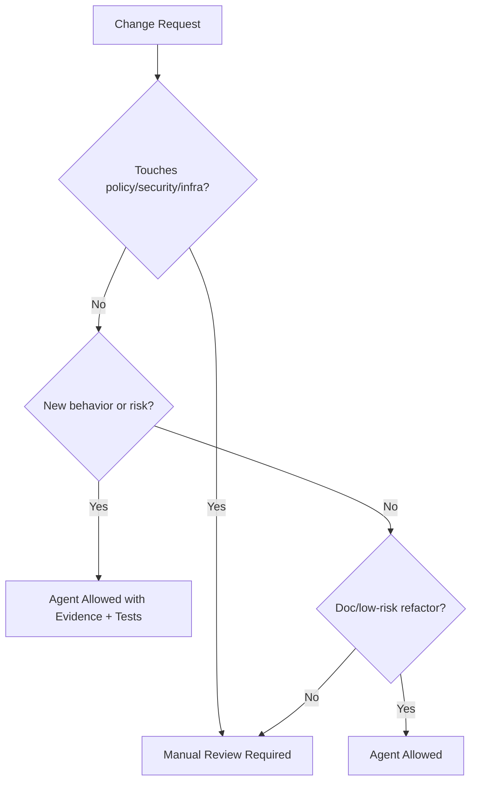

# AI Validation Migration Guide

## Purpose

This guide defines how teams migrate to Prompt Packets and the Agent vs Manual rubric while preserving evidence, governance, and rollback safety.

## Migration Guide

1. Register prompts in `prompts/registry.yaml` and record SHA-256 hashes.
2. Align tasks to `agents/task-spec.schema.json` and store concrete specs under `agents/examples/`.
3. Confirm evidence index entries exist in `evidence/index.json` with report/metrics/stamp mappings.
4. Run `python3 scripts/verify_evidence.py` and `python3 scripts/ci/validate_evidence_schema.py`.
5. Update `docs/roadmap/STATUS.json` when work advances roadmap scope.

## Agent vs Manual Rubric

Use the decision tree below to choose automation or manual handling.

## Rollback Plan

- If validation gates block critical fixes, use `[skip ai-validation]` only with written approval and a follow-up ticket.
- Revert evidence-only changes by restoring the prior `evidence/index.json` and associated report/metrics/stamp files.
- Re-run `python3 scripts/verify_evidence.py` to confirm the evidence bundle is consistent after rollback.
