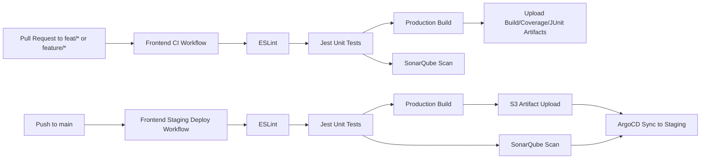

# Frontend CI/CD Pipeline

This document outlines the automated build and deployment flow for the IntelGraph frontend. The new GitHub Actions workflows enforce linting, testing, code-quality analysis, artifact distribution, and deployment through ArgoCD.

## Workflow Overview

- **Pull Request Validation** (`frontend-ci.yml`)
  - Runs on pull requests targeting `feat/**` or `feature/**` branches.
  - Executes ESLint, Jest (with coverage and JUnit output), builds production assets, and performs a SonarQube scan.
  - Publishes build, coverage, and quality reports as workflow artifacts.
- **Staging Deployment** (`frontend-staging-deploy.yml`)
  - Executes on pushes to `main` or when triggered manually.
  - Repeats linting, testing, and build steps before publishing artifacts.
  - Uploads the compiled frontend to S3 and triggers an ArgoCD sync for the staging environment after successful SonarQube analysis.

## Pipeline Diagram

## Secrets and Configuration

| Workflow | Purpose | Required Secrets/Variables |
| --- | --- | --- |
| `frontend-ci.yml` | Pull request linting, testing, build, and SonarQube scan | `SONAR_TOKEN`, `SONAR_HOST_URL` |
| `frontend-staging-deploy.yml` | Build, artifact publication, S3 upload, ArgoCD sync | `SONAR_TOKEN`, `SONAR_HOST_URL`, `AWS_STAGING_ROLE_ARN`, `AWS_REGION`, `S3_STAGING_BUCKET`, `ARGOCD_SERVER`, `ARGOCD_AUTH_TOKEN`, `ARGOCD_STAGING_APP` |

Additional environment variables such as `PNPM_VERSION` and `NODE_VERSION` are defined inside each workflow to standardize runtime versions.

## Local Developer Support

Developers can replicate the CI checks locally using the new scripts:

- `pnpm run client:lint` – run ESLint against the frontend codebase.
- `pnpm run client:test` – execute the Jest suite with CI-aligned options.
- `pnpm run client:build` – produce an optimized build identical to the workflow artifact.
- `pnpm run client:sonar` – invoke the SonarQube scanner using the shared `sonar-project.properties` configuration (requires the Sonar scanner CLI).
- Within `client/`, `pnpm run ci:verify` chains linting, testing, and build steps.

> ℹ️ Install the frontend workspace dependencies with `pnpm install --filter intelgraph-client... --config.shared-workspace-lockfile=false --no-frozen-lockfile` to mirror the CI environment before running the scripts above.

These commands ensure parity between local verification and the automated pipeline.
