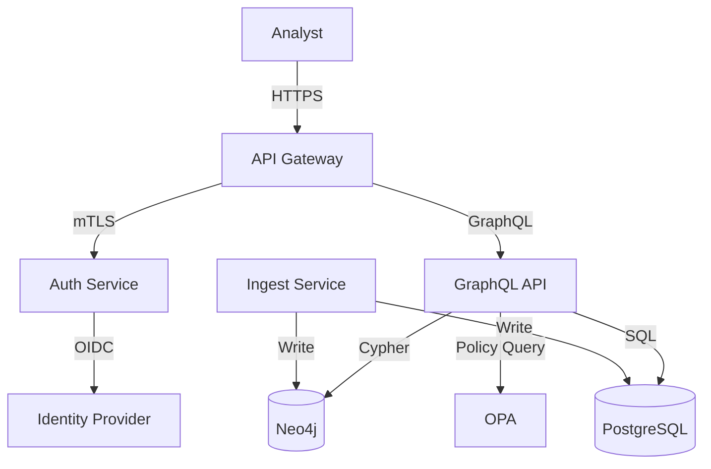

# Prompt 11: Threat Model (STRIDE) + Privacy Design Pack

## Role
Security Architect

## Context
IntelGraph is a SaaS multi-tenant intelligence platform handling sensitive data. Security and privacy are paramount:
- **Threat landscape**: Nation-state actors, insider threats, supply chain attacks
- **Compliance**: GDPR, CCPA, intelligence community regulations
- **Trust**: Customers require evidence of security-by-design

A living security pack ensures continuous threat management and privacy compliance.

## Task
Produce a comprehensive security and privacy design pack:

### 1. STRIDE Threat Model
- Data Flow Diagrams (DFDs) for key workflows
- STRIDE analysis (Spoofing, Tampering, Repudiation, Information Disclosure, Denial of Service, Elevation of Privilege)
- Threat enumeration with severity ratings
- Mitigations mapped to controls

### 2. Abuse & Misuse Cases
- Unauthorized access scenarios
- Data exfiltration attempts
- Insider threats
- Supply chain compromise

### 3. Privacy Design
- Data minimization principles
- Purpose limitation enforcement
- Retention policies
- Field-level encryption strategy

### 4. Key Management Plan
- Key generation and rotation
- Secure storage (HSM, KMS)
- Audit logging for key access

### 5. Warrant & Authority Binding
- Legal hold procedures
- Data export for law enforcement
- Audit trail for warrant execution

### 6. Rollback & Backout
- Policy failure recovery
- Graceful degradation
- Emergency access procedures

## Guardrails

### Security
- **Concrete mitigations** - All threats have actionable controls
- **Traceability** - Mitigations linked to tests and policies
- **Defense in depth** - Multiple layers of controls

### Privacy
- **Privacy by default** - PII redacted unless explicitly authorized
- **Minimal retention** - Data purged according to retention tiers
- **Auditability** - All data access logged

## Deliverables

### 1. Security Pack Directory
- [ ] `security/` directory with:
  - [ ] `THREAT_MODEL.md` - STRIDE analysis
  - [ ] `DFD.md` - Data flow diagrams (Mermaid)
  - [ ] `ABUSE_CASES.md` - Abuse and misuse scenarios
  - [ ] `PRIVACY_DESIGN.md` - Privacy architecture
  - [ ] `KEY_MANAGEMENT.md` - Key management plan
  - [ ] `WARRANT_PROCEDURES.md` - Legal hold and warrant handling
  - [ ] `INCIDENT_RESPONSE.md` - Security incident procedures

### 2. Diagrams
- [ ] Mermaid diagrams for:
  - [ ] System context DFD
  - [ ] Authentication flow
  - [ ] Data ingestion flow
  - [ ] Query execution flow
  - [ ] Export flow

### 3. Controls Matrix
- [ ] `security/CONTROLS_MATRIX.md`:
  - [ ] Threats mapped to mitigations
  - [ ] Mitigations mapped to tests
  - [ ] Mitigations mapped to policies
  - [ ] Verification status (implemented, tested, audited)

### 4. Privacy Checklists
- [ ] `security/PRIVACY_CHECKLIST.md`:
  - [ ] Data inventory
  - [ ] PII fields identified
  - [ ] Retention tiers assigned
  - [ ] Encryption applied
  - [ ] Access controls verified

### 5. Runbooks
- [ ] `RUNBOOKS/security/`:
  - [ ] Breach response
  - [ ] Insider threat investigation
  - [ ] Legal hold execution
  - [ ] Key rotation procedure

## Acceptance Criteria
- ✅ Security review checklist passes
- ✅ All threats have mapped mitigations
- ✅ Mitigations have verification steps (tests, policies, audits)
- ✅ DFDs cover all critical workflows
- ✅ Privacy checklist validated
- ✅ Controls matrix complete and traceable

## STRIDE Threat Model Example

### Data Flow Diagram (Mermaid)



### STRIDE Analysis: API Gateway

| Threat | Description | Severity | Mitigation | Status |
|--------|-------------|----------|------------|--------|
| **Spoofing** | Attacker impersonates legitimate user | High | OIDC authentication, mTLS, JWT signature verification | ✅ Implemented |
| **Tampering** | Attacker modifies GraphQL queries in transit | High | TLS 1.3 encryption, request signing | ✅ Implemented |
| **Repudiation** | User denies performing an action | Medium | Audit logging with immutable provenance ledger | ✅ Implemented |
| **Information Disclosure** | Unauthorized access to sensitive data | Critical | ABAC via OPA, field-level encryption, PII redaction | ✅ Implemented |
| **Denial of Service** | Attacker overwhelms API with requests | High | Rate limiting, query complexity analysis, circuit breakers | ✅ Implemented |
| **Elevation of Privilege** | Attacker gains admin access | Critical | Principle of least privilege, RBAC+ABAC, policy simulation in CI | ✅ Implemented |

## Abuse Cases Example

### Abuse Case 1: Insider Threat - Data Exfiltration

**Scenario**: Authorized analyst attempts to export large volumes of data for unauthorized purposes.

**Attack Vector**:
1. Analyst creates legitimate investigation
2. Queries entire database using broad filters
3. Exports data using signed export bundles
4. Transfers data to external storage

**Mitigations**:
- **Purpose-based access control**: Queries restricted to investigation scope
- **Export size limits**: Alert on exports exceeding threshold (e.g., >10,000 entities)
- **Export approval workflow**: Large exports require manager approval
- **Audit logging**: All exports logged with analyst identity and purpose
- **DLP monitoring**: Detect unusual data access patterns
- **Signed export tracking**: Export bundles include signer identity and timestamp

**Verification**:
- Unit test: Export size limit enforced
- Integration test: Approval workflow triggered for large exports
- Audit test: Export logged in provenance ledger

---

### Abuse Case 2: Supply Chain Compromise - Malicious Dependency

**Scenario**: Attacker compromises npm package used by IntelGraph.

**Attack Vector**:
1. Attacker publishes malicious version of popular dependency
2. IntelGraph CI/CD pulls compromised package
3. Malicious code exfiltrates secrets or data

**Mitigations**:
- **Dependency pinning**: Lock file (pnpm-lock.yaml) with integrity hashes
- **SBOM generation**: CycloneDX SBOM for all releases
- **Vulnerability scanning**: Trivy, Snyk, Dependabot in CI
- **Dependency review**: GitHub Dependency Review Action
- **Provenance attestation**: SLSA Level 3 attestations on builds
- **Least privilege**: Service accounts with minimal permissions
- **Network policies**: Egress filtering in Kubernetes

**Verification**:
- CI test: Dependency review fails on HIGH/CRITICAL vulnerabilities
- CI test: SBOM generated and attached to release
- CI test: Provenance attestation signed and verifiable

## Privacy Design: Field-Level Encryption

```typescript
// libs/crypto/src/field-encryption.ts
import { createCipheriv, createDecipheriv, randomBytes } from 'crypto';

const ALGORITHM = 'aes-256-gcm';
const KEY_LENGTH = 32; // 256 bits
const IV_LENGTH = 16;
const TAG_LENGTH = 16;

export interface EncryptedField {
  ciphertext: string;  // Base64
  iv: string;          // Base64
  tag: string;         // Base64
  keyId: string;       // KMS key identifier
}

export class FieldEncryption {
  constructor(private kms: KMSClient) {}

  async encrypt(plaintext: string, keyId: string): Promise<EncryptedField> {
    // Get data encryption key from KMS
    const dek = await this.kms.generateDataKey(keyId);

    const iv = randomBytes(IV_LENGTH);
    const cipher = createCipheriv(ALGORITHM, dek, iv);

    const ciphertext = Buffer.concat([
      cipher.update(plaintext, 'utf8'),
      cipher.final(),
    ]);

    const tag = cipher.getAuthTag();

    return {
      ciphertext: ciphertext.toString('base64'),
      iv: iv.toString('base64'),
      tag: tag.toString('base64'),
      keyId,
    };
  }

  async decrypt(encrypted: EncryptedField): Promise<string> {
    // Get data encryption key from KMS
    const dek = await this.kms.getDataKey(encrypted.keyId);

    const iv = Buffer.from(encrypted.iv, 'base64');
    const ciphertext = Buffer.from(encrypted.ciphertext, 'base64');
    const tag = Buffer.from(encrypted.tag, 'base64');

    const decipher = createDecipheriv(ALGORITHM, dek, iv);
    decipher.setAuthTag(tag);

    const plaintext = Buffer.concat([
      decipher.update(ciphertext),
      decipher.final(),
    ]);

    return plaintext.toString('utf8');
  }
}
```

## Key Management Plan

### Key Hierarchy
- **Master Key**: Stored in HSM or cloud KMS (AWS KMS, Azure Key Vault, GCP KMS)
- **Data Encryption Keys (DEKs)**: Generated per-entity or per-field
- **Envelope Encryption**: DEKs encrypted with Master Key

### Key Rotation
- **Master Key**: Rotate annually or on compromise
- **DEKs**: Rotate on re-encryption (lazy rotation)

### Key Access Audit
- All key retrieval operations logged
- Audit log stored in immutable storage (S3 with object lock)

```yaml
# security/key-rotation-schedule.yaml
keyRotation:
  masterKey:
    schedule: annually
    lastRotation: 2024-01-15
    nextRotation: 2025-01-15

  dataEncryptionKeys:
    strategy: lazy  # Re-encrypt on access
    targetRotationPeriod: 90 days

  auditLogging:
    enabled: true
    destination: s3://intelgraph-audit-logs/key-access/
    retention: 7 years
```

## Controls Matrix

| Threat | Control | Implementation | Test | Policy | Status |
|--------|---------|----------------|------|--------|--------|
| Unauthorized access | OIDC + mTLS | `services/auth/` | `tests/auth.test.ts` | `policy/tenant-isolation.rego` | ✅ Verified |
| Data exfiltration | Export size limits | `libs/export/` | `tests/export-limits.test.ts` | `policy/export.rego` | ✅ Verified |
| PII disclosure | Field-level encryption | `libs/crypto/` | `tests/encryption.test.ts` | `policy/privacy.rego` | ✅ Verified |
| Insider threat | Audit logging | `libs/provenance/` | `tests/audit.test.ts` | - | ✅ Verified |
| DoS attack | Rate limiting | `api-gateway/middleware/` | `tests/rate-limit.test.ts` | - | ✅ Verified |
| Supply chain | SBOM + Trivy scan | `.github/workflows/ci.yml` | CI job | - | ✅ Verified |

## Related Files
- `/home/user/summit/SECURITY/` - Security documentation
- `/home/user/summit/docs/privacy.md` - Privacy requirements
- `/home/user/summit/policy/` - OPA policies

## Usage with Claude Code

```bash
# Invoke this prompt directly
claude "Execute prompt 11: Threat model and privacy design"

# Or use the slash command (if configured)
/threat-model
```

## Notes
- Use OWASP Threat Modeling methodology
- Conduct threat modeling workshops with engineering and security
- Update threat model on architectural changes
- Integrate threat model review into design phase
- Consider MITRE ATT&CK framework for threat intelligence
