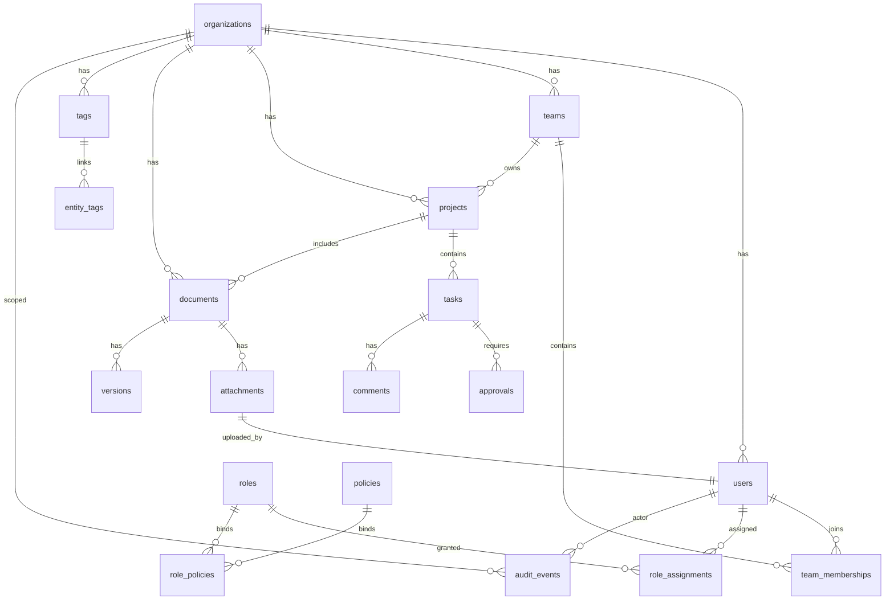

# CompanyOS Multi-Tenant Core Domain & API Contract

## Overview

This document defines the shared domain model, API surface, and operational controls for CompanyOS, a multi-tenant internal operating system. The scope covers Organizations, Users, Teams, Roles, Policies, Documents, Projects, Tasks, Approvals, Comments, Attachments, Tags, and Activity/Audit Events with REST (OpenAPI 3.1) semantics and PostgreSQL+Prisma persistence.

## Entity-Relationship Diagram (ERD)



### Core Tables (selected fields, constraints, indexes)

- **organizations**: `id (pk, uuid)`, `name (text, unique)`, `slug (citext, unique)`, `created_at`, `updated_at`. Index: `name`, `slug`. Constraint: `name != ''`.
- **users**: `id (pk, uuid)`, `tenant_id (fk organizations.id)`, `email (citext, unique within tenant)`, `display_name`, `status (enum: active, disabled, invited)`, `mfa_enabled (bool)`, `created_at`, `updated_at`, `deleted_at (nullable)`. Index: `(tenant_id, email)`, `(tenant_id, status)`, `deleted_at` for soft delete filter.
- **teams**: `id`, `tenant_id`, `name`, `description`, `created_by (fk users.id)`, timestamps, `deleted_at`. Unique index `(tenant_id, name)`.
- **team_memberships**: `id`, `tenant_id`, `team_id`, `user_id`, `role (enum: member, lead)`, `created_at`. Unique `(tenant_id, team_id, user_id)`; fks to teams/users with `ON DELETE CASCADE`.
- **roles**: `id`, `tenant_id`, `key (text)`, `description`, `managed (bool)`. Unique `(tenant_id, key)`.
- **policies**: `id`, `tenant_id`, `name`, `effect (allow|deny)`, `action (text[])`, `resource (text pattern)`, `conditions (jsonb)`, `created_at`, `version`. Index on `(tenant_id, resource)` with GIN on `conditions`.
- **role_policies**: `role_id fk roles`, `policy_id fk policies`, `tenant_id`, composite pk `(role_id, policy_id, tenant_id)`.
- **role_assignments**: `id`, `tenant_id`, `user_id`, `role_id`, `scope_type (organization|team|project)`, `scope_id`, `created_at`. Unique `(tenant_id, user_id, role_id, scope_type, scope_id)`.
- **projects**: `id`, `tenant_id`, `name`, `description`, `owner_team_id fk teams`, `status (enum: planned|active|on_hold|complete)`, timestamps, `deleted_at`. Unique `(tenant_id, name)`; index `(owner_team_id)`.
- **documents**: `id`, `tenant_id`, `project_id fk projects`, `title`, `body`, `search_vector (tsvector)`, `created_by fk users`, timestamps, `deleted_at`. Indexes: GIN on `search_vector`, `(tenant_id, project_id)`.
- **versions** (document versions): `id`, `document_id fk documents`, `tenant_id`, `version_number`, `body`, `created_by fk users`, `created_at`. Unique `(document_id, version_number)`.
- **tasks**: `id`, `tenant_id`, `project_id fk projects`, `title`, `description`, `status (enum: todo|in_progress|blocked|done)`, `assignee_id fk users`, `due_date`, `priority (enum: low|med|high|urgent)`, timestamps, `deleted_at`. Indexes: `(tenant_id, project_id, status)`, `(tenant_id, assignee_id, status)`, GIN on `description` for search.
- **approvals**: `id`, `tenant_id`, `task_id fk tasks`, `requested_by fk users`, `approved_by fk users`, `status (enum: pending|approved|rejected)`, `comment`, `created_at`, `decided_at`. Index `(tenant_id, task_id)`, `(tenant_id, status)`.
- **comments**: `id`, `tenant_id`, `entity_type (task|document|project)`, `entity_id`, `author_id fk users`, `body`, `created_at`, `deleted_at`. Index `(tenant_id, entity_type, entity_id)`; GIN on `body`.
- **attachments**: `id`, `tenant_id`, `entity_type`, `entity_id`, `filename`, `content_type`, `size_bytes`, `storage_uri`, `uploaded_by fk users`, `created_at`. Index `(tenant_id, entity_type, entity_id)`.
- **tags**: `id`, `tenant_id`, `name`, `color`, `created_at`. Unique `(tenant_id, name)`.
- **entity_tags**: `tenant_id`, `tag_id fk tags`, `entity_type`, `entity_id`, `created_at`. Unique `(tenant_id, tag_id, entity_type, entity_id)`.
- **audit_events** (immutable): `id (bigserial)`, `tenant_id`, `actor_id fk users nullable for system`, `actor_type (user|system)`, `entity_type`, `entity_id`, `action`, `metadata jsonb`, `ip`, `user_agent`, `created_at timestamptz default now()`. Indexes: `(tenant_id, entity_type, entity_id)`, `GIN(metadata)`, `created_at desc`.

## Multi-Tenancy Strategy

- **Isolation model**: Shared database with **row-level `tenant_id`** on all tables. Enforce PostgreSQL **Row-Level Security (RLS)** policies per tenant and Prisma middleware injecting `tenant_id` for all queries/mutations.
- **Tenant-aware unique constraints**: All natural keys scoped by `(tenant_id, field)` to avoid cross-tenant collisions; global tables (e.g., feature flags) kept separate.
- **Soft delete**: `deleted_at` nullable timestamp on logical entities; queries default to `WHERE deleted_at IS NULL AND tenant_id = $tenant`.
- **Migration plan**: Migrations created via Prisma migrate; pre-deployment: apply in shadow DB, run smoke tests; deployment: transactional migration with locks per service; post-deployment: RLS validation script ensures policies exist for every table.
- **Data residency option**: Supports optional future tenant-level schema sharding by duplicating schema per cluster; `tenant` registry tracks storage topology. Path keeps same logical model.

## API Contract (REST, OpenAPI 3.1)

- **Base URL**: `/api/v1` (versioned). `X-Tenant-ID` header required and cross-validated with auth token claims.
- **AuthZ hooks**: Each write endpoint calls `authorize(actor, action, resource, scope)` backed by role assignments + policies; audit events written before commit.
- **Pagination**: `page` + `page_size` or cursor (`cursor`, `limit`); default `page_size=25`, max 100. Responses include `total`, `next_cursor`.
- **Filtering & search**: Query params `status`, `assignee_id`, `tag`, `entity_type`, `q` (full-text), `updated_since`. Tag filter joins `entity_tags`. Text search uses `to_tsvector` indexes per tenant.
- **Soft delete semantics**: `DELETE` sets `deleted_at`; restore via `POST /{entity}/{id}/restore` or by patching `deleted_at=null` when authorized.

### Key Endpoint Families (CRUD + search)

- Organizations: `GET /organizations`, `POST /organizations`, `GET /organizations/{id}`, `PATCH /organizations/{id}`, `DELETE /organizations/{id}` (soft), `GET /organizations/search?q=`.
- Users: `GET /users`, `POST /users`, `GET /users/{id}`, `PATCH /users/{id}`, `DELETE /users/{id}`, `POST /users/{id}/roles`, `GET /users/search?q=&status=&team_id=`.
- Teams: `GET /teams`, `POST`, `GET /teams/{id}`, `PATCH`, `DELETE`, `POST /teams/{id}/members`, `DELETE /teams/{id}/members/{user_id}`, `GET /teams/search?q=`.
- Roles & Policies: `GET/POST/PATCH/DELETE /roles`, `GET/POST /policies`, `POST /roles/{id}/policies`, `GET /authorizations/check` (dry-run).
- Projects: `GET/POST/PATCH/DELETE /projects`, `GET /projects/{id}`, `GET /projects/search?q=&tag=`.
- Tasks: `GET/POST/PATCH/DELETE /tasks`, `GET /tasks/{id}`, `POST /tasks/{id}/complete`, `GET /tasks/search?q=&status=&assignee_id=&tag=`.
- Documents & Versions: `GET/POST/PATCH/DELETE /documents`, `GET /documents/{id}`, `POST /documents/{id}/versions`, `GET /documents/{id}/versions`, `GET /documents/search?q=&tag=`.
- Approvals: `POST /tasks/{id}/approvals`, `PATCH /approvals/{id}`, `GET /approvals?status=pending`.
- Comments: `GET/POST/PATCH/DELETE /comments?entity_type=&entity_id=`.
- Attachments: `POST /attachments` (pre-signed URL flow), `GET /attachments/{id}`, `DELETE /attachments/{id}`.
- Tags: `GET/POST/PATCH/DELETE /tags`, `POST /tags/{id}/attach` with `entity_type`+`entity_id`.
- Audit/Activity: `GET /audit-events?entity_type=&entity_id=&actor_id=&action=&since=` (read-only, cursor-based).

## Audit & Activity Event Model (Immutable Log)

- **Write path**: For every mutating endpoint, wrap in transaction: `(1) authorize -> (2) perform mutation -> (3) insert audit_event -> (4) commit`. If audit insert fails, rollback mutation.
- **Schema**: `audit_events` uses append-only table with `INSERT ONLY` privilege; no `UPDATE/DELETE`. `created_at` default `now()`. Partition by `tenant_id` or by month for retention/archival efficiency.
- **Event shape**: `{ id, tenant_id, actor: {id, type}, entity: {type, id}, action, diff, metadata, request_id, ip, user_agent, created_at }`. `diff` stored as JSON Patch for before/after snapshot; `metadata` stores policy decision id for traceability.
- **Consumption**: Downstream Kafka topic `audit.events` fed via logical decoding slot for SIEM and analytics.

## Versioning Approach

- **API**: URI versioning (`/api/v1`), with semantic change policy. Breaking changes require `/api/v2` and dual-run deprecation window; responses include `Deprecation` and `Sunset` headers.
- **Schema migrations**: Prisma migrate files kept in `schema/prisma/migrations`; use `prisma migrate deploy` in CI with shadow DB validation. Backwards-compatible additive changes first; removals guarded by feature flags and multi-phase rollout. `versions` table supports optimistic concurrency via `version_number`.
- **Documentation**: OpenAPI contract auto-generated from source annotations and published per version.

## Representative OpenAPI 3.1 Excerpt (5 endpoints)

```yaml
openapi: 3.1.0
info:
  title: CompanyOS API
  version: 1.0.0
paths:
  /api/v1/projects:
    get:
      summary: List projects
      parameters:
        - in: query; name: q; schema: { type: string }
        - in: query; name: tag; schema: { type: string }
        - in: query; name: status; schema: { type: string, enum: [planned, active, on_hold, complete] }
        - $ref: '#/components/parameters/Pagination'
      responses:
        '200':
          description: Project page
          content:
            application/json:
              schema:
                $ref: '#/components/schemas/PaginatedProjects'
    post:
      summary: Create project
      security: [ { bearerAuth: [] } ]
      requestBody:
        required: true
        content:
          application/json:
            schema: { $ref: '#/components/schemas/ProjectCreate' }
      responses:
        '201': { $ref: '#/components/responses/Project' }
  /api/v1/tasks:
    get:
      summary: Search tasks
      parameters:
        - in: query; name: q; schema: { type: string }
        - in: query; name: assignee_id; schema: { type: string, format: uuid }
        - in: query; name: status; schema: { type: string, enum: [todo, in_progress, blocked, done] }
        - in: query; name: tag; schema: { type: string }
        - $ref: '#/components/parameters/Pagination'
      responses:
        '200': { $ref: '#/components/responses/TaskList' }
    post:
      summary: Create task
      requestBody:
        required: true
        content:
          application/json:
            schema: { $ref: '#/components/schemas/TaskCreate' }
      responses:
        '201': { $ref: '#/components/responses/Task' }
  /api/v1/documents/search:
    get:
      summary: Full-text search documents
      parameters:
        - in: query; name: q; required: true; schema: { type: string }
        - in: query; name: tag; schema: { type: string }
        - $ref: '#/components/parameters/Pagination'
      responses:
        '200': { $ref: '#/components/responses/DocumentList' }
  /api/v1/approvals/{id}:
    patch:
      summary: Update approval decision
      requestBody:
        required: true
        content:
          application/json:
            schema:
              type: object
              properties:
                status: { type: string, enum: [approved, rejected] }
                comment: { type: string }
      responses:
        '200': { $ref: '#/components/responses/Approval' }
  /api/v1/audit-events:
    get:
      summary: List audit events (read-only)
      parameters:
        - in: query; name: entity_type; schema: { type: string }
        - in: query; name: entity_id; schema: { type: string }
        - in: query; name: actor_id; schema: { type: string }
        - in: query; name: since; schema: { type: string, format: date-time }
        - $ref: '#/components/parameters/Cursor'
      responses:
        '200': { $ref: '#/components/responses/AuditEventList' }
components:
  parameters:
    Pagination:
      name: page_size
      in: query
      schema: { type: integer, minimum: 1, maximum: 100 }
    Cursor:
      name: cursor
      in: query
      schema: { type: string }
  schemas:
    ProjectCreate:
      type: object
      required: [name]
      properties:
        name: { type: string }
        description: { type: string }
        owner_team_id: { type: string, format: uuid }
    PaginatedProjects:
      type: object
      properties:
        data: { type: array, items: { $ref: '#/components/schemas/Project' } }
        next_cursor: { type: string, nullable: true }
        total: { type: integer }
    Project:
      type: object
      properties:
        id: { type: string, format: uuid }
        tenant_id: { type: string }
        name: { type: string }
        status: { type: string }
        created_at: { type: string, format: date-time }
    TaskCreate:
      type: object
      required: [title, project_id]
      properties:
        title: { type: string }
        description: { type: string }
        project_id: { type: string, format: uuid }
        assignee_id: { type: string, format: uuid }
        priority: { type: string, enum: [low, med, high, urgent] }
    Task:
      type: object
      properties:
        id: { type: string, format: uuid }
        title: { type: string }
        status: { type: string }
        assignee_id: { type: string, format: uuid }
        tag_ids: { type: array, items: { type: string, format: uuid } }
    TaskList:
      type: object
      properties:
        data: { type: array, items: { $ref: '#/components/schemas/Task' } }
        next_cursor: { type: string, nullable: true }
    DocumentList:
      type: object
      properties:
        data: { type: array, items: { $ref: '#/components/schemas/Document' } }
        next_cursor: { type: string, nullable: true }
    Document:
      type: object
      properties:
        id: { type: string }
        project_id: { type: string }
        title: { type: string }
        tags: { type: array, items: { type: string } }
    Approval:
      type: object
      properties:
        id: { type: string }
        task_id: { type: string }
        status: { type: string }
        comment: { type: string }
    AuditEventList:
      type: object
      properties:
        data: { type: array, items: { $ref: '#/components/schemas/AuditEvent' } }
        next_cursor: { type: string, nullable: true }
    AuditEvent:
      type: object
      properties:
        id: { type: integer }
        entity_type: { type: string }
        entity_id: { type: string }
        action: { type: string }
        actor_id: { type: string, nullable: true }
        created_at: { type: string, format: date-time }
```

## RBAC Hook & Enforcement Notes

- **Policy evaluation**: Use policy engine middleware invoked pre-handler with `tenant_id`, `actor_id`, `action`, `resource`, `context` (tags, entity scope). Cache policy decision results per request to avoid duplicate evaluations.
- **Data-layer guardrails**: Prisma extensions enforce `tenant_id` injection and forbid cross-tenant joins; soft-delete filter added automatically. RLS policies deny cross-tenant access even if app bug occurs.
- **Audit coupling**: `request_id` propagated across services; audit events include policy decision reference for traceability.

## Search & Tagging

- **Text search**: `q` uses `to_tsvector` indexes on `documents.search_vector`, `tasks.description`, `comments.body`. Weighted columns prioritize titles.
- **Tag search**: `tag` filter joins `entity_tags`; supports multiple tags via `tag=tag1&tag=tag2` (intersection) or `tag_any` for union.
- **Entity-type filtering**: Search endpoints accept `entity_type` to filter across projects, tasks, documents when using unified search (optional `/search` gateway).

## Resilience & Forward-Looking Enhancements

- **Innovation**: Adopt **attribute-based access control (ABAC) overlays** atop RBAC by extending `policies.conditions` to support CEL expressions; enables dynamic contextual checks (e.g., "only approvers in same team and within business hours").
- **Performance**: Monthly partitioning on `audit_events` and `comments` to reduce index bloat; background workers compact old partitions to cold storage.
- **Observability**: Every request emits structured logs with `tenant_id`, `actor_id`, `resource`, `policy_decision_id`, and `latency_ms`; metrics exported via OpenTelemetry to enforce SLOs on authorization latency and audit write success.
