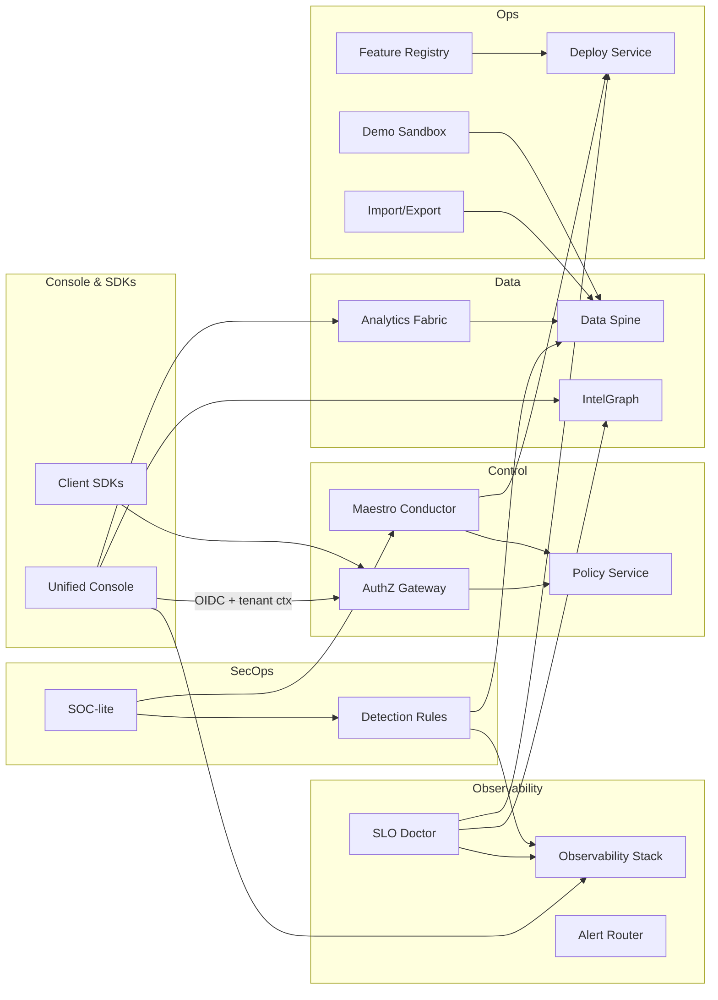

# CompanyOS Wave 4 Blueprints (Prompts 25–32)

This document captures v1 blueprints for the fourth wave of CompanyOS initiatives spanning console UX, analytics, SLO coaching, security operations, change management, tenant data pipelines, client SDKs, and partner demo sandboxing. Each section includes an ADR-style decision log, information architecture, integrations, UX patterns, workflows, and clear definition-of-done checklists.

## Cross-Cutting Foundations
- **Identity & tenancy:** All surfaces honor explicit tenant + environment context, propagate correlation IDs, and require purpose binding for cross-tenant access. RBAC/ABAC policies are enforced at the edge and revalidated in each service call.
- **Evidence & auditability:** Actions emit signed audit events with request IDs and user/role context. Evidence packs (deploy verifications, import/export validations, playbook runs) are stored with lineage in the Data Spine and linked via IntelGraph.
- **Resilience & safety:** Zero-downtime defaults, circuit breakers for downstream dependencies, feature-flag gates for rollout, and rate limits tuned per tenant tier. All flows specify timeouts, retries with jitter, and compensating actions.
- **Observability:** Standard telemetry envelope (structured logs, traces, SLI/SLO metrics) with per-tenant tagging and budget burn alerts. Every workflow specifies primary SLIs, alert routes, and noisy-alert guardrails.
- **Data protection:** PII minimization, residency-aware routing, encryption in transit/at rest, and export/import watermarking.
- **Definition of Ready:** Each capability requires wiring in API contracts, auth scopes, dashboards, runbooks, and sample data so it can be demoed or productionalized without additional scaffolding.

### Shared Reference Architecture (Mermaid)

## 25) CompanyOS Console v1 (Unified Admin & Operator Front Door)

### ADR — Console Model
- **Personas:** platform engineer (service topology, deployments), SRE (SLOs, incidents), security analyst (policies, audit), tenant admin (configuration, feature flags, billing views).
- **Navigation pillars:** Services, Tenants, Deployments, Incidents, Policies. Global utility bar for search, user/session controls, environment switcher, and notifications.
- **Multi-tenant principles:**
  - Tenant context is always explicit (scoped breadcrumbs + environment chip).
  - RBAC/ABAC drives visibility and available actions; controls render disabled with rationale when ineligible.
  - Cross-tenant views only for users with elevated scopes and purpose binding (e.g., investigations) with audit stamps.
  - Safe defaults: read-first pages with progressive disclosure for mutations and mandatory step-up auth for high-risk actions.

### Information Architecture
- **Home overview:** service health (SLO conformance, active alerts), recent deployments with evidence packs, current incidents by severity, tenant spotlight (recent config changes, active feature flags).
- **Service detail:** health summary, SLOs, dependencies map, deployments timeline (build → deploy → verification), evidence packs, open incidents, runbooks.
- **Tenant detail:** configuration, feature flags with effective policy view, data residency posture, recent admin actions.
- **Incidents:** list and drill-down with timeline, responders, linked dashboards, and Maestro tasks.
- **Policies:** catalog of policies, evaluation results, and exceptions per tenant/service.

### Integrations
- Pluggable panels for observability (Grafana/Loki/Prometheus), Maestro plans/runs (rollouts, remediations), and IntelGraph audit views (“what changed?” with entity relationships).

### UX Patterns
- Global search across services, incidents, tenants with typeahead and scoped filters.
- “Inspect entity” side panel exposing IntelGraph, audit trail, logs/metrics links, and permitted inline actions.
- Safe inline actions: confirmations with impact summary, step-up auth for risky items (e.g., policy edits, tenant-wide config), dry-run previews when possible.

### Definition of Done
- Navigate to a service to view health, SLO status, deployments, and evidence packs.
- Navigate to a tenant to view configuration, feature flags, and effective policies.
- Operator walkthrough documented: on-call flow from alert → incident → service/tenant context → remediation via Maestro.

### Operator Walkthrough (Condensed)
1. Alert from Observability posts to console inbox with service + tenant context, severity, and SLO budget impact.
2. Clicking the alert opens the incident page with the “inspect entity” panel preloaded (logs, metrics, audit, related deploys).
3. On-call can trigger a safe inline action (e.g., rollback deployment) gated by step-up auth; Maestro plan executes with live
   status and emits evidence to IntelGraph.
4. Post-action verification panel shows SLO burn-down, error-budget delta, and linked runbook checkboxes for handoff.

## 26) Analytics & Reporting Fabric v1 (Multi-Tenant Product Analytics)

### ADR — Analytics Model
- **Event taxonomy:**
  - Product events (feature usage, UI flows, experiments) vs. Ops events (deploys, incidents, policy decisions, SLO breaches).
- **Core dimensions:** tenant, user role, feature, region, environment, client type, version, residency tier.
- **Privacy/PII controls:** classification tags, minimization (hashed user IDs), residency-aware routing, DLP guards tied to Data Spine and Privacy Kit.

### Ingestion & Storage
- Streaming ingestion from services/frontends with validation; partitioned by tenant + region.
- Normalization pipeline: schema registry, enrichment (role, feature flags), consent checks.
- Storage: hot (columnar warehouse) + cold (object storage) with row-level tenant filters; materialized views for canned reports; Presto/Trino/ClickHouse adapters for ad-hoc queries.

### Reporting & Dashboards
- Built-in reports: feature adoption per tenant/role, retention and WAU/MAU, operational KPIs (uptime, latency percentiles) exposed to tenant admins.

### Tenant-Facing Views
- Minimal console: time/feature/environment filters, cohort comparisons, export with residency + DLP checks and watermarking; scheduled reports with delivery policies.

### Definition of Done
- Two demo tenants with contrasting usage profiles.
- Example report: Feature X adoption over last 30 days by tenant and role (prebuilt SQL + dashboard card).
- Runbook for feature teams to instrument events, verify pipelines, and read analytics.

### Example Report & Queries
- **Feature X adoption (30d):** materialized view keyed by tenant, role, feature flag state; KPI cards for DAU/WAU/MAU deltas and
  P90 latency overlay.
- **Safety checks:** every export honors residency tag; dashboards include “data freshness” badge and sampling notice.
- **Run instrumentation steps:** add event to schema registry → validate in staging → verify partition routing (tenant/region) →
  smoke query in hot store → publish report to tenants with release note.

## 27) SLO Doctor & Performance Coach v1

### ADR — SLO Knowledge Model
- Standard SLOs: availability, latency, error rate, freshness/backlog for async flows.
- Mapping: SLO → SLIs (per endpoint/task) → metrics sources (APM, logs, RUM, queue stats).
- Heuristics: alert noise scoring (pages per SLO vs burn rate), tight/loose threshold detection, dependency sensitivity (upstream failure contribution), regression detection via error-budget burn anomalies.

### Data Integration
- Inputs: SLO configs from Observability, time series + alert history, incidents/postmortems from IntelGraph/Audit, deployment metadata for correlation.

### Analysis Engine
- Detects noisy alerts, misaligned SLOs, recurring hotspots (endpoints, regions, tenants), dependency issues, and capacity/caching opportunities.
- Recommendations: threshold tuning, alert window changes, request hedging/caching, capacity or circuit-breaker settings, runbook links, and suggested Maestro remediation plans.

### UX & Surfacing
- Doctor view in Console: per-service health report, recommended actions with confidence and expected noise reduction, deep links to dashboards/runbooks; optional LLM summarization for exec-friendly notes.

### Definition of Done
- At least one service with generated SLO health report.
- At least one actionable recommendation to reduce pager noise or improve reliability.
- Doc: how teams use SLO Doctor during reliability reviews.

### Sample SLO Health Report Structure
- **Executive summary:** burn rate, noisy-alert score, top 3 recommendations with expected impact (% pager reduction, error-budget
  saved).
- **Findings:** hotspots by endpoint/region/tenant, dependency contribution, regression windows aligned to deploy IDs.
- **Actions:** auto-tunable thresholds, suggested alert windows, Maestro remediation plan links, and rollback candidates.
- **Follow-up:** owner, due date, success metric, and verification queries (e.g., error rate P95 < threshold for 7d).

## 28) SecOps & Threat Detection Spine v1 (SOC-lite)

### ADR — Threat Model
- Priority classes: account takeover, token theft, privilege abuse, supply-chain anomalies.
- Signals: auth anomalies (MFA bypass attempts, geo-velocity), policy denials spikes, unusual deploys/config changes, registry/package integrity alerts.

### Signal Ingest
- Integrations: Audit Spine (auth, policy decisions, sensitive actions), infra/network logs, normalized security-event schema with tenant + asset + user principal.

### Detection Rules & Playbooks
- Initial rules: suspicious login patterns, excessive policy denials, unexpected admin actions/config changes, sudden permission escalations, anomalous deploy paths.
- Maestro-integrated playbooks: lock account, rotate keys/credentials, enforce step-up auth, increase logging, rollback deploy, isolate workload.

### SOC Console
- Views: open alerts with severity/owner, event timelines with correlated context, IntelGraph one-click for relationships, response playbook launcher with audit stamps.

### Definition of Done
- Simulated attack scenarios generating alerts.
- At least one end-to-end response drill executed via platform.
- Runbook: triage and response steps for new security alerts.

### Detection & Response Flow
1. Normalized security event ingested (with tenant/asset labels) triggers detection rule → alert created with severity rubric.
2. SOC console auto-enriches with IntelGraph neighbors (recent deploys, policy changes, related incidents) and UEBA risk score.
3. Analyst selects Maestro playbook (e.g., lock account + rotate token) with step-up auth; actions produce audit + evidence pack.
4. Post-playbook verification checks (login attempts, policy denials) and auto-creates follow-up tasks with SLA.

## 29) Change & Feature Lifecycle v1 (ProductOps Fabric)

### ADR — Lifecycle Model
- Feature states: idea → experiment → beta → GA → sunset.
- Relationships: features map to flags, releases, tenants/environments; evidence requirements per state (designs, KPIs, risk/controls, SLO checks, security signoff).

### Feature Registry
- Central catalog capturing metadata (owner, objectives, KPIs), links to flags/code/docs, IntelGraph relationships, and evidence automation hooks.

### Workflow Automation
- Requests for tenant rollout with approvals and automated risk checks (SLO health, security posture, compliance constraints); Maestro plans for rollout/rollback.

### Experimentation Hooks
- Control/variant definitions, feature-flag wiring, analytics bindings for experiment metrics and guardrails.

### Definition of Done
- At least one feature tracked end-to-end through the lifecycle with evidence.
- Feature review template for decision meetings.
- Dashboard: features by state with status and owners.

### Feature Review Template (Essentials)
- **Problem & hypothesis:** KPI target, risk/guardrail SLOs, supported personas/tenants.
- **Readiness:** experiment results, security/privacy review, SLO health gate, dependency risks, rollout blast radius.
- **Controls:** flags per tenant/env, rollback plan, communication plan, evidence links (docs, dashboards, runbooks).
- **Decision & owners:** approver list, DRI, next checkpoint date, exit criteria for beta/GA.

## 30) Tenant Data On/Off-Ramp v1 (Data Import/Export & Migration)

### ADR — Migration Model
- Supported formats: NDJSON/JSONL, CSV with schemas, Parquet; checksums for integrity.
- Validation/trust: schema validation, classification tags, PII detection, residency tagging; SLA and throttling for large migrations with staged checkpoints.

### Import Pipelines
- Ingest framework that validates schema/classification, runs DLP/privacy checks, writes to Data Spine with lineage and quarantine for failures; resumable jobs with chunk-level status.

### Export Pipelines
- Tenant-initiated exports honoring residency and DLP, redaction policies, signed export packs with lineage and validation evidence; audit events for start/complete/cancel.

### Admin UX & Status
- Admin UI to start/monitor/cancel imports/exports, view errors/partial failures, retry options, and estimated completion with throughput metrics.

### Definition of Done
- Demo tenant fully imported from sample dataset.
- Sample export pack with lineage and validation results.
- Runbook: how to execute large tenant migrations safely.

### Migration Runbook (Happy Path)
1. Pre-flight: verify schema + classification tags, residency constraints, and quota limits; stage checksum manifest in object
   store.
2. Import: start job with chunking + retries; quarantine failures; stream lineage + validation results to evidence pack.
3. Validation: run DLP + residency attestations, sample row audit, and reconciliation counts vs manifest.
4. Export: tenant-initiated request creates signed package with watermarking, redaction policy, and audit trail for start/stop.
5. Post-run: dashboard shows throughput, errors, retries; runbook captures rollback/cleanup steps and RPO/RTO achieved.

## 31) Client SDK & Edge Access Kit v1 (Web, Mobile, CLI)

### ADR — Client Model
- Platforms: TypeScript web, baseline mobile (React Native-friendly), CLI (Node-based).
- Auth: OIDC/OAuth with PKCE, token refresh, step-up flows for privileged actions; tenant + environment selection baked into client context.

### Core SDK Features
- Shared auth handling and auto-refresh, typed API clients (OpenAPI-generated), built-in telemetry (logs, perf, UX events), correlation IDs.

### Offline & Edge Considerations
- Optional offline queue with retry/backoff, cache with encryption for PII, edge-friendly mode for latency-sensitive calls.

### Developer Experience
- Quickstarts: web app with login + sample API calls; CLI for tenant/service interactions (list services, trigger runs); versioning/release guidance (semver, changelogs, signed artifacts).

### Definition of Done
- At least one internal tool or demo app built solely on the SDK.
- Client integration guide for partner developers.

### SDK Quickstarts & Safety Rails
- **Web:** login via OIDC/PKCE, tenant/environment selector, typed client (OpenAPI codegen), auto-refresh tokens, telemetry
  interceptors with correlation IDs.
- **CLI:** commands for listing tenants/services, triggering Maestro plans, tailing logs with tenant filters; supports device code
  auth and offline queue with encrypted cache.
- **Mobile:** token storage with secure enclave/keystore, background retry queue with backoff, PII-safe logging.
- **Release hygiene:** semver, signed artifacts, changelog template, and smoke-test matrix (web/node) per release.

## 32) Partner & Demo Sandbox v1 (Sales & CS Railhead)

### ADR — Sandbox Model
- Environments: production vs staging vs sandbox separation; sandbox uses synthetic/anonymized data with guardrails (rate limits, restricted actions, capped quotas).

### Demo Tenants & Scenarios
- Preconfigured tenants:
  - Ops-heavy: seeded incidents, SLOs, releases, noisy alerts to showcase SLO Doctor and SOC-lite.
  - Admin-heavy: multi-tenant config, analytics cards, feature lifecycle examples.
- Scripted events: deployments, incidents, usage bursts to keep data fresh.

### Self-Service Trials
- Flow to create time-limited trial tenants with guided tours/checklists for value moments; auto-expiry with export option respecting residency.

### Sales & CS Tooling
- Playbooks and console helpers: “start a demo in 5 minutes,” reset tenant to known state, capture feedback from demo/trial usage.

### Definition of Done
- Sales/CS can run a compelling end-to-end demo without engineering help.
- Demo handbook with recommended stories/paths and reset procedures.

### Demo & Reset Toolkit
- **Demo scripts:** ops-heavy (incident → SLO Doctor → rollback) and admin-heavy (feature lifecycle → analytics card → export).
- **Self-service trials:** timed tenants with auto-expiry, guardrail policies (rate limits, blocked destructive actions), and
  guided tours.
- **Reset:** one-click reset to seeded state via Maestro plan; telemetry dashboard tracks demo completion and feedback form
  submission for follow-up.

