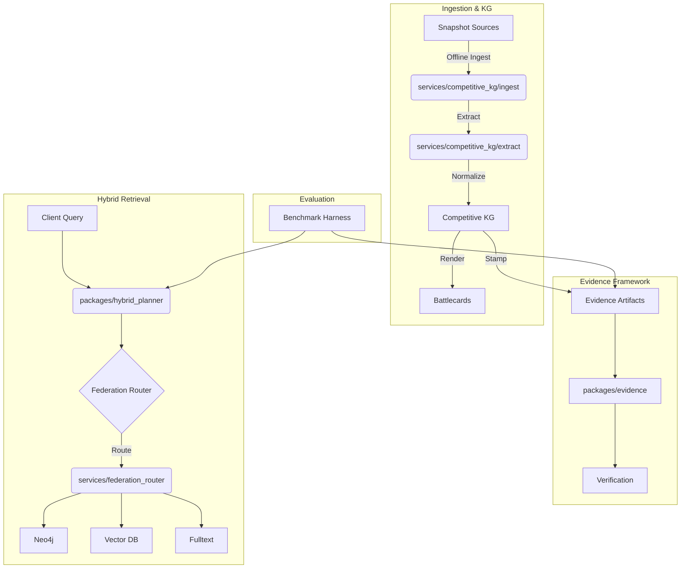

# Competitive Intelligence & Hybrid Retrieval Architecture

This directory contains documentation and architecture for the Competitive Knowledge Graph (KG), Hybrid Retrieval Planner, and Federation Router.

## Component Diagram

## Overview

### Competitive KG
Ingests competitive intelligence data (snapshots) to produce deterministic evidence and battlecards.
Located in: `services/competitive_kg`

### Hybrid Retrieval Planner
Plans queries across graph, vector, and full-text engines.
Located in: `packages/hybrid_planner`

### Federation Router
Routes queries to appropriate data sources enforcing residency and policy.
Located in: `services/federation_router`

## Evidence
Strict schema-based evidence generation.
Schemas in: `packages/evidence/schemas`

## PR Roadmap

### PR-1: Repo Scaffolding
*   Directory structure for `services/competitive_kg`, `packages/evidence`, `docs/competitive`.
*   Initial schemas and documentation.

### PR-2: Source Snapshot Ingestion
*   Ingestion scripts in `services/competitive_kg/ingest`.
*   Offline-first processing of HTML/PDF.

### PR-3: Claim Extractor & Capability Taxonomy
*   Implementation of claim extraction in `services/competitive_kg/extract`.
*   Capability taxonomy definition.

### PR-4: Battlecard Generator
*   Rendering logic in `services/competitive_kg/render`.
*   Deterministic markdown generation.

### PR-5: Benchmark Harness
*   Scaffolding for benchmark runners and evaluation.
