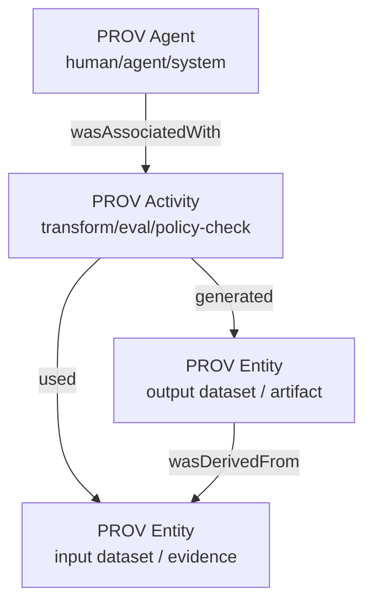

# PROV-JSON Mapping Specification

**Status:** Draft / Adopted
**Standards:** W3C PROV-DM, PROV-JSON

## Overview

This document defines how Summit's internal provenance concepts map to the W3C PROV standard. By projecting our system events into this standard model, we ensure that our compliance evidence is interoperable and verifiable by standard PROV validators.

## Semantic Model

The core of our mapping relies on the relationships between Agents, Activities, and Entities.

### Diagram: PROV Semantic Model

## Canonical Mappings

We map Summit's domain objects to the three core PROV types as follows:

### 1. PROV Agent
*Represents an entity that bears responsibility for an activity taking place.*

| Summit Concept | Mapped PROV Type | Description |
| :--- | :--- | :--- |
| **User** | `prov:Person` | A human user initiating an action. |
| **Service Account** | `prov:SoftwareAgent` | A system service or daemon (e.g., `ingestion-worker`). |
| **Policy** | `prov:Plan` | A governance policy or rule definition that guides execution. |
| **Model** | `prov:SoftwareAgent` | An AI model instance (e.g., `gpt-4`, `llama-3`). |

### 2. PROV Activity
*Represents dynamic aspects of the world, such as actions, processes, etc.*

| Summit Concept | Mapped PROV Type | Description |
| :--- | :--- | :--- |
| **Transformation** | `prov:Activity` | A data processing job (ETL, normalization). |
| **Evaluation** | `prov:Activity` | A policy check or model evaluation run. |
| **Deployment** | `prov:Activity` | The act of deploying code or configuration. |
| **Audit** | `prov:Activity` | A compliance verification step. |

### 3. PROV Entity
*Represents physical, digital, conceptual, or other kinds of things with some fixed aspects.*

| Summit Concept | Mapped PROV Type | Description |
| :--- | :--- | :--- |
| **Artifact** | `prov:Entity` | A build artifact, binary, or docker image. |
| **Dataset** | `prov:Entity` | A specific version of a dataset (table, file). |
| **Evidence** | `prov:Entity` | A compliance record, log entry, or test result. |
| **Prompt** | `prov:Entity` | A versioned prompt template. |

## Relationships

*   **wasAssociatedWith**: An `Activity` was associated with an `Agent` (e.g., "The `Build` activity was run by `User A`").
*   **used**: An `Activity` used an `Entity` (e.g., "The `Eval` activity used `Dataset X`").
*   **generated**: An `Activity` generated an `Entity` (e.g., "The `Eval` activity generated `Score Y`").
*   **wasDerivedFrom**: An `Entity` was derived from another `Entity` (e.g., "`Score Y` was derived from `Dataset X`").

## Determinism Contract

To ensure stable hashes for signatures:
1.  **Keys**: All keys in the JSON object must be sorted alphabetically.
2.  **Identifiers**: All internal IDs must be stable and deterministic (no UUIDv4).
3.  **Time**: Timestamps must be ISO 8601 UTC.
