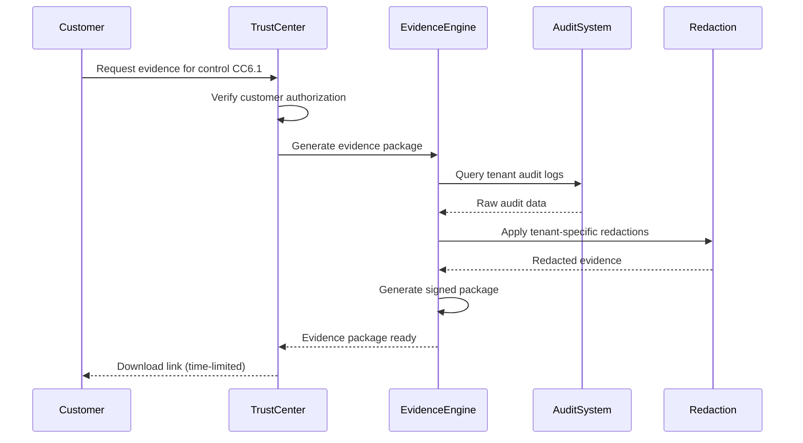
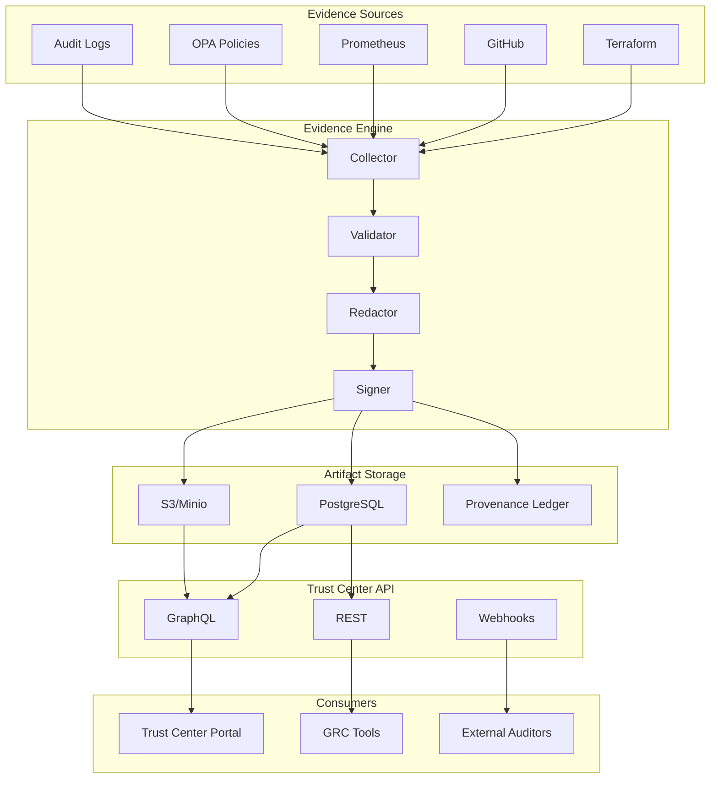

# Trust Center & Regulatory Packs v0

> **Version**: 0.1.0
> **Last Updated**: 2025-12-07
> **Status**: Active Development
> **Owner**: Regulatory Packs, Trust Center & Customer Assurance Team

---

## Executive Summary

The Trust Center & Regulatory Packs system transforms CompanyOS's compliance posture into a **product**—providing customers with self-service access to security documentation, compliance certifications, and control evidence powered directly by CompanyOS telemetry.

### Key Objectives

1. **Automate Evidence Collection**: Eliminate manual spreadsheet work by generating evidence from live systems
2. **Self-Service Trust Center**: Enable customers to access compliance artifacts without support tickets
3. **Regulatory Pack Library**: Pre-built compliance packages for SOC 2, ISO 27001, HIPAA, FedRAMP, and more
4. **Real-Time Assurance**: Live dashboards showing control effectiveness and SLO compliance
5. **Multi-Tenant Scoping**: Tenant-specific evidence with appropriate redaction of sensitive details

---

## Table of Contents

1. [Assurance Artifacts Model](#1-assurance-artifacts-model)
2. [Trust Center Experience](#2-trust-center-experience)
3. [Regulatory Packs](#3-regulatory-packs)
4. [Control-to-Evidence Mapping](#4-control-to-evidence-mapping)
5. [Architecture](#5-architecture)
6. [API Specification](#6-api-specification)
7. [Implementation Roadmap](#7-implementation-roadmap)

---

## 1. Assurance Artifacts Model

### 1.1 Artifact Types

| Artifact Type | Description | Retention | Access Level |
|---------------|-------------|-----------|--------------|
| **Control Description** | Human-readable control narrative with technical implementation details | Indefinite | Public |
| **Test Procedure** | Automated or manual test steps validating control effectiveness | Indefinite | Customer |
| **Evidence Snapshot** | Point-in-time capture of system state proving control operation | 7 years | Customer (scoped) |
| **Compliance Report** | Aggregated assessment across multiple controls | 7 years | Customer |
| **Attestation** | Signed statement by authorized personnel | 7 years | Customer |
| **Certification** | Third-party audit certification (SOC 2, ISO, etc.) | 7 years | Customer (NDA) |
| **Penetration Test Summary** | Redacted findings from security assessments | 3 years | Customer (NDA) |
| **SLO Dashboard** | Real-time service level metrics | Live | Public |

### 1.2 Artifact Data Model

```typescript
interface AssuranceArtifact {
  id: string;                          // UUID v7 (time-sortable)
  type: ArtifactType;
  version: string;                     // Semantic versioning
  status: 'draft' | 'published' | 'superseded' | 'archived';

  // Metadata
  title: string;
  description: string;
  frameworkMappings: FrameworkMapping[];
  controlIds: string[];

  // Content
  content: ArtifactContent;
  attachments: Attachment[];

  // Provenance
  createdAt: ISO8601DateTime;
  createdBy: ActorReference;
  publishedAt?: ISO8601DateTime;
  expiresAt?: ISO8601DateTime;

  // Scoping
  scope: ArtifactScope;
  classification: DataClassification;

  // Integrity
  contentHash: string;                 // SHA-256
  signature?: CryptographicSignature;
  provenanceChainId?: string;
}

interface FrameworkMapping {
  framework: ComplianceFramework;
  controlId: string;                   // e.g., "CC6.1", "A.9.4.1"
  requirement: string;
  mappingConfidence: 'exact' | 'partial' | 'related';
}

interface ArtifactScope {
  level: 'platform' | 'tenant' | 'workspace';
  tenantId?: string;
  workspaceId?: string;
  redactionRules: RedactionRule[];
}

type ComplianceFramework =
  | 'SOC2_TYPE_I'
  | 'SOC2_TYPE_II'
  | 'ISO_27001'
  | 'ISO_27017'
  | 'ISO_27018'
  | 'HIPAA'
  | 'HITRUST'
  | 'FEDRAMP_MODERATE'
  | 'FEDRAMP_HIGH'
  | 'PCI_DSS_4'
  | 'GDPR'
  | 'CCPA'
  | 'SOX'
  | 'NIST_CSF'
  | 'NIST_800_53'
  | 'CIS_CONTROLS';
```

### 1.3 Platform vs. Tenant Evidence

| Evidence Type | Scope | Examples |
|---------------|-------|----------|
| **Platform-Level** | Shared infrastructure controls | Network security, physical security, encryption at rest, vendor management |
| **Tenant-Level** | Customer-specific controls | Access logs for tenant users, tenant data retention, tenant-specific configurations |
| **Hybrid** | Platform + tenant overlay | Audit logs (platform system + tenant activity), SLOs (platform + tenant-specific) |

---

## 2. Trust Center Experience

### 2.1 Public Trust Center Portal

**URL**: `https://trust.companyos.io`

#### Self-Service Features

| Feature | Access | Description |
|---------|--------|-------------|
| **Security Overview** | Public | High-level security architecture and practices |
| **Compliance Certifications** | Public | List of active certifications with validity periods |
| **Service Status** | Public | Real-time uptime and incident history |
| **SLO Dashboard** | Public | Current SLO metrics (availability, latency, durability) |
| **Security Whitepaper** | Public | Downloadable technical security documentation |
| **Subprocessor List** | Public | Current list of data subprocessors |

#### Authenticated Customer Features

| Feature | Access | Description |
|---------|--------|-------------|
| **Compliance Reports** | Customer | SOC 2 Type II reports, ISO certificates |
| **Penetration Test Summaries** | NDA Required | Redacted annual pentest findings |
| **Control Evidence** | Customer | Tenant-scoped evidence snapshots |
| **Security Questionnaire API** | Customer | Programmatic access for GRC tool integration |
| **Custom Evidence Requests** | Customer | Request specific evidence for audits |
| **Audit Log Export** | Customer | Export tenant-specific audit logs |

### 2.2 Trust Center UI Components

```
┌─────────────────────────────────────────────────────────────────┐
│  COMPANYOS TRUST CENTER                          [Login] [Docs] │
├─────────────────────────────────────────────────────────────────┤
│                                                                 │
│  ┌─────────────┐  ┌─────────────┐  ┌─────────────┐             │
│  │ ✓ SOC 2    │  │ ✓ ISO 27001│  │ ✓ HIPAA    │             │
│  │ Type II    │  │ Certified  │  │ Compliant  │             │
│  │ Valid: 2025│  │ Valid: 2026│  │ BAA Ready  │             │
│  └─────────────┘  └─────────────┘  └─────────────┘             │
│                                                                 │
│  ┌─ CURRENT SERVICE STATUS ─────────────────────────────────┐  │
│  │ ● API Services         99.99%  ████████████████████ ▲    │  │
│  │ ● Graph Database       99.95%  ███████████████████▌ ▲    │  │
│  │ ● AI/ML Services       99.90%  ███████████████████  ●    │  │
│  │ ● Storage Services     99.99%  ████████████████████ ▲    │  │
│  └──────────────────────────────────────────────────────────┘  │
│                                                                 │
│  ┌─ SECURITY HIGHLIGHTS ────────────────────────────────────┐  │
│  │ • End-to-end encryption (TLS 1.3 + AES-256-GCM)         │  │
│  │ • Zero-trust architecture with continuous verification   │  │
│  │ • SOC 2 Type II audited annually by [Auditor]           │  │
│  │ • 24/7 security monitoring with <15min response SLA     │  │
│  └──────────────────────────────────────────────────────────┘  │
│                                                                 │
│  [Download Security Whitepaper]  [View All Certifications]     │
│  [Request Compliance Package]    [Contact Security Team]       │
│                                                                 │
└─────────────────────────────────────────────────────────────────┘
```

### 2.3 Evidence Request Workflow



### 2.4 Multi-Tenant Redaction Rules

| Data Category | Redaction Rule | Example |
|---------------|----------------|---------|
| **Other Tenant IDs** | Full replacement | `tenant_abc` → `[REDACTED_TENANT]` |
| **Internal IPs** | Network masking | `10.0.45.67` → `10.0.x.x` |
| **Employee Names** | Role replacement | `jane.doe@company.io` → `[ADMIN_USER]` |
| **Internal Systems** | Generic labels | `prod-neo4j-03` → `[DATABASE_SERVER]` |
| **Secrets/Keys** | Full removal | `sk_live_xxx` → `[CREDENTIAL]` |
| **Investigation Data** | Tenant filter | Only show requesting tenant's data |

---

## 3. Regulatory Packs

### 3.1 Pack Structure

```yaml
# regulatory-pack.yaml
id: soc2-type-ii-2025
name: SOC 2 Type II Compliance Pack
version: "2025.1"
framework: SOC2_TYPE_II
status: active

metadata:
  audit_period: "2024-01-01/2024-12-31"
  auditor: "Example Audit Firm LLP"
  certification_date: "2025-02-15"
  expiration_date: "2026-02-15"

controls:
  - id: CC6.1
    title: "Logical Access Security"
    description: |
      The entity implements logical access security software,
      infrastructure, and architectures over protected information
      assets to protect them from security events.

    evidence_sources:
      - type: audit_log
        query: "auth.* AND outcome:success OR outcome:failure"
        retention: 7y

      - type: configuration
        source: opa_policies
        path: "/policies/abac.rego"

      - type: metric
        source: prometheus
        query: 'sum(rate(auth_attempts_total[24h]))'

    tests:
      - id: CC6.1.T1
        name: "Access Control Enforcement"
        type: automated
        frequency: continuous
        procedure: |
          Verify that all API endpoints require authentication
          and enforce RBAC+ABAC policies via OPA.

        automation:
          script: tests/compliance/cc6-1-access-control.test.ts
          schedule: "0 */4 * * *"  # Every 4 hours

    mappings:
      - framework: ISO_27001
        control: "A.9.4.1"
      - framework: NIST_800_53
        control: "AC-3"
      - framework: HIPAA
        control: "164.312(d)"

artifacts:
  - type: report
    name: "SOC 2 Type II Report"
    access: customer_nda
    path: "/artifacts/soc2-type-ii-2024.pdf"

  - type: certificate
    name: "SOC 2 Type II Certificate"
    access: customer
    path: "/artifacts/soc2-certificate-2025.pdf"
```

### 3.2 Available Regulatory Packs

| Pack ID | Framework | Status | Last Updated |
|---------|-----------|--------|--------------|
| `soc2-type-ii-2025` | SOC 2 Type II | Active | 2025-02-15 |
| `iso-27001-2024` | ISO 27001:2022 | Active | 2024-11-01 |
| `hipaa-2025` | HIPAA Security Rule | Active | 2025-01-15 |
| `fedramp-moderate-2025` | FedRAMP Moderate | In Progress | - |
| `pci-dss-4-2025` | PCI DSS v4.0 | Planned | - |
| `gdpr-2025` | GDPR | Active | 2025-01-01 |
| `ccpa-2025` | CCPA/CPRA | Active | 2025-01-01 |
| `nist-csf-2` | NIST CSF 2.0 | Active | 2024-12-01 |

### 3.3 Pack Automation

#### Automatic Updates

```typescript
interface PackUpdateTrigger {
  type: 'control_change' | 'policy_change' | 'evidence_expiry' | 'manual';
  source: string;
  timestamp: ISO8601DateTime;
  changes: ControlChange[];
}

// Triggers pack re-evaluation when:
// 1. OPA policies are modified
// 2. Infrastructure configurations change
// 3. Evidence snapshots approach expiration
// 4. Control test failures occur
// 5. Manual audit requests
```

#### Evidence Freshness

| Evidence Type | Refresh Frequency | Staleness Threshold |
|---------------|-------------------|---------------------|
| Audit Logs | Continuous | 1 hour |
| Configuration | On change + daily | 24 hours |
| Metrics/SLOs | Real-time | 5 minutes |
| Certifications | Annual | 30 days before expiry |
| Penetration Tests | Annual | 365 days |
| Access Reviews | Quarterly | 90 days |

### 3.4 Export Formats

| Format | Use Case | Includes |
|--------|----------|----------|
| **JSON/YAML** | GRC Tool Import | Machine-readable control data |
| **PDF Report** | Executive Review | Formatted compliance report |
| **CSV Matrix** | Spreadsheet Analysis | Control-to-evidence mapping |
| **OSCAL** | Federal Compliance | NIST OSCAL formatted data |
| **CAIQ** | Cloud Security | CSA CAIQ questionnaire |

---

## 4. Control-to-Evidence Mapping

### 4.1 Access Control (CC6.1 / A.9.4.1 / AC-3)

```yaml
control:
  id: ACCESS-001
  title: "Logical Access Control"

  framework_mappings:
    - soc2: CC6.1
    - iso27001: A.9.4.1
    - nist_800_53: AC-3
    - hipaa: 164.312(d)
    - fedramp: AC-3

  description: |
    Access to information systems and data is restricted based on
    business need and granted through a formal authorization process.
    Access rights are enforced through technical controls including
    authentication, authorization, and audit logging.

  implementation:
    authentication:
      - OIDC/OAuth 2.0 with PKCE
      - MFA enforcement for privileged access
      - Session management with secure tokens
      - SSO integration (SAML 2.0, OIDC)

    authorization:
      - RBAC with predefined roles
      - ABAC via Open Policy Agent (OPA)
      - Tenant isolation at database level
      - Resource-level permissions

    audit:
      - All auth events logged immutably
      - Failed attempt alerting
      - Session tracking

  evidence_sources:
    - source: audit_logs
      table: audit_events
      query: |
        SELECT * FROM audit_events
        WHERE event_category = 'authentication'
        AND timestamp >= NOW() - INTERVAL '90 days'
      fields:
        - event_type
        - actor_id
        - outcome
        - timestamp
        - ip_address
        - user_agent

    - source: opa_policies
      path: /SECURITY/policy/opa/abac.rego
      verification: |
        Verify default deny policy is enforced
        Verify role-based rules are active
        Verify tenant isolation rules exist

    - source: configuration
      systems:
        - name: identity_provider
          config: /infra/terraform/modules/auth/
        - name: api_gateway
          config: /services/gateway/src/auth/

    - source: metrics
      prometheus_queries:
        - name: auth_success_rate
          query: |
            sum(rate(auth_attempts_total{outcome="success"}[24h])) /
            sum(rate(auth_attempts_total[24h]))
        - name: mfa_enforcement
          query: |
            sum(auth_mfa_challenges_total{result="passed"}) /
            sum(auth_mfa_challenges_total)

  tests:
    - id: ACCESS-001-T01
      name: "Authentication Required"
      type: automated
      frequency: continuous
      script: tests/compliance/access-auth-required.test.ts
      expected: "All protected endpoints return 401 without valid auth"

    - id: ACCESS-001-T02
      name: "RBAC Enforcement"
      type: automated
      frequency: daily
      script: tests/compliance/access-rbac.test.ts
      expected: "Unauthorized role access is denied with 403"

    - id: ACCESS-001-T03
      name: "Tenant Isolation"
      type: automated
      frequency: daily
      script: tests/compliance/access-tenant-isolation.test.ts
      expected: "Cross-tenant data access is prevented"

    - id: ACCESS-001-T04
      name: "Access Review Process"
      type: manual
      frequency: quarterly
      procedure: docs/compliance/quarterly_access_review.md
      expected: "All access reviews completed and documented"
```

### 4.2 Backup & Recovery (A1.2 / A.12.3.1 / CP-9)

```yaml
control:
  id: BACKUP-001
  title: "Backup and Recovery"

  framework_mappings:
    - soc2: A1.2
    - iso27001: A.12.3.1
    - nist_800_53: CP-9
    - hipaa: 164.308(a)(7)(ii)(A)
    - fedramp: CP-9

  description: |
    Critical data and systems are backed up according to defined
    schedules, and recovery procedures are tested regularly to
    ensure business continuity objectives can be met.

  implementation:
    backup_systems:
      - PostgreSQL: WAL archiving + daily snapshots
      - Neo4j: Online backups + point-in-time recovery
      - Redis: RDB snapshots + AOF persistence
      - Object Storage: Cross-region replication

    retention:
      - Daily backups: 30 days
      - Weekly backups: 90 days
      - Monthly backups: 1 year
      - Compliance archives: 7 years

    recovery_targets:
      - RPO: 1 hour (production data)
      - RTO: 4 hours (critical services)

  evidence_sources:
    - source: backup_logs
      systems:
        - postgresql_backup_cron
        - neo4j_backup_job
        - redis_snapshot_job
      fields:
        - backup_timestamp
        - backup_size
        - backup_status
        - duration
        - destination

    - source: metrics
      prometheus_queries:
        - name: backup_success_rate
          query: |
            sum(backup_job_success_total) /
            sum(backup_job_total)
        - name: backup_age
          query: |
            time() - max(backup_last_success_timestamp)

    - source: recovery_tests
      documentation: RUNBOOKS/disaster-recovery.md
      test_logs: /var/log/dr-tests/

  tests:
    - id: BACKUP-001-T01
      name: "Backup Completion"
      type: automated
      frequency: daily
      script: tests/compliance/backup-completion.test.ts
      expected: "All scheduled backups completed successfully"

    - id: BACKUP-001-T02
      name: "Backup Integrity"
      type: automated
      frequency: weekly
      script: tests/compliance/backup-integrity.test.ts
      expected: "Backup checksums match source data"

    - id: BACKUP-001-T03
      name: "Recovery Test"
      type: automated
      frequency: monthly
      script: tests/compliance/recovery-test.test.ts
      expected: "Full recovery completes within RTO"
```

### 4.3 Change Management (CC8.1 / A.12.1.2 / CM-3)

```yaml
control:
  id: CHANGE-001
  title: "Change Management"

  framework_mappings:
    - soc2: CC8.1
    - iso27001: A.12.1.2
    - nist_800_53: CM-3
    - hipaa: 164.308(a)(8)
    - fedramp: CM-3
    - pci_dss: 6.5.6

  description: |
    Changes to information systems are authorized, tested, approved,
    and documented before implementation. Emergency changes follow
    an expedited process with post-implementation review.

  implementation:
    process:
      - All changes via pull requests
      - Required code review (2 approvers)
      - Automated CI/CD testing
      - Staged deployment (dev → staging → prod)
      - Automated rollback capability

    authorization:
      - CODEOWNERS for sensitive paths
      - Branch protection on main
      - Signed commits required
      - Security review for high-risk changes

    documentation:
      - Commit messages (conventional commits)
      - PR descriptions with test plans
      - Deployment logs retained 1 year
      - Incident post-mortems

  evidence_sources:
    - source: github
      api: /repos/BrianCLong/summit
      data:
        - pull_requests
        - reviews
        - commits
        - deployments
        - branch_protection

    - source: ci_cd
      systems:
        - github_actions
        - deployment_logs
      fields:
        - workflow_run_id
        - status
        - approvers
        - timestamp
        - artifacts

    - source: audit_logs
      query: |
        SELECT * FROM audit_events
        WHERE event_category = 'deployment'
        AND timestamp >= NOW() - INTERVAL '90 days'

  tests:
    - id: CHANGE-001-T01
      name: "PR Required"
      type: automated
      frequency: continuous
      script: tests/compliance/change-pr-required.test.ts
      expected: "Direct pushes to main are blocked"

    - id: CHANGE-001-T02
      name: "Review Required"
      type: automated
      frequency: daily
      script: tests/compliance/change-review.test.ts
      expected: "All merged PRs have required approvals"

    - id: CHANGE-001-T03
      name: "CI Tests Pass"
      type: automated
      frequency: continuous
      script: tests/compliance/change-ci-pass.test.ts
      expected: "No deployments without passing CI"
```

---

## 5. Architecture

### 5.1 System Components

```
┌─────────────────────────────────────────────────────────────────────┐
│                         TRUST CENTER ARCHITECTURE                    │
├─────────────────────────────────────────────────────────────────────┤
│                                                                      │
│  ┌─────────────────────────────────────────────────────────────┐   │
│  │                    TRUST CENTER PORTAL                       │   │
│  │  ┌─────────────┐  ┌─────────────┐  ┌─────────────────────┐ │   │
│  │  │ Public Site │  │ Customer    │  │ Admin Dashboard     │ │   │
│  │  │ (React)     │  │ Portal      │  │ (Internal)          │ │   │
│  │  └─────────────┘  └─────────────┘  └─────────────────────┘ │   │
│  └─────────────────────────────────────────────────────────────┘   │
│                              │                                       │
│  ┌───────────────────────────┴───────────────────────────────────┐ │
│  │                    TRUST CENTER API                            │ │
│  │  ┌──────────────┐ ┌──────────────┐ ┌────────────────────────┐│ │
│  │  │ GraphQL API  │ │ REST API     │ │ Webhook API            ││ │
│  │  │ /graphql     │ │ /api/v1/trust│ │ /webhooks/compliance   ││ │
│  │  └──────────────┘ └──────────────┘ └────────────────────────┘│ │
│  └───────────────────────────────────────────────────────────────┘ │
│                              │                                       │
│  ┌───────────────────────────┴───────────────────────────────────┐ │
│  │                    CORE SERVICES                               │ │
│  │                                                                 │ │
│  │  ┌────────────────┐  ┌────────────────┐  ┌─────────────────┐ │ │
│  │  │ Evidence       │  │ Regulatory     │  │ Report          │ │ │
│  │  │ Engine         │  │ Pack Manager   │  │ Generator       │ │ │
│  │  │                │  │                │  │                 │ │ │
│  │  │ - Collection   │  │ - Pack Loader  │  │ - PDF Builder   │ │ │
│  │  │ - Validation   │  │ - Mapping      │  │ - OSCAL Export  │ │ │
│  │  │ - Redaction    │  │ - Updates      │  │ - CAIQ Export   │ │ │
│  │  └────────────────┘  └────────────────┘  └─────────────────┘ │ │
│  │                                                                 │ │
│  │  ┌────────────────┐  ┌────────────────┐  ┌─────────────────┐ │ │
│  │  │ Compliance     │  │ Control        │  │ Artifact        │ │ │
│  │  │ Test Runner    │  │ Monitor        │  │ Store           │ │ │
│  │  │                │  │                │  │                 │ │ │
│  │  │ - Scheduled    │  │ - Real-time    │  │ - S3/Minio      │ │ │
│  │  │ - On-demand    │  │ - Alerting     │  │ - Versioned     │ │ │
│  │  │ - Results      │  │ - Dashboards   │  │ - Signed        │ │ │
│  │  └────────────────┘  └────────────────┘  └─────────────────┘ │ │
│  └───────────────────────────────────────────────────────────────┘ │
│                              │                                       │
│  ┌───────────────────────────┴───────────────────────────────────┐ │
│  │                    DATA SOURCES                                │ │
│  │                                                                 │ │
│  │  ┌──────────┐ ┌──────────┐ ┌──────────┐ ┌──────────────────┐ │ │
│  │  │ Audit    │ │ OPA      │ │ Prom/    │ │ External         │ │ │
│  │  │ System   │ │ Policies │ │ Metrics  │ │ Integrations     │ │ │
│  │  │          │ │          │ │          │ │                  │ │ │
│  │  │ TimescaleDB│ │ Rego     │ │ Victoria │ │ - GitHub        │ │ │
│  │  │ + Hash   │ │ Files    │ │ Metrics  │ │ - Terraform     │ │ │
│  │  │   Chain  │ │          │ │          │ │ - Cloud APIs    │ │ │
│  │  └──────────┘ └──────────┘ └──────────┘ └──────────────────┘ │ │
│  └───────────────────────────────────────────────────────────────┘ │
│                                                                      │
└─────────────────────────────────────────────────────────────────────┘
```

### 5.2 Data Flow



---

## 6. API Specification

### 6.1 GraphQL Schema

```graphql
type Query {
  # Trust Center Public
  trustCenterStatus: TrustCenterStatus!
  certifications(framework: ComplianceFramework): [Certification!]!
  serviceStatus: ServiceStatus!

  # Authenticated Customer
  controlEvidence(
    controlId: String!
    dateRange: DateRangeInput
    scope: EvidenceScope
  ): ControlEvidence!

  complianceReport(
    framework: ComplianceFramework!
    reportType: ReportType!
  ): ComplianceReport

  regulatoryPack(
    packId: String!
  ): RegulatoryPack

  availablePacks(
    frameworks: [ComplianceFramework!]
  ): [RegulatoryPackSummary!]!
}

type Mutation {
  # Evidence Requests
  requestEvidence(input: EvidenceRequestInput!): EvidenceRequest!

  # Report Generation
  generateComplianceReport(input: ReportGenerationInput!): ReportJob!

  # Webhook Registration
  registerComplianceWebhook(input: WebhookInput!): Webhook!
}

type Subscription {
  # Real-time control status
  controlStatus(controlIds: [String!]!): ControlStatusUpdate!

  # Report generation progress
  reportProgress(jobId: String!): ReportJobProgress!
}

# Types
type TrustCenterStatus {
  overallStatus: HealthStatus!
  certifications: [CertificationSummary!]!
  sloSummary: SLOSummary!
  lastUpdated: DateTime!
}

type ControlEvidence {
  controlId: String!
  control: ControlDefinition!
  evidenceSnapshots: [EvidenceSnapshot!]!
  testResults: [TestResult!]!
  metrics: ControlMetrics!
}

type EvidenceSnapshot {
  id: ID!
  timestamp: DateTime!
  source: EvidenceSource!
  content: JSON!
  hash: String!
  signature: String
  redactionApplied: Boolean!
}

type RegulatoryPack {
  id: ID!
  name: String!
  framework: ComplianceFramework!
  version: String!
  controls: [PackControl!]!
  artifacts: [PackArtifact!]!
  metadata: PackMetadata!
}

enum ComplianceFramework {
  SOC2_TYPE_I
  SOC2_TYPE_II
  ISO_27001
  HIPAA
  FEDRAMP_MODERATE
  FEDRAMP_HIGH
  PCI_DSS_4
  GDPR
  NIST_CSF
}
```

### 6.2 REST API Endpoints

| Method | Endpoint | Description |
|--------|----------|-------------|
| `GET` | `/api/v1/trust/status` | Public trust center status |
| `GET` | `/api/v1/trust/certifications` | List certifications |
| `GET` | `/api/v1/trust/slo` | Current SLO metrics |
| `GET` | `/api/v1/packs` | List available regulatory packs |
| `GET` | `/api/v1/packs/:packId` | Get pack details |
| `GET` | `/api/v1/packs/:packId/controls` | Get pack controls |
| `GET` | `/api/v1/controls/:controlId/evidence` | Get control evidence |
| `POST` | `/api/v1/evidence/request` | Request evidence package |
| `GET` | `/api/v1/reports/:reportId` | Download report |
| `POST` | `/api/v1/reports/generate` | Generate compliance report |
| `GET` | `/api/v1/questionnaire/caiq` | Get CAIQ responses |
| `GET` | `/api/v1/export/oscal` | OSCAL format export |

---

## 7. Implementation Roadmap

### Phase 1: Foundation (Weeks 1-4)

- [ ] Assurance artifacts data model and database schema
- [ ] Evidence collection service for audit logs
- [ ] Basic Trust Center portal (public status page)
- [ ] SOC 2 regulatory pack (controls + mappings)

### Phase 2: Core Features (Weeks 5-8)

- [ ] Full evidence engine with redaction
- [ ] Customer authentication and scoping
- [ ] Report generation (PDF, CSV)
- [ ] ISO 27001 regulatory pack
- [ ] Control test automation framework

### Phase 3: Advanced (Weeks 9-12)

- [ ] OSCAL export capability
- [ ] GRC tool API integrations
- [ ] Real-time control monitoring dashboard
- [ ] HIPAA regulatory pack
- [ ] Evidence request workflow

### Phase 4: Scale (Weeks 13-16)

- [ ] Multi-tenant evidence isolation
- [ ] Webhook notifications
- [ ] FedRAMP regulatory pack
- [ ] Advanced analytics and trending
- [ ] Self-service questionnaire responses

---

## Appendices

### A. Glossary

| Term | Definition |
|------|------------|
| **Artifact** | A piece of evidence, report, or documentation supporting compliance |
| **Control** | A security measure designed to mitigate risk |
| **Evidence** | Data demonstrating that a control is operating effectively |
| **Framework** | A structured set of compliance requirements (e.g., SOC 2) |
| **Pack** | A pre-configured bundle of controls, mappings, and evidence for a framework |
| **TSC** | Trust Services Criteria (SOC 2 framework) |

### B. Related Documents

- [SOC 2 Control Matrix](./soc2_control_matrix.md)
- [Evidence Collection Guide](./evidence_collection.md)
- [Zero-Touch Regulatory Matrix](./zero_touch_regulatory_matrix.md)
- [Audit System Design](../audit/audit-system-design.md)
- [Provenance Ledger](../evidence/provenance-ledger.md)

### C. Change Log

| Version | Date | Author | Changes |
|---------|------|--------|---------|
| 0.1.0 | 2025-12-07 | Trust Center Team | Initial draft |
