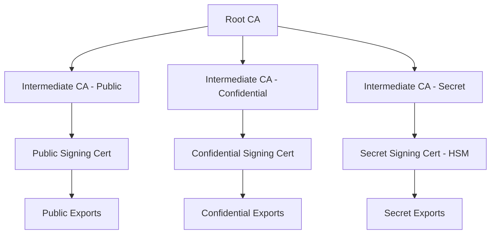
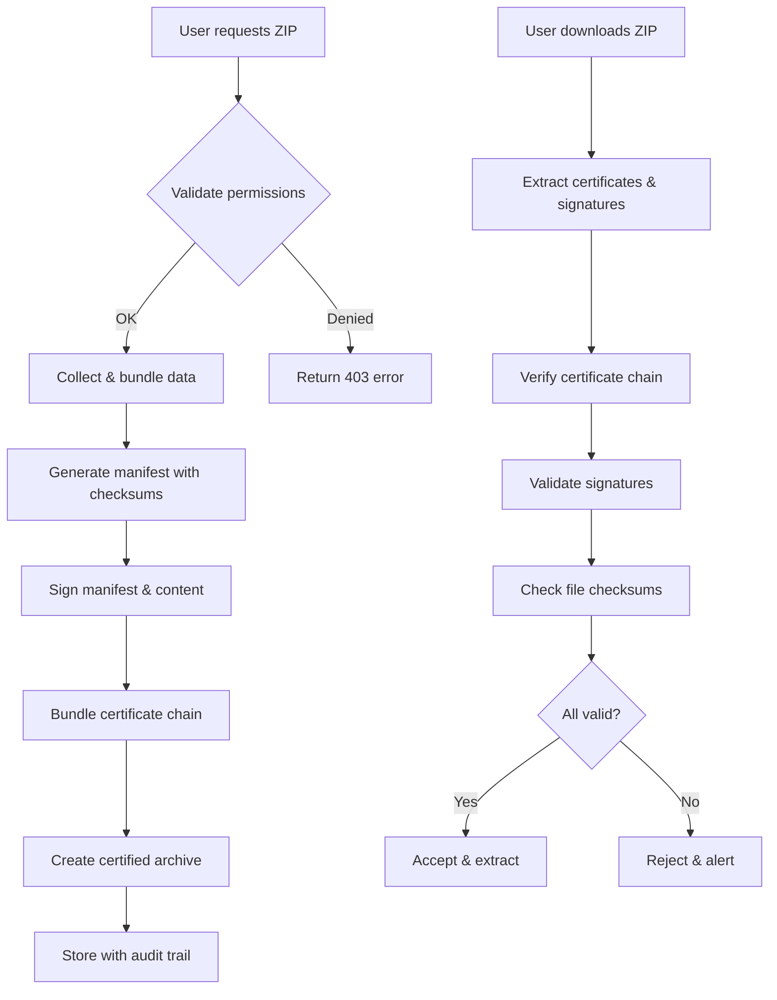
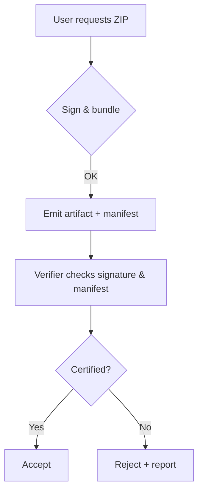

## Overview

IntelGraph's certification system provides cryptographic guarantees for data integrity, authenticity, and non-repudiation. Every exported artifact can be certified with digital signatures and tamper-evident seals, ensuring data reliability across organizational boundaries.

## Certification Levels

### Public Certification

- **Use Case**: Open research, demonstrations, non-sensitive data sharing
- **Signature**: RSA-2048 with SHA-256
- **Validity**: 1 year
- **Authority**: Standard PKI certificate
- **Verification**: Standard certificate validation

### Confidential Certification

- **Use Case**: Internal analysis, partner sharing, sensitive data
- **Signature**: RSA-4096 with SHA-256 + timestamp
- **Validity**: 6 months with renewal required
- **Authority**: Extended validation certificate
- **Verification**: Certificate + timestamp validation

### Secret Certification

- **Use Case**: Government, military, classified data
- **Signature**: Hardware Security Module (HSM) required
- **Validity**: 3 months with mandatory rotation
- **Authority**: Government-approved CA
- **Verification**: HSM + policy compliance checks

## Certificate Hierarchy



## Certification Process

### 1. Request Certification

```bash
# Via API
curl -X POST /v2/certifications \
  -H "Authorization: Bearer $TOKEN" \
  -d '{"level": "confidential", "duration": "6M"}'

# Via CLI
intelgraph cert request --level confidential --duration 6M
```

### 2. Identity Verification

- Public: Email verification + account validation
- Confidential: Background check + organizational validation
- Secret: Security clearance + government authorization

### 3. Certificate Issuance

- Generate key pair (client-side for secret level)
- Submit certificate signing request (CSR)
- CA validates identity and issues certificate
- Certificate delivered via secure channel

### 4. Export Signing

- System validates certificate is active
- Generates manifest with file checksums
- Signs manifest and content with private key
- Bundles certificate chain with export

## Verification Process

### Automated Verification

IntelGraph automatically verifies all certified exports:



### Manual Verification Steps

#### 1. Certificate Chain Validation

```bash
# Extract certificate chain
unzip -j export.zip certificates/signing-cert.pem certificates/ca-chain.pem

# Verify chain to root CA
openssl verify -CAfile ca-chain.pem signing-cert.pem

# Check certificate validity period
openssl x509 -in signing-cert.pem -noout -dates

# Verify certificate purpose
openssl x509 -in signing-cert.pem -noout -purpose
```

#### 2. Signature Validation

```bash
# Verify manifest signature
openssl dgst -sha256 -verify signing-cert.pem \
  -signature signatures/manifest.sig manifest.json

# Verify content signature
openssl dgst -sha256 -verify signing-cert.pem \
  -signature signatures/content.sig <(find data/ -type f | sort | xargs cat)
```

#### 3. Integrity Checks

```bash
# Verify file checksums against manifest
jq -r '.files[] | "\(.checksum) \(.path)"' manifest.json | \
while read checksum path; do
  echo "Verifying $path..."
  echo "${checksum#sha256:} $path" | sha256sum -c
done
```

## Trust Model

### Certificate Authorities

- **IntelGraph Root CA**: Self-signed root for internal operations
- **DigiCert**: Commercial CA for public certifications
- **Government CA**: Federal PKI for secret certifications
- **Corporate CAs**: Partner organization certificates

### Trust Policies

```yaml
trust_policy:
  public:
    allowed_cas: ['IntelGraph Root CA', 'DigiCert']
    min_key_size: 2048
    max_validity: '1y'

  confidential:
    allowed_cas: ['IntelGraph Root CA']
    min_key_size: 4096
    max_validity: '6M'
    require_timestamp: true

  secret:
    allowed_cas: ['Government CA']
    require_hsm: true
    max_validity: '3M'
    require_clearance_validation: true
```

## Certificate Management

### Key Generation

```bash
# Generate private key (confidential level)
openssl genpkey -algorithm RSA -pkcs8 -out private.key -aes256 -pass pass:$STRONG_PASSWORD -keylen 4096

# Generate certificate signing request
openssl req -new -key private.key -out request.csr \
  -subj "/C=US/O=Organization/OU=IntelGraph/CN=analyst@org.com"
```

### Certificate Renewal

```bash
# Check expiration
intelgraph cert check --cert signing-cert.pem

# Renew before expiration
intelgraph cert renew --cert signing-cert.pem --extend 6M

# Rotate to new certificate
intelgraph cert rotate --old signing-cert.pem --new new-cert.pem
```

### Revocation

```bash
# Revoke compromised certificate
intelgraph cert revoke --cert compromised-cert.pem --reason key_compromise

# Check revocation status
intelgraph cert check-revocation --cert signing-cert.pem
```

## Compliance & Auditing

### Audit Trail

Every certification action is logged:

- Certificate requests and issuance
- Export signing operations
- Verification attempts and results
- Certificate renewals and revocations

### Compliance Reports

```bash
# Generate compliance report
intelgraph compliance report --period 2025-Q3 --format pdf

# Export audit logs
intelgraph audit export --start 2025-09-01 --end 2025-09-08
```

### Standards Compliance

- **FIPS 140-2**: Hardware security modules for secret level
- **Common Criteria**: EAL4+ certification for crypto modules
- **NIST Cybersecurity Framework**: Risk management alignment
- **SOC 2 Type II**: Operational security controls

## Troubleshooting

### Common Issues

**Certificate Validation Failed**

```bash
# Check certificate validity dates
openssl x509 -in cert.pem -noout -dates

# Verify certificate chain
openssl verify -verbose -CAfile ca-chain.pem cert.pem
```

**Signature Verification Failed**

- Ensure correct signing certificate used
- Check for file corruption during transfer
- Verify signature algorithm compatibility

**Trust Policy Violations**

- Certificate may not meet minimum requirements
- Issuing CA may not be trusted for certification level
- Certificate may be expired or revoked

### Support Resources

- [Certificate Management Guide](../how-to/certificate-management.md)
- [PKI Troubleshooting](../support/pki-troubleshooting.md)
- [Compliance Documentation](../compliance/certification-standards.md)


