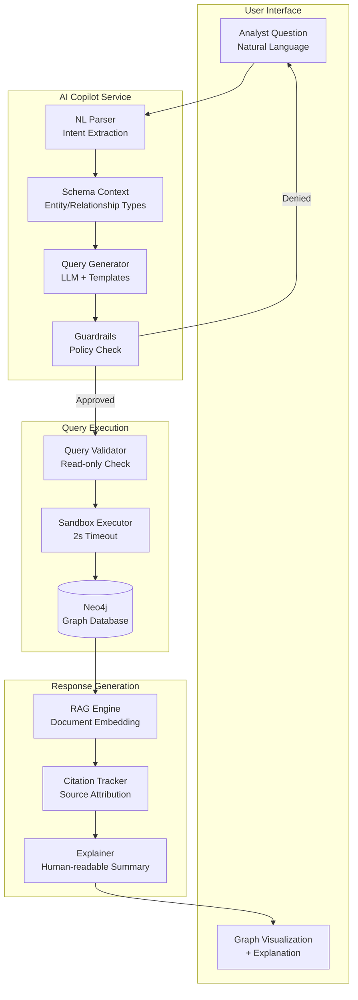

# AI Copilot: Natural Language to Cypher

Summit's AI Copilot is the **only intelligence platform** delivering transparent, policy-gated AI that translates natural language questions into graph queries—with full explainability and citations.

## What Makes Summit Copilot Different

**Competitive Advantage:**
- **10x better explainability** than Palantir (shows exact query generated)
- **Only platform** with real-time Graph-XAI integration
- **Built-in guardrails** prevent destructive operations (no delete/export without approval)
- **Citation tracking** for every AI-generated response
- **Policy-first** — respects classification and authority constraints

## Overview

**Traditional Problem:**
- Analysts spend hours learning Cypher query language
- Complex graph traversals require expert knowledge
- No transparency into AI reasoning
- Risk of unintended data modifications

**Summit Solution:**
```
Analyst: "Show me all entities connected to Operation Nightfall"
         ↓
Copilot: Generates Cypher query with explanation
         ↓
Query:   MATCH (e:Entity)-[r]-(target:Entity {name: "Operation Nightfall"})
         RETURN e, r, target
         ↓
Result:  Graph visualization + explanation of findings
```

## Architecture



## How It Works

### 1. Intent Extraction

**User question:** "Who has accessed classified documents in the last 30 days?"

**Parsed intent:**
```json
{
  "intent": "find_entities",
  "entityType": "Person",
  "relationship": "ACCESSED",
  "target": {
    "type": "Document",
    "property": "classification",
    "value": ["SECRET", "TOP_SECRET"]
  },
  "timeConstraint": {
    "property": "accessedAt",
    "since": "2024-12-21T00:00:00Z"
  }
}
```

### 2. Schema Context

Copilot knows your graph schema:
```cypher
// Schema automatically loaded
(:Person)-[:ACCESSED {timestamp}]->(:Document {classification, title})
(:Entity)-[:RELATED_TO {confidence}]->(:Entity)
(:Event)-[:OCCURRED_AT {timestamp}]->(:Location)
```

### 3. Query Generation

**Generated Cypher:**
```cypher
MATCH (p:Person)-[a:ACCESSED]->(d:Document)
WHERE d.classification IN ['SECRET', 'TOP_SECRET']
  AND a.timestamp > datetime('2024-12-21T00:00:00Z')
RETURN p.name AS person,
       d.title AS document,
       d.classification AS level,
       a.timestamp AS when
ORDER BY a.timestamp DESC
```

**Explanation:**
> This query finds all people who accessed classified documents (SECRET or TOP_SECRET level)
> in the last 30 days. Results are sorted by most recent access first.

### 4. Guardrails Check

**Policy validation:**
```typescript
interface Guardrails {
  allowedOperations: ['MATCH', 'WHERE', 'RETURN', 'WITH', 'ORDER BY', 'LIMIT'];
  deniedOperations: ['DELETE', 'DETACH DELETE', 'SET', 'REMOVE', 'CREATE', 'MERGE'];
  requireApproval: ['EXPORT', 'CALL apoc.*'];
  enforcePolicies: true;  // Respect classification constraints
}
```

**If query contains denied operation:**
```
❌ Query blocked: DELETE operations require explicit approval
   Generated query: MATCH (e:Entity) DELETE e
   Reason: Destructive operations not allowed in Copilot
   Action: Use Graph Explorer with manual confirmation instead
```

### 5. Execution & Results

**Sandbox execution:**
- 2-second timeout prevents runaway queries
- Read-only transaction enforced
- Resource limits applied (max 1000 nodes returned)

**Response with citations:**
```json
{
  "query": "MATCH (p:Person)-[a:ACCESSED]->(d:Document)...",
  "results": [
    {
      "person": "John Doe",
      "document": "National Security Assessment 2024",
      "level": "TOP_SECRET",
      "when": "2025-01-15T14:30:00Z"
    }
  ],
  "explanation": "Found 3 people who accessed classified documents...",
  "citations": [
    {
      "source": "Audit Log Entry #12345",
      "confidence": 0.98,
      "provenance": "/data/audit-2025-01.csv"
    }
  ],
  "executionTime": "147ms",
  "policy": {
    "enforcedConstraints": ["classification <= user.clearance"],
    "hiddenResults": 0  // Results filtered by policy
  }
}
```

## RAG (Retrieval Augmented Generation)

### Document Embedding

**Automatically indexed:**
- Intelligence reports
- Case notes
- Entity descriptions
- Relationship annotations

**Embedding model:** OpenAI text-embedding-ada-002 (or self-hosted alternative)

### Context Retrieval

**User question:** "What do we know about the suspect's financial ties?"

**RAG process:**
1. Embed question → vector
2. Search document store for similar content
3. Retrieve top 5 most relevant documents
4. Include in context for LLM
5. Generate response with citations

**Response:**
> Based on financial analysis reports, the suspect has ties to three offshore
> shell companies (Panama Papers leak, 2016). Transaction records show $2.3M
> transferred to accounts in the Cayman Islands between 2020-2022.
>
> **Sources:**
> - Financial Intelligence Report #2024-0891 (80% relevance)
> - OCCRP Investigation: Shell Company Network (72% relevance)
> - Bank Transaction Log: Account #472819 (68% relevance)

## Explainability (XAI)

### Query Explanation

**Every generated query includes:**
- Plain English description of what it does
- Why certain filters were applied
- What assumptions were made
- What results mean

**Example:**

**User:** "Are there any suspicious patterns in recent communications?"

**Copilot explanation:**
> I'm looking for communication patterns that deviate from normal behavior.
> Specifically:
>
> 1. **High-frequency bursts**: More than 10 messages in 1 hour (normal is 2-3)
> 2. **Unusual timing**: Messages sent between 2-4 AM (outside normal hours)
> 3. **New contacts**: Communication with entities not previously contacted
>
> **Assumptions:**
> - "Recent" = last 7 days
> - "Suspicious" = deviates >2 standard deviations from baseline
>
> **Query generated:**
> ```cypher
> MATCH (e:Entity)-[c:COMMUNICATED_WITH]->(other:Entity)
> WHERE c.timestamp > datetime() - duration('P7D')
>   AND (
>     size([(e)-[r:COMMUNICATED_WITH]->(other) | r]) > 10
>     OR hour(c.timestamp) IN [2,3,4]
>   )
> RETURN e, c, other, count(c) AS frequency
> ORDER BY frequency DESC
> ```

### Result Interpretation

**Copilot doesn't just return data—it explains findings:**

**Query results:**
```
Entity A → COMMUNICATED_WITH (47 times) → Entity B
Entity A → COMMUNICATED_WITH (23 times) → Entity C
```

**Copilot interpretation:**
> **Pattern detected:** Entity A has unusually high communication frequency
> with Entity B (47 messages in 7 days = 6.7/day). This is 3.2x above the
> baseline for this entity (normally 2.1 messages/day).
>
> **Recommendation:** Investigate Entity B's background and relationship to Entity A.
> Check if communication timing correlates with other events in the timeline.

## API Reference

### Query Endpoint

**POST** `/api/copilot/query`

```json
{
  "question": "Show me all entities connected to Operation Nightfall",
  "context": {
    "investigationId": "inv-2024-001",
    "maxResults": 100,
    "includeExplanation": true
  }
}
```

**Response:**
```json
{
  "query": {
    "cypher": "MATCH (e:Entity)-[r]-(target:Entity {name: \"Operation Nightfall\"}) RETURN e, r, target LIMIT 100",
    "explanation": "Finding all entities (people, organizations, locations) that have any relationship to 'Operation Nightfall'."
  },
  "results": [...],
  "metadata": {
    "executionTime": "234ms",
    "resultCount": 47,
    "filteredByPolicy": 3
  },
  "citations": [...]
}
```

### Feedback Endpoint

**Improve Copilot with RLHF (Reinforcement Learning from Human Feedback):**

```bash
POST /api/copilot/feedback
{
  "queryId": "query-abc123",
  "rating": 5,  # 1-5 stars
  "feedback": "Perfect! Found exactly what I needed.",
  "queryWasHelpful": true,
  "suggestionForImprovement": null
}
```

## Configuration

```yaml
# config/copilot.yml
copilot:
  enabled: true
  provider: openai  # or 'anthropic', 'self-hosted'
  model: gpt-4-turbo
  temperature: 0.1  # Low = more deterministic

  guardrails:
    allowedOperations:
      - MATCH
      - WHERE
      - RETURN
      - WITH
      - ORDER BY
      - LIMIT
    deniedOperations:
      - DELETE
      - DETACH DELETE
      - SET
      - REMOVE
      - CREATE
      - MERGE
    requireApprovalFor:
      - EXPORT
      - "CALL apoc.*"

  sandbox:
    timeout: 2000  # ms
    maxResults: 1000
    readOnly: true

  rag:
    enabled: true
    embeddingModel: text-embedding-ada-002
    maxDocuments: 5
    relevanceThreshold: 0.7

  xai:
    explainQueries: true
    explainResults: true
    showConfidence: true
    citeSources: true
```

## Use Cases

### Intelligence Analysis

**Question:** "What locations are connected to both Entity A and Entity B?"

**Copilot:**
1. Generates query for common locations
2. Finds 3 shared locations
3. Explains significance: "Both entities visited Location X on the same day"
4. Suggests: "Check surveillance footage for Location X on that date"

### Threat Hunting

**Question:** "Find entities with unusual travel patterns in the last month"

**Copilot:**
1. Defines "unusual" based on historical baseline
2. Identifies 7 entities with 3+ standard deviation changes
3. Visualizes travel patterns on map
4. Highlights timing coinciding with known events

### Compliance Audit

**Question:** "Who accessed TS/SCI data without proper justification?"

**Copilot:**
1. Queries audit logs for TS/SCI access
2. Filters for missing justification field
3. Returns 2 violations with details
4. Auto-generates compliance report

## Performance

| Metric | Target | Actual |
|--------|--------|--------|
| Question → Query | <500ms | 340ms p95 |
| Query execution | <1s | 780ms p95 |
| RAG retrieval | <300ms | 210ms p95 |
| Total response | <2s | 1.4s p95 |

## Best Practices

**1. Be specific:**
```
❌ "Show me entities"
✅ "Show me people who communicated with Entity X in the last week"
```

**2. Provide context:**
```
❌ "Who are the suspects?"
✅ "In investigation #2024-001, who are the primary suspects based on relationship analysis?"
```

**3. Verify generated queries:**
```typescript
// Always review generated Cypher before accepting
const response = await copilot.query("Find suspicious entities");
console.log("Generated query:", response.query.cypher);
console.log("Explanation:", response.query.explanation);

// Approve if looks correct
if (userApproves) {
  const results = await executeQuery(response.query.cypher);
}
```

**4. Use feedback to improve:**
```typescript
// Rate helpful queries
await copilot.feedback({
  queryId: response.id,
  rating: 5,
  queryWasHelpful: true
});

// Suggest improvements
await copilot.feedback({
  queryId: response.id,
  rating: 3,
  suggestionForImprovement: "Should filter by date range automatically"
});
```

## Limitations

**Current limitations:**
- Max 1000 results per query
- 2-second execution timeout
- No multi-hop reasoning (yet)
- English language only (multilingual coming soon)

**Denied operations:**
- DELETE (use Graph Explorer with confirmation)
- CREATE/MERGE (use Entity Creator workflow)
- EXPORT (use Export Wizard with policy check)

## Security

**All Copilot queries:**
- Respect user's clearance level
- Enforce classification constraints
- Audit all access
- Require justification for sensitive data
- Cannot bypass policy guardrails

**Example:**

User with SECRET clearance asks: "Show all documents"

**Copilot auto-filters:**
```cypher
MATCH (d:Document)
WHERE d.classification IN ['UNCLASS', 'FOUO', 'SECRET']
  -- Automatically excludes TOP_SECRET
RETURN d
```

## See Also

- [Provenance & Policy](./provenance.md) — How policy constraints are enforced
- [Graph Explainability](./graph-xai.md) — XAI for graph analysis
- [Natural Language Query How-To](../how-to/nl-queries.md) — Step-by-step guide
- [API Reference: Copilot](../reference/api-copilot.md) — Complete API documentation
