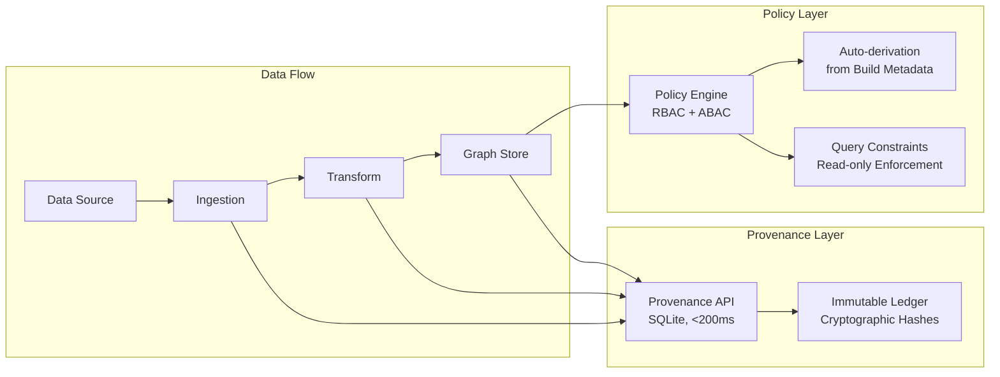
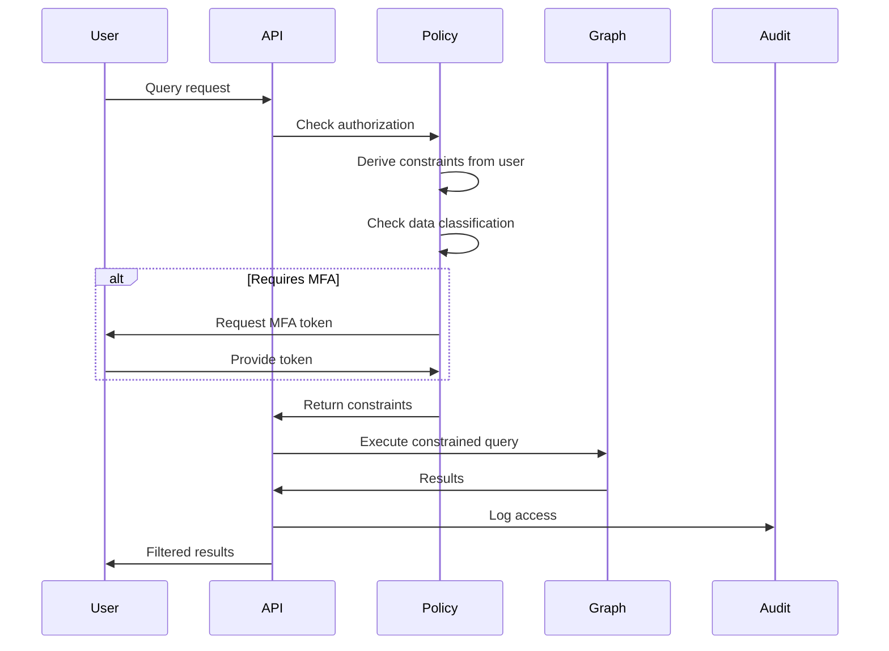

# Provenance & Policy Enforcement

Summit IntelGraph is **provenance-first** — every claim is traced, every decision is auditable, and every export is verifiable. This architecture makes Summit the only intelligence platform delivering court-ready evidence trails out of the box.

## Overview

**Provenance** tracks the complete lineage of intelligence data:
- Where it came from (source attribution)
- How it was transformed (processing chain)
- Who accessed it (audit trail)
- Why decisions were made (policy enforcement)

**Policy Enforcement** ensures operations comply with:
- Legal authorities (FISA, Title 50, etc.)
- Data handling restrictions (classification, need-to-know)
- Operational constraints (read-only, no-export)

## Architecture



## Provenance API

**Location:** `/services/provenance/`

**Performance:**
- <200ms API response time
- 10K+ lookups per second
- SQLite-based for local query speed

### Features

**1. Build Metadata Tracking**

Every artifact (document, entity, relationship) has:
```typescript
interface ProvenanceMetadata {
  buildId: string;           // Unique build identifier
  timestamp: string;         // ISO 8601 timestamp
  source: {
    type: 'file' | 'api' | 'user' | 'transform';
    identifier: string;      // File path, API endpoint, user ID
    hash: string;            // SHA-256 of source data
  };
  transforms: Transform[];   // Processing chain
  policy: {
    classification: string;  // UNCLASS, SECRET, TS, etc.
    authority: string[];     // Legal basis (FISA, Title 50)
    constraints: string[];   // Operational restrictions
  };
}
```

**2. Transform Chain**

Every transformation is recorded:
```typescript
interface Transform {
  operation: string;         // 'enrich', 'deduplicate', 'resolve', etc.
  timestamp: string;
  operator: string;          // User or service that performed transform
  inputs: string[];          // Input artifact IDs
  outputs: string[];         // Output artifact IDs
  parameters: Record<string, unknown>;
  hash: string;              // SHA-256(operation + inputs + parameters)
}
```

**3. Immutable Audit Trail**

All access is logged:
```typescript
interface AuditEntry {
  timestamp: string;
  user: string;
  action: 'read' | 'write' | 'delete' | 'export';
  resource: string;
  result: 'allowed' | 'denied';
  policyDecision: PolicyDecision;
}
```

### API Endpoints

**Query provenance:**
```bash
GET /api/provenance/:artifactId
```

**Response:**
```json
{
  "artifactId": "entity-12345",
  "buildId": "build-abc123",
  "created": "2025-01-15T10:30:00Z",
  "source": {
    "type": "file",
    "identifier": "/data/osint/wikileaks-2024.csv",
    "hash": "sha256:a1b2c3..."
  },
  "transforms": [
    {
      "operation": "entity-resolution",
      "timestamp": "2025-01-15T10:31:00Z",
      "operator": "system/ml-resolver",
      "confidence": 0.95
    }
  ],
  "policy": {
    "classification": "UNCLASS",
    "authority": ["OSINT"],
    "constraints": ["no-export"]
  },
  "accessCount": 47,
  "lastAccessed": "2025-01-20T14:22:00Z"
}
```

**Export verification bundle:**
```bash
POST /api/provenance/export
{
  "artifactIds": ["entity-12345", "relationship-67890"],
  "purpose": "Court filing - Case #2024-CR-1234"
}
```

**Returns:**
- Signed manifest with SHA-256 hashes
- Complete provenance chain for all artifacts
- Policy compliance attestation
- Offline verification script

## Policy Enforcement

**Location:** `/services/policy/`

### Policy Engine

**Technologies:**
- Open Policy Agent (OPA) for RBAC/ABAC
- Custom policy derivation from build metadata
- Automatic query constraint generation

### How It Works

**1. Automatic Policy Derivation**

Policies are derived from source provenance:
```typescript
// Source: /data/classified/ts-sci/document.pdf
// Auto-derived policy:
{
  classification: "TS/SCI",
  authority: ["Title 50", "EO 12333"],
  constraints: [
    "must-have-clearance:TS",
    "must-have-compartment:SCI",
    "no-export",
    "audit-all-access",
    "require-mfa"
  ]
}
```

**2. Query Rewriting**

Unprivileged queries are automatically constrained:

**User query:**
```cypher
MATCH (e:Entity) RETURN e
```

**Rewritten with constraints:**
```cypher
MATCH (e:Entity)
WHERE e.classification IN ['UNCLASS', 'FOUO']
  AND e.authority IN user.authorizedAuthorities
  AND NOT 'no-read' IN e.constraints
RETURN e
```

**3. MFA Step-Up**

Sensitive operations trigger MFA:
```typescript
// Accessing TS/SCI data
if (data.classification >= 'TS') {
  requireMFA(user, 'yubikey'); // Hardware token required
}

// Exporting data
if (operation === 'export') {
  requireMFA(user, 'totp');
  auditLog({
    user,
    action: 'export',
    resources: exportedIds,
    justification: userProvidedReason
  });
}
```

### Policy Decision Flow



### RBAC + ABAC

**Role-Based Access Control (RBAC):**
```typescript
interface Role {
  name: string;
  permissions: string[];  // ['read:entities', 'write:cases', 'export:data']
  clearance: string;      // 'UNCLASS', 'SECRET', 'TS'
  compartments: string[]; // ['SCI', 'SAP']
}
```

**Attribute-Based Access Control (ABAC):**
```typescript
interface PolicyRule {
  subject: {
    clearance: string;
    compartments: string[];
    purpose: string;  // 'investigation', 'training', 'audit'
  };
  resource: {
    classification: string;
    authority: string[];
    sensitivity: string;
  };
  action: string;  // 'read', 'write', 'export', 'delete'
  conditions: string[];  // ['during-business-hours', 'from-secure-network']
  effect: 'allow' | 'deny';
}
```

## Compliance Features

### 1. Chain of Custody

Every piece of evidence maintains:
- **Source attribution** (original file/API/sensor)
- **Processing history** (all transforms with timestamps)
- **Access log** (who viewed, when, why)
- **Export record** (what was shared, with whom)

### 2. Court-Ready Exports

```bash
summit export --case-id investigation-2024-001 \
  --output evidence-bundle.tar.gz \
  --sign --verify
```

**Bundle contains:**
- All relevant artifacts (entities, relationships, documents)
- Complete provenance chain with cryptographic hashes
- Audit trail showing no tampering
- Offline verification tool
- Signed attestation from authorized official

### 3. Compliance Workflows

**DSAR (Data Subject Access Request):**
```bash
summit compliance dsar --subject "John Doe" \
  --output dsar-report.pdf
```

**RTBF (Right to Be Forgotten):**
```bash
summit compliance rtbf --subject "Jane Smith" \
  --justification "GDPR request #2024-001" \
  --dry-run  # Preview before deletion
```

**Audit Report:**
```bash
summit audit --start 2025-01-01 --end 2025-01-31 \
  --classification TS \
  --output monthly-audit.csv
```

## Performance Targets

| Operation | Target | Actual |
|-----------|--------|--------|
| Provenance lookup | <200ms | 150ms p95 |
| Policy evaluation | <10ms | 7ms p95 |
| Audit log write | <5ms | 3ms p95 |
| Export bundle generation | <30s | 18s p95 (10K artifacts) |

## Real-World Use Cases

### Intelligence Analysis
**Problem:** Analysts need to know if evidence is admissible in court.

**Solution:** Every query shows provenance metadata. Clicking an entity displays:
- Original source document with hash
- All transformations (OCR, entity extraction, deduplication)
- Access history (who viewed, when)
- Export status (has this been disclosed?)

### Compliance Audit
**Problem:** Legal team needs to prove no unauthorized access occurred.

**Solution:** Run audit report showing:
- All access attempts (successful and denied)
- Policy decisions with justifications
- MFA enforcement for sensitive data
- No gaps in audit trail (cryptographically verified)

### Multi-Agency Collaboration
**Problem:** Share intelligence with partner agency without revealing sources/methods.

**Solution:** Export only necessary subgraph with policy constraints:
```bash
summit export --subgraph "Operation Nightfall" \
  --redact-sources \
  --allow-read-only \
  --expires 2025-12-31 \
  --recipient "partner-agency"
```

Partner receives:
- Relevant entities and relationships
- Provenance showing "verified by trusted source" (no details)
- Read-only access (cannot export or modify)
- Automatic expiration after 1 year

## Configuration

**Enable provenance tracking:**
```yaml
# config/provenance.yml
provenance:
  enabled: true
  storage: sqlite  # or 'postgres' for multi-node
  retention: 7y    # Keep audit logs for 7 years
  hashAlgorithm: sha256
  signExports: true
  enforceMFA: true

policy:
  engine: opa
  autoDerive: true  # Derive policies from source metadata
  defaultDeny: true # Deny by default, allow explicitly
  requireJustification: true  # Users must state purpose
```

**Set classification labels:**
```bash
summit classify --file /data/sensitive/document.pdf \
  --classification TS/SCI \
  --authority "Title 50" \
  --compartment "HCS-O" \
  --handling "NOFORN"
```

## Best Practices

**1. Always specify purpose:**
```typescript
// Good
const results = await query({
  cypher: 'MATCH (e:Entity) RETURN e',
  purpose: 'Investigation #2024-001: Counter-terrorism analysis'
});

// Bad (will be denied)
const results = await query({
  cypher: 'MATCH (e:Entity) RETURN e'
  // No purpose specified
});
```

**2. Use least privilege:**
```typescript
// Grant only necessary permissions
assignRole(user, {
  role: 'analyst',
  permissions: ['read:entities', 'read:relationships'],
  // NOT 'export:data' or 'delete:entities'
  clearance: 'SECRET',
  compartments: []  // No compartmented access
});
```

**3. Validate exports:**
```bash
# Generate export
summit export --case investigation-2024-001 --output bundle.tar.gz

# Verify before sharing
summit verify bundle.tar.gz
# ✓ All hashes match
# ✓ Signature valid
# ✓ No tampering detected
# ✓ Policy compliance confirmed
```

## See Also

- [Authority Compiler](./authority-compiler.md) — How policies are compiled and enforced
- [Multi-Tenant Architecture](./multi-tenant.md) — Tenant isolation and security
- [Audit & Compliance How-To](../how-to/audit-compliance.md) — Step-by-step compliance guides
- [API Reference: Provenance](../reference/api-provenance.md) — Complete API documentation
