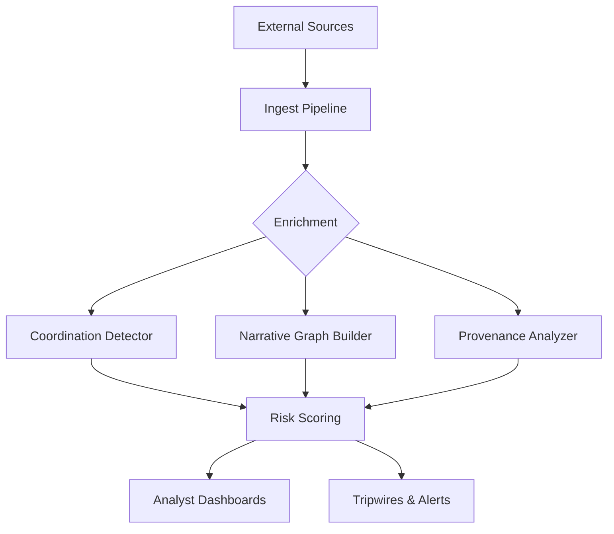

# Counterintelligence Architecture

This document describes the counterintelligence (CI) architecture of the Summit platform. It outlines how narrative intelligence is ingested, enriched, and scored, and identifies the trust boundaries and control points critical for defending against adversarial manipulation.

## Commander's Intent
To advance Summit's defensive posture by making the narrative intelligence pipeline legible and identifying key hooks for detecting and countering adversarial operations without enabling offensive capabilities.

## Narrative Intelligence Pipeline

The narrative intelligence pipeline follows a structured flow from raw data ingestion to analyst-facing insights.

### 1. Ingestion Stage
Data is ingested through the `IngestPipeline` (`summit/ingest/pipeline.py`), where it may undergo flattening and initial normalization.
- **Source**: External data feeds, social media, internal reports.
- **Control Point**: Schema validation and provenance tagging.

### 2. Enrichment Stage
Ingested data is enriched using several specialized detectors and graph builders.
- **Coordination Detection**: `summit/influence/coordination_detector.py` identifies synchronized narrative bursts across multiple sources.
- **Narrative Graphing**: `summit/influence/narrative_graph.py` builds relationship models between documents based on semantic similarity.
- **Provenance Analysis**: `summit/influence/provenance_analyzer.py` traces the origin and lineage of narratives.

### 3. Scoring Stage
Narratives and actors are scored for risk and threat levels.
- **Campaign Detection**: `summit/security/influence_ops/detectors/campaign.py` identifies indicators of coordinated campaigns.
- **Risk Posture**: `packages/risk-scoring/` provides models for calculating risk scores based on various signals.

### 4. Analyst Surface
Insights are presented to analysts through dashboards and reports.
- **Surfaces**: `docs/counter-intelligence/cognitive-terrain.md`, `docs/counter-intelligence/pattern-library.md`.

## Data Flow Diagram

## Trust Boundaries and Control Points

Adversaries may attempt to manipulate the system at various points. The following table identifies these risks and the corresponding counter-measures.

| Boundary | Adversarial Action | Control Point | CI Hook |
| :--- | :--- | :--- | :--- |
| **Ingestion** | Poisoning narratives or sources | Provenance Verification | Tripwire on anomalous source behavior |
| **Enrichment** | Mimicking organic coordination | Similarity Thresholds | Flagging high-similarity/compressed-time bursts |
| **Scoring** | Manipulating risk parameters | Interpretable Models | Audit logs for scoring adjustments |
| **Analyst Surface** | Deceptive visualization/reporting | Human-in-the-loop (HITL) | Playbook-based verification |

## Counterintelligence Hooks

CI hooks are specific points in the architecture where detections and tripwires are implemented.
- **Detections**: Heuristics or models identifying known adversarial patterns (e.g., coordinated delegitimization).
- **Flags**: Indicators attached to assets or narratives requiring further scrutiny.
- **Tripwires**: Alerts triggered by specific threshold crossings or pattern matches.
