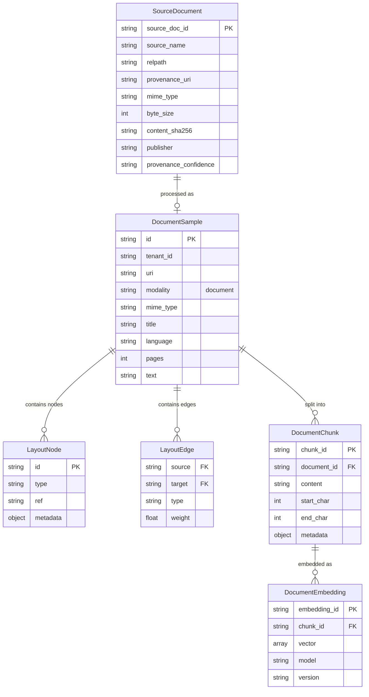

# Document Ingestion Data Model

The **Document Ingestion Data Model** defines how unstructured source documents (like PDFs, slide decks, or text files) are represented, laid out, chunked, and embedded within the Summit data ecosystem.

## Document and Extracted Data Diagram

## `SourceDocument` (Ingestion Schema)

The `SourceDocument` schema represents the raw document as acquired from a source or pipeline before downstream NLP processing or chunking.

| Field | Type | Description |
|---|---|---|
| `source_doc_id` | string | Unique document identifier. |
| `source_name` | string | Originating system or channel. |
| `relpath` | string | Relative file path or object key. |
| `provenance_uri` | string | Canonical source location or URL. |
| `mime_type` | string | Document MIME type (e.g. `application/pdf`). |
| `byte_size` | integer | Total document size in bytes. |
| `content_sha256` | string | Full SHA-256 hash of the content. |
| `publisher` | string | Originating publisher or organization. |
| `provenance_confidence` | string | Quality or certainty level of provenance. |

## `DocumentSample` (Multimodal Schema)

The `DocumentSample` schema represents a parsed and semantically enriched document (e.g., text, PDFs, presentations) including its layout projections, extracted text, and graph transformations.

| Field | Type | Description |
|---|---|---|
| `id` | string | Parsed document instance ID. |
| `tenant_id` | string | Owner or tenant scoping ID. |
| `uri` | string | Location of the source document. |
| `modality` | string (const) | Always `"document"`. |
| `mime_type` | string | Specific file MIME type. |
| `title` | string | Extracted or inferred title. |
| `language` | string | Detected ISO language code. |
| `pages` | integer | Number of discrete pages/slides. |
| `layout` | object | Embedded structure representing spatial layout. |
| `text` | string | Full extracted string for fallback chunking. |
| `graphs` | array(object) | Graph projections linking text, images, and layout nodes. |
| `security_tags` | array(string) | Document-level redaction or security class labels. |
| `metadata` | object | Hashes, detector details, and internal markers. |

## Chunking & Embeddings

Document chunking relies on token approximations (approx. 4 characters per token). Overlapping chunks are constructed natively by iterating over the `DocumentSample.text` property, breaking at optimal boundaries such as newlines or whitespace.

Each chunk is passed to the embedding tier and is structurally associated with vector arrays, yielding representations suitable for dense vector search and GraphRAG.
