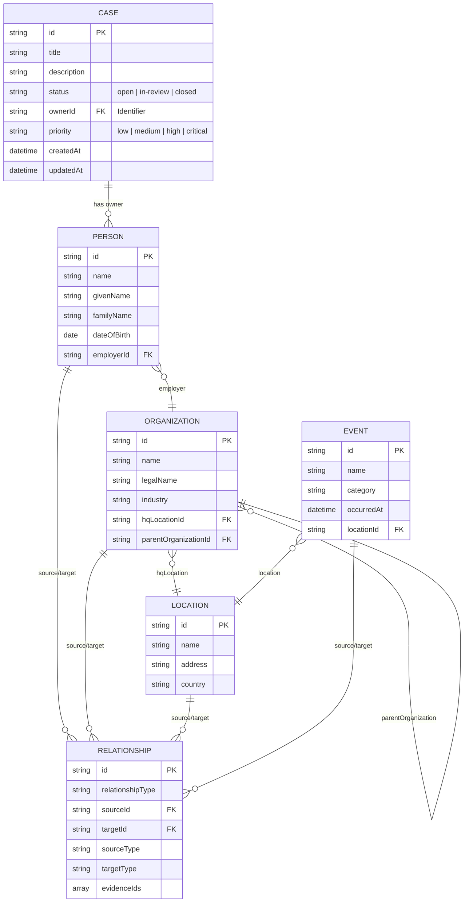

# Knowledge Graph Data Model

The **Knowledge Graph Data Model** in Summit represents the core domain entities (`Case`, `Person`, `Organization`, `Location`, `Event`) and the structured relationships between them. These models are defined using JSON Schema 2020-12 and form the foundational graph representation of intelligence data.

## Entity-Relationship Diagram

## Entities Reference

### `Case` (v1)
A canonical container for managing intelligence investigations.

| Field | Type | Description |
|---|---|---|
| `id` | string (Identifier) | Unique stable identifier (ULID/UUID). |
| `title` | string | Name of the case. |
| `description` | string | Detailed description. |
| `status` | string (enum) | `open`, `in-review`, or `closed`. |
| `ownerId` | string (Identifier) | Entity ID responsible for the case. |
| `priority` | string (enum) | `low`, `medium`, `high`, or `critical`. |
| `createdAt` | string (Timestamp) | RFC 3339 timestamp. |

### `Person` (v1)
An individual human actor in the graph.

| Field | Type | Description |
|---|---|---|
| `id` | string (Identifier) | Unique stable identifier. |
| `name` | string | Full display name. |
| `givenName` | string | First name. |
| `familyName` | string | Last name. |
| `dateOfBirth` | string (date) | Date of birth. |
| `nationalities` | array(string) | List of nationalities. |
| `roles` | array(string) | List of roles or functions. |
| `employerId` | string (Identifier) | ID of associated Organization. |
| `contact` | object | `{ email, phone }`. |

### `Organization` (v1)
A formal entity, company, or group.

| Field | Type | Description |
|---|---|---|
| `id` | string (Identifier) | Unique stable identifier. |
| `name` | string | Primary trading or public name. |
| `legalName` | string | Formal registered name. |
| `industry` | string | Primary industry sector. |
| `registration` | object | `{ country, number }`. |
| `hqLocationId` | string (Identifier) | ID of headquarters Location. |
| `parentOrganizationId`| string (Identifier) | ID of parent holding or overarching organization. |

### `Location` (v1)
A geographical place, facility, or region.

| Field | Type | Description |
|---|---|---|
| `id` | string (Identifier) | Unique stable identifier. |
| `name` | string | Place or facility name. |
| `address` | string | Full postal address. |
| `country` | string | Country code or name. |
| `geo` | object | `{ lat, lon }` bounding coordinates. |

### `Event` (v1)
A point-in-time occurrence or persistent incident.

| Field | Type | Description |
|---|---|---|
| `id` | string (Identifier) | Unique stable identifier. |
| `name` | string | Name or headline of the event. |
| `category` | string | Event categorization type. |
| `occurredAt` | string (Timestamp) | Exact timestamp of occurrence. |
| `timeRange` | object | `{ start, end }` timestamps. |
| `locationId` | string (Identifier) | Primary ID where the event took place. |

### `Relationship` (v1)
A directed graph edge representing typed connectivity between any two entities.

| Field | Type | Description |
|---|---|---|
| `id` | string (Identifier) | Edge ID. |
| `relationshipType` | string (enum) | e.g. `associatedWith`, `controls`, `locatedIn`, `owns`, `targets`. |
| `sourceId` | string (Identifier) | The origin node of the relationship. |
| `targetId` | string (Identifier) | The destination node of the relationship. |
| `sourceType` | string | Node type name (e.g. `Person`). |
| `targetType` | string | Node type name (e.g. `Organization`). |
| `validDuring` | object | `{ start, end }` temporal validity. |
| `evidenceIds` | array(string) | Links to SourceDocuments backing this edge. |
