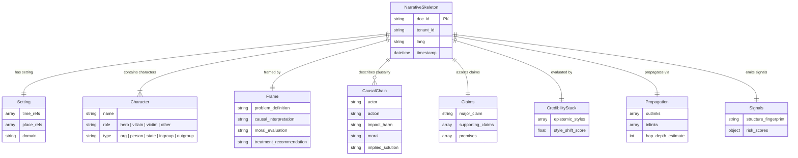

# Narrative & Risk Data Model

The **Narrative & Risk Data Model** is built around the `Narrative Skeleton` schema. It captures how a document frames information, identifying actors, assigning moral evaluations, outlining causal chains, and projecting the resulting risks or intelligence signals.

## Entity-Relationship Diagram

## `NarrativeSkeleton` Schema

The `NarrativeSkeleton` is the root object generated by the Narrative Intelligence pipeline.

| Field | Type | Description |
|---|---|---|
| `doc_id` | string | Unique document identifier. |
| `tenant_id` | string | Owner or tenant ID. |
| `lang` | string | BCP-47 language tag (e.g. `en-US`). |
| `timestamp` | string (date-time) | Analysis generation timestamp. |
| `setting` | object | Extracted `time_refs`, `place_refs`, and `domain`. |
| `characters` | array(object) | Extracted cast of actors and their roles. |
| `frame` | object | The rhetorical structure or frame. |
| `causal_chain` | array(object) | Chain of events, actors, impacts, and solutions. |
| `claims` | object | Major and supporting assertions made. |
| `credibility_stack` | object | Epistemic styling and style shifts. |
| `propagation` | object | Graph metrics like inlinks, outlinks, and hop depth. |
| `signals` | object | Overall structural fingerprint and risk scoring. |

### Component Types

#### `Character`
An entity introduced within the text performing a narrative function.
*   **`name`**: Extracted entity name.
*   **`role`**: Required enum: `hero`, `villain`, `victim`, or `other`.
*   **`type`**: Required enum: `org`, `person`, `state`, `ingroup`, or `outgroup`.

#### `Frame`
The overall intent, moral interpretation, and rhetorical objective of the document.
*   **`problem_definition`**: How the author defines the central issue.
*   **`causal_interpretation`**: Why the problem exists, according to the text.
*   **`moral_evaluation`**: The text's ethical or moral judgment of the actors/problem.
*   **`treatment_recommendation`**: Proposed or implied solutions.

#### `CausalChain`
The sequence of actions creating harm or impact within the narrative.
*   **`actor`**: The instigator of the action.
*   **`action`**: The action taken.
*   **`impact_harm`**: The resulting harm, cost, or impact.
*   **`moral`**: The ethical lesson or judgment resulting from the action.
*   **`implied_solution`**: How to resolve or prevent the action.

#### `CredibilityStack`
Calculations on the epistemic nature of the text.
*   **`epistemic_styles`**: Array of identified rhetorical styles (e.g. `objective`, `emotive`).
*   **`style_shift_score`**: Numeric score denoting shifts or breaks in the text's epistemic styling (a potential signal of generative AI or compiled text).

#### `Signals`
Rollups of system-generated metrics.
*   **`structure_fingerprint`**: A deterministic hash representing the document's rhetorical and structural flow.
*   **`risk_scores`**: Key-value pairs representing specific risk dimensions (e.g. `bias`, `toxicity`, `deception`).
