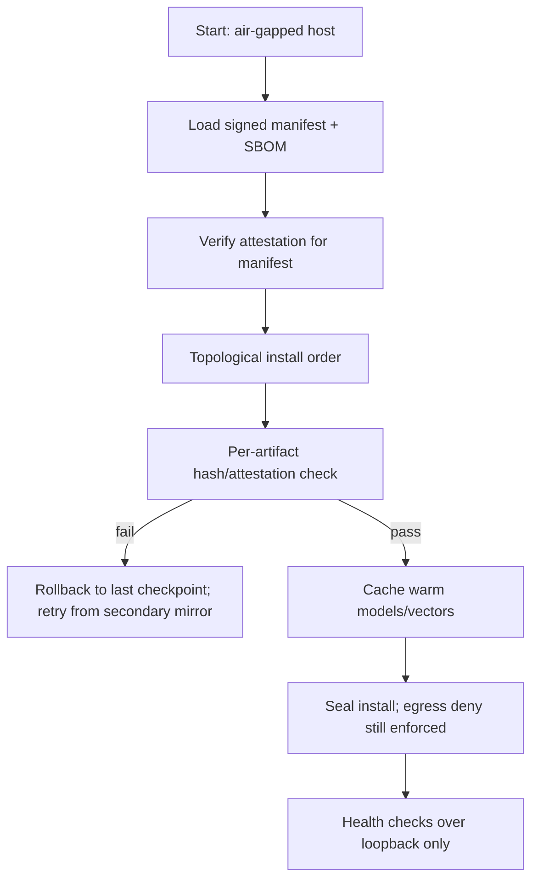

# Defensive publication: Offline mirror choreography for air-gapped 5-minute installs

## Context

- Air-gapped deployments that must complete within five minutes while enforcing signed artifacts and rollback safety.
- Supports Summit/IntelGraph installer flows with GPU artifact pinning and SBOM/SLSA attestations.

## Technique

1. **Mirror priming:** Pre-stage package/model artifacts with signed manifests; include GPU-specific wheels/containers; store SHA256 + provenance attestations.
2. **Two-phase verification:** Phase A (control plane) verifies manifests and SBOM attestations; Phase B (data plane) verifies each artifact during stream-from-mirror.
3. **Deterministic ordering:** Install in dependency-topological order with checkpoint hashes after each tier (runtime, DB, graph stack, copilot models).
4. **Fallback tiers:** If mirror chunk fails integrity, automatically roll back to last checkpoint and retry from secondary mirror; never fall back to unsigned sources.
5. **Offline cache warming:** Populate read-only cache for models/vectors before services start; include size/latency guardrails so boot completes <5 minutes.
6. **Egress deny default:** All network egress stays blocked; mirrors are mounted locally; temporary loopback-only exceptions for health checks.

## Rationale

- Establishes prior art for deterministic, signed offline installs with rollback-safe mirror orchestration and GPU-aware artifacts.
- Reduces supply-chain risk by enforcing attestations and denying opportunistic online fallbacks.

## Flow outline

