# Release Process Documentation

## Table of Contents

1. [Overview](#overview)
2. [Release Types](#release-types)
3. [Semantic Versioning](#semantic-versioning)
4. [Automated Release Pipeline](#automated-release-pipeline)
5. [Deployment Stages](#deployment-stages)
6. [Feature Flags](#feature-flags)
7. [Blue-Green Deployments](#blue-green-deployments)
8. [Rollback Procedures](#rollback-procedures)
9. [Health Checks](#health-checks)
10. [Troubleshooting](#troubleshooting)

## Overview

IntelGraph uses a fully automated CI/CD pipeline with semantic versioning, automated changelog generation, and zero-downtime deployments. The release process is designed to be:

- **Automated**: Minimal manual intervention required
- **Safe**: Comprehensive health checks and automatic rollbacks
- **Transparent**: Detailed logs and notifications at every step
- **Reversible**: Quick rollback capabilities

## Release Types

### Major Release (vX.0.0)

Breaking changes that require migration guides.

**Triggers:**
- Commit with `BREAKING CHANGE:` in footer
- Major API changes
- Database schema breaking changes

**Process:**
1. Create release notes with migration guide
2. Deploy to staging for extensive testing
3. Schedule production deployment with maintenance window
4. Provide rollback plan

**Example Commit:**
```
feat: new authentication system

Migrate from JWT to OAuth2/OIDC

BREAKING CHANGE: All API clients must update to use OAuth2 flow
```

### Minor Release (vX.Y.0)

New features, backward compatible.

**Triggers:**
- Commits with `feat:` prefix
- New functionality
- Performance improvements

**Process:**
1. Automated release creation
2. Deploy to staging automatically
3. Deploy to production after approval

**Example Commit:**
```
feat: add real-time collaboration features

Implements WebSocket-based collaborative editing
```

### Patch Release (vX.Y.Z)

Bug fixes and minor improvements.

**Triggers:**
- Commits with `fix:` prefix
- Bug fixes
- Security patches

**Process:**
1. Automated release creation
2. Fast-track to production for critical fixes

**Example Commit:**
```
fix: resolve memory leak in graph query optimizer

Closes #1234
```

## Semantic Versioning

We follow [Semantic Versioning 2.0.0](https://semver.org/):

```
MAJOR.MINOR.PATCH
  │     │     │
  │     │     └─── Bug fixes, patches
  │     └───────── New features, backward compatible
  └─────────────── Breaking changes
```

### Commit Message Convention

We use [Conventional Commits](https://www.conventionalcommits.org/):

```
<type>(<scope>): <subject>

<body>

<footer>
```

**Types:**
- `feat`: New feature (→ MINOR)
- `fix`: Bug fix (→ PATCH)
- `perf`: Performance improvement (→ PATCH)
- `refactor`: Code refactoring (→ PATCH)
- `docs`: Documentation changes
- `test`: Test updates
- `chore`: Build/tooling changes
- `ci`: CI/CD changes

**Examples:**

```bash
# Patch release
git commit -m "fix: resolve authentication timeout issue"

# Minor release
git commit -m "feat(api): add GraphQL subscriptions support"

# Major release
git commit -m "feat(auth): migrate to OAuth2

BREAKING CHANGE: JWT tokens no longer supported"
```

## Automated Release Pipeline

### Workflow Overview

```mermaid
graph LR
    A[Push to main] --> B[Run Tests]
    B --> C[Semantic Release]
    C --> D[Create Tag]
    D --> E[Generate Changelog]
    E --> F[Build Docker Images]
    F --> G[Deploy to Staging]
    G --> H[Health Checks]
    H --> I[Manual Approval]
    I --> J[Deploy to Production]
    J --> K[Production Health Checks]
    K --> L[Monitor]
```



### Stage Details

#### 1. Continuous Integration (CI)

**Triggers:** Push to `main`, `beta`, or `alpha` branches

**Steps:**
- Checkout code
- Install dependencies
- Run linters
- Run unit tests
- Run integration tests
- Build artifacts

#### 2. Semantic Release

**Workflow:** `.github/workflows/semantic-release.yml`

**Steps:**
1. Analyze commits since last release
2. Determine version bump (major/minor/patch)
3. Generate changelog
4. Create git tag
5. Create GitHub release
6. Update package.json
7. Commit version bump

**Outputs:**
- New version number
- Git tag (e.g., `v1.2.3`)
- Release notes
- Changelog update

#### 3. Docker Image Build

**Workflow:** `.github/workflows/docker-build-multiarch.yml`

**Features:**
- Multi-architecture builds (amd64, arm64)
- Layer caching for fast builds
- Security scanning with Trivy
- Image signing with Cosign
- Push to GitHub Container Registry

**Image Tags:**
```
ghcr.io/brianelong/summit/api:1.2.3
ghcr.io/brianelong/summit/api:1.2.3-abc1234
ghcr.io/brianelong/summit/api:latest
ghcr.io/brianelong/summit/api:stable
```

#### 4. Staging Deployment

**Workflow:** `.github/workflows/deploy-staging.yml`

**Automatically triggers** after successful release.

**Steps:**
1. Pull versioned Docker images
2. Deploy to staging EKS cluster
3. Run health checks
4. Run smoke tests
5. Notify team

**Environment:** `https://staging.intelgraph.io`

#### 5. Production Deployment

**Workflow:** `.github/workflows/deploy-production.yml`

**Requires manual approval** via GitHub Environments.

**Steps:**
1. Validate version tag exists
2. Request manual approval
3. Run pre-deployment checks
4. Create backup snapshot
5. Execute deployment (blue-green/canary)
6. Run health checks
7. Monitor for 10 minutes
8. Rollback if issues detected

**Environment:** `https://intelgraph.io`

## Deployment Stages

### Development

**Branch:** Feature branches
**Trigger:** Push to feature branch
**Environment:** Local/Docker Compose
**Testing:** Unit tests, integration tests
**Approval:** None

### Staging

**Branch:** `main`
**Trigger:** Merge to main + successful release
**Environment:** AWS EKS (staging cluster)
**URL:** `https://staging.intelgraph.io`
**Testing:** Full test suite + smoke tests
**Approval:** Automatic
**Rollback:** Automatic on failure

### Production

**Branch:** Git tags (`v*`)
**Trigger:** Manual workflow dispatch
**Environment:** AWS EKS (production cluster)
**URL:** `https://intelgraph.io`
**Testing:** Health checks + smoke tests + 10-min monitoring
**Approval:** Required (GitHub Environments)
**Rollback:** Automatic on failure

## Feature Flags

See [Feature Flags Guide](./FEATURE_FLAGS.md) for detailed documentation.

### Integration with Releases

1. **Deploy with flag disabled**: Ship code to production with feature flag OFF
2. **Test in production**: Enable for internal users only
3. **Gradual rollout**: Increase percentage over time
4. **Monitor**: Watch metrics and error rates
5. **Full rollout**: Enable for 100% of users
6. **Cleanup**: Remove flag after 30 days

**Example Workflow:**

```bash
# Week 1: Deploy to production (flag disabled)
git commit -m "feat: add real-time collaboration (behind feature flag)"
# → Creates v1.5.0

# Week 2: Enable for internal team (via LaunchDarkly dashboard)
# Monitor metrics

# Week 3: Gradual rollout
# Day 1: 10%
# Day 3: 25%
# Day 5: 50%
# Day 7: 100%

# Week 5: Cleanup
git commit -m "chore: remove real-time-collaboration feature flag"
```

## Blue-Green Deployments

### Overview

Blue-green deployment maintains two identical production environments:
- **Blue**: Current production version
- **Green**: New version being deployed

Traffic switches from blue to green only after validation.

### Process

1. **Deploy to Green Environment**
   ```bash
   ./scripts/blue-green-deploy.sh production v1.2.3
   ```

2. **Validate Green Environment**
   - Health checks
   - Smoke tests
   - Manual validation

3. **Switch Traffic**
   - Update load balancer/service selector
   - Route 100% traffic to green

4. **Monitor**
   - Watch metrics for 10 minutes
   - Auto-rollback if errors detected

5. **Keep Blue for Rollback**
   - Blue environment remains running
   - Can instantly switch back if needed

### Rollback

**Automatic rollback** triggers if:
- Health checks fail
- Error rate > 5%
- Response time > 2x baseline
- Manual rollback requested

**Manual rollback:**
```bash
./scripts/rollback-deployment.sh production
```

## Rollback Procedures

### Automatic Rollback

Triggers automatically on:
- Failed health checks
- High error rates
- Failed smoke tests
- Deployment timeout

### Manual Rollback

#### Option 1: Via Workflow

1. Go to GitHub Actions
2. Run "Deploy to Production" workflow
3. Select previous version
4. Approve deployment

#### Option 2: Via Script

```bash
# Rollback to previous version
./scripts/rollback-deployment.sh production

# Rollback to specific version
./scripts/rollback-deployment.sh production v1.2.2
```

#### Option 3: Via Helm

```bash
# List releases
helm list -n intelgraph-production

# Rollback to previous release
helm rollback intelgraph -n intelgraph-production

# Rollback to specific revision
helm rollback intelgraph 5 -n intelgraph-production
```

### Post-Rollback

1. **Notify team** via Slack
2. **Create incident** in PagerDuty/Jira
3. **Investigate root cause**
4. **Document lessons learned**
5. **Plan fix and re-deploy**

## Health Checks

### Types

#### Liveness Probe

Checks if the application is running:

```yaml
livenessProbe:
  httpGet:
    path: /health
    port: 4000
  initialDelaySeconds: 30
  periodSeconds: 10
```

#### Readiness Probe

Checks if the application can serve traffic:

```yaml
readinessProbe:
  httpGet:
    path: /ready
    port: 4000
  initialDelaySeconds: 15
  periodSeconds: 5
```

### Endpoints

#### `/health`

Basic health check:

```json
{
  "status": "healthy",
  "uptime": 3600,
  "timestamp": "2025-01-15T10:30:00Z"
}
```

#### `/ready`

Readiness check (includes dependencies):

```json
{
  "status": "ready",
  "checks": {
    "database": "ok",
    "redis": "ok",
    "neo4j": "ok"
  }
}
```

### Smoke Tests

Run after every deployment:

```bash
./scripts/smoke-tests.sh

# Tests include:
# - Health endpoint responds
# - GraphQL endpoint accessible
# - Authentication flow works
# - Database connectivity
# - Cache connectivity
# - Basic CRUD operations
```

## Troubleshooting

### Release Not Created

**Symptom:** Push to main doesn't create a release

**Possible Causes:**
1. No conventional commits since last release
2. Only `chore`/`docs` commits (don't trigger release)
3. CI tests failing

**Solution:**
```bash
# Check commit messages
git log --oneline v1.2.2..HEAD

# Ensure at least one feat/fix commit
git commit -m "fix: trigger release"

# Check CI status
gh run list --workflow=semantic-release.yml
```

### Staging Deployment Failed

**Symptom:** Deployment to staging fails

**Debug:**
```bash
# Check pod status
kubectl -n intelgraph-staging get pods

# Check pod logs
kubectl -n intelgraph-staging logs -l app=api --tail=100

# Check events
kubectl -n intelgraph-staging get events --sort-by='.lastTimestamp'

# Check deployment status
kubectl -n intelgraph-staging describe deployment api
```

**Common Issues:**
- Image pull errors (check registry access)
- Resource limits (check cluster capacity)
- Configuration errors (check secrets)
- Database migrations failed

### Production Approval Stuck

**Symptom:** Production deployment waiting for approval

**Action:**
1. Verify staging deployment successful
2. Review deployment plan in GitHub Actions
3. Check #deployments Slack channel for notifications
4. Approve in GitHub UI (Settings → Environments → production)

### Health Checks Failing

**Symptom:** Deployment succeeded but health checks fail

**Debug:**
```bash
# Port forward to pod
kubectl -n intelgraph-production port-forward deployment/api 8080:4000

# Test health endpoint
curl http://localhost:8080/health
curl http://localhost:8080/ready

# Check application logs
kubectl -n intelgraph-production logs -f deployment/api
```

### Rollback Not Working

**Symptom:** Rollback command fails

**Debug:**
```bash
# Check Helm release history
helm history intelgraph -n intelgraph-production

# List available revisions
helm list -n intelgraph-production --all-namespaces

# Manual rollback to specific revision
helm rollback intelgraph <revision> -n intelgraph-production
```

## Monitoring and Alerts

### Metrics to Monitor

1. **Deployment Success Rate**
   - Track in Grafana dashboard
   - Alert if < 95%

2. **Rollback Frequency**
   - Track rollback count
   - Alert if > 1 per week

3. **Deployment Duration**
   - Track time from commit to production
   - Alert if > 2 hours

4. **Release Frequency**
   - Track releases per week
   - Target: 2-5 releases/week

### Alerts

Configure in AlertManager:

```yaml
# High Rollback Rate
- alert: HighRollbackRate
  expr: rate(rollback_count[7d]) > 1
  annotations:
    summary: "High rollback rate detected"

# Deployment Failures
- alert: DeploymentFailures
  expr: deployment_status == 0
  annotations:
    summary: "Deployment failed"
```

## Best Practices

### Commits

1. ✅ Use conventional commit format
2. ✅ Write clear, descriptive messages
3. ✅ Reference issue numbers
4. ✅ Keep commits atomic and focused
5. ❌ Don't use `[skip ci]` unless necessary

### Releases

1. ✅ Test thoroughly in staging first
2. ✅ Deploy during low-traffic hours
3. ✅ Have rollback plan ready
4. ✅ Monitor for at least 10 minutes
5. ❌ Don't deploy on Fridays (unless urgent)

### Features

1. ✅ Use feature flags for risky changes
2. ✅ Gradual rollout (0% → 10% → 50% → 100%)
3. ✅ Monitor metrics during rollout
4. ✅ Clean up flags after full rollout
5. ❌ Don't ship features without flags if risky

## Resources

- [Semantic Versioning](https://semver.org/)
- [Conventional Commits](https://www.conventionalcommits.org/)
- [Feature Flags Guide](./FEATURE_FLAGS.md)
- [Production Deployment Guide](./PRODUCTION_DEPLOYMENT_GUIDE.md)
- [Runbook](../runbooks/DEPLOYMENT.md)

## Support

- **Slack:** #platform-engineering, #deployments
- **PagerDuty:** Platform team rotation
- **Documentation:** https://docs.intelgraph.io
- **Runbooks:** `docs/runbooks/`

## Changelog

- **2025-01-15**: Added multi-arch Docker builds
- **2025-01-10**: Implemented semantic-release automation
- **2025-01-05**: Added feature flags integration
- **2025-01-01**: Initial release process documentation
