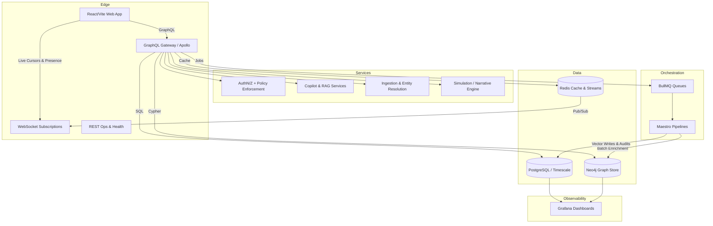
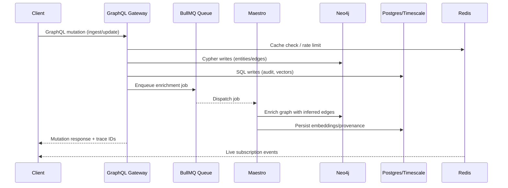

# IntelGraph Architecture Overview (Developer Edition)

This guide gives developers a working map of how IntelGraph fits together: subsystems, data flows, orchestration, and the API contracts that bind them.

## Platform Topology

## Subsystem Map

- **API Edge**
  - GraphQL gateway served by Apollo. Schema composition is centralized in
    `server/src/graphql/schema-unified.ts`, which merges the baseline schema with
    the domain modules registered in `server/src/graphql/schema.js`.
  - Domain-specific SDL modules live alongside `schema.*` and `schema.*.gql`
    files under `server/src/graphql/` (copilot, graph ops, AI, annotations,
    health, subscriptions).
  - WebSocket subscriptions deliver live collaboration events (presence, cursors,
    graph updates) through the GraphQL layer.
- **Service Layer**
  - Copilot/RAG services orchestrate graph + vector lookups before generating
    responses.
  - Ingestion and entity resolution normalize inputs before writing to
    Neo4j/Postgres.
  - Simulation/Narrative engine runs long-lived what-if scenarios; outputs are
    persisted via Maestro jobs.
- **Orchestration**
  - BullMQ handles queueing/retries; Maestro pipelines execute enrichment,
    provenance stamping, and compliance audits.
- **Data Plane**
  - Neo4j stores entities/relationships; Postgres/Timescale handle relational
    data, audits, and metrics; Redis provides request caching and real-time
    pub/sub.
- **Observability & Safety**
  - Grafana dashboards consume metrics from Postgres/Timescale and graph probes;
    ABAC/OPA enforcement protects mutation paths.

## Data & Control Flows

## API Contracts

### GraphQL

- **Endpoint**: `POST /graphql` (supports queries, mutations, subscriptions via WebSockets).
- **Health contract**: `health` query returns `HealthStatus` with `status`,
  `timestamp`, `version`, `environment`, and per-service `ServiceHealth` records.
- **Schema composition**: Type definitions are assembled from `schema.js` plus
  domain-specific modules (copilot, graph ops, AI, annotations, health).
- **Working with the schema**:
  - Introspection is enabled for local development; export the SDL with `apollo codegen:download` or by hitting `/graphql` with `__schema` queries.
  - Domain SDL files live in `server/src/graphql/schema.*` and `server/src/graphql/schema.*.gql` for specialty modules (collaboration, copilot, strategic-foresight, etc.).
  - Use the health types as a reference shape for operational probes and CI smoke
    tests.

### REST, Ops & OpenAPI

- **REST routes**: Express handlers live under `server/src/routes/` and expose
  operational, admin, and health endpoints used by deployments.
- **OpenAPI contracts**: Reference specs live in `openapi/` (e.g.
  `openapi/intelgraph-core-api.yaml`, `openapi/maestro-orchestration-api.yaml`)
  for downstream tooling and SDK generation.
- **Health & readiness**: `/health` resolves via the `health` GraphQL query; REST
  routing also exposes operational checks for containerized deployments.
- **Admin/ops routes**: lightweight REST endpoints support configuration
  inspection and job introspection; they are intentionally narrow and are
  guarded by the same ABAC/OPA middleware as GraphQL mutations.

## Implementation Hints for New Features

- Prefer emitting events to BullMQ/Maestro for long-running work instead of synchronous GraphQL mutations.
- Co-locate new schema modules under `server/src/graphql/` and export them through `schema.js` to keep SDL composition centralized.
- When persisting AI-generated insights, write provenance pointers into Postgres alongside Neo4j graph updates to keep audit and graph data in sync.
- Expose new health or readiness signals by extending `HealthStatus`/`ServiceHealth` so both GraphQL and REST probes stay aligned.

## Appendix: Quick Links

- **Full Architecture Guide**: [`docs/ARCHITECTURE.md`](../ARCHITECTURE.md)
- **Developer Onboarding**: [`docs/DEVELOPER_ONBOARDING.md`](../DEVELOPER_ONBOARDING.md)
- **OpenAPI Specs**: [`openapi/README.md`](../../openapi/README.md)
- **GraphQL Baselines**: [`schema/`](../../schema/)
- **Golden Path Commands**: run `make bootstrap && make up && make smoke` from repo root.
