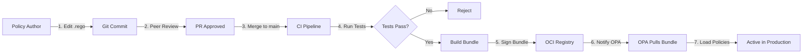

# GA Governance Design Document

> **Version**: 2.0
> **Last Updated**: 2025-12-27
> **Status**: Production
> **Audience**: Engineers, Product Managers, Security Teams

## Table of Contents

1. [Executive Summary](#executive-summary)
2. [Problem Statement](#problem-statement)
3. [Design Goals](#design-goals)
4. [Policy-as-Code Rationale](#policy-as-code-rationale)
5. [GovernanceVerdict Design](#governanceverdict-design)
6. [Human-in-the-Loop Workflow](#human-in-the-loop-workflow)
7. [Appeal and Override Mechanisms](#appeal-and-override-mechanisms)
8. [Audit Trail Requirements](#audit-trail-requirements)
9. [Policy Lifecycle Management](#policy-lifecycle-management)
10. [Performance Considerations](#performance-considerations)
11. [Security Design](#security-design)
12. [Failure Modes and Mitigation](#failure-modes-and-mitigation)
13. [Testing Strategy](#testing-strategy)
14. [Migration and Deployment](#migration-and-deployment)
15. [Future Enhancements](#future-enhancements)

---

## Executive Summary

The **Governance & Attestation (GA)** system implements a **policy-driven, auditable, human-in-the-loop** access control framework for IntelGraph. It addresses the unique requirements of intelligence community (IC) operations:

- **Policy-as-Code**: Declarative policies (Rego) stored in Git, versioned, and peer-reviewed
- **GovernanceVerdict**: Structured decision object with evidence, reasoning, and appeals
- **Human-in-the-Loop**: Automated workflows for high-risk operations requiring human approval
- **Immutable Audit Trail**: Cryptographically signed, append-only ledger of all decisions
- **Fail-Safe Defaults**: All failures result in DENY decisions with clear error reporting

### Key Metrics

- **Policy Evaluation Latency**: <10ms p99
- **Approval Workflow SLA**: 4 hours (with escalation)
- **Audit Retention**: 7 years (compliance requirement)
- **Availability**: 99.95% (policy evaluation)

---

## Problem Statement

### Background

Traditional access control systems (RBAC, ABAC) are insufficient for IC operations because:

1. **Static Policies**: Hard-coded authorization logic is difficult to audit and evolve
2. **Binary Decisions**: Simple allow/deny doesn't capture nuance (e.g., "allow with oversight")
3. **Lack of Transparency**: Users don't understand why access was denied
4. **No Provenance**: No verification that data is from trusted sources
5. **No Appeal Process**: Users can't challenge incorrect denials
6. **Weak Audit**: Audit logs don't capture decision reasoning or policy version

### Requirements

From IC stakeholders:

| Requirement                                                       | Source          | Priority |
| ----------------------------------------------------------------- | --------------- | -------- |
| **Policy Versioning**: Track every policy change with Git history | Security Team   | P0       |
| **Explainability**: Provide clear reasons for all decisions       | End Users       | P0       |
| **Human Oversight**: Require approval for high-risk operations    | Compliance      | P0       |
| **Provenance Tracking**: Verify data authenticity and lineage     | Data Governance | P0       |
| **Appeal Process**: Allow users to challenge denials              | Legal           | P1       |
| **Audit Completeness**: Record all decisions with full context    | Auditors        | P0       |
| **Performance**: <50ms added latency for policy evaluation        | Engineering     | P1       |

### Non-Requirements

See [NON-CAPABILITIES.md](./NON-CAPABILITIES.md) for explicit scope exclusions.

---

## Design Goals

### Goal 1: Declarative Policy-as-Code

**Rationale**: Hard-coded authorization logic is:

- Difficult to audit (scattered across codebase)
- Impossible to version independently
- Requires code changes for policy updates
- No separation of duties (developers == policy authors)

**Solution**: Policy-as-Code with **Open Policy Agent (OPA)**

**Benefits**:

- Policies are declarative (Rego language)
- Stored in Git with peer review
- Versioned and immutable
- Testable independently of application code
- Separation of duties: policy authors ≠ developers

**Example Policy**:

```rego
package intelgraph.authz

import future.keywords.if

# Allow entity read if user has required clearance
allow if {
  input.action == "entity.read"
  input.user.clearances[_] >= input.resource.classification
}

# Deny if user is on revocation list
deny if {
  input.user.id in data.revoked_users
}

# Default deny
default allow := false
```

### Goal 2: Explainable Decisions

**Rationale**: "Access Denied" is insufficient. Users need to know:

- Why was I denied?
- What do I need to fix?
- Who can help me?

**Solution**: **GovernanceVerdict** object with structured reasoning

**Benefits**:

- Clear explanation of decision
- Actionable guidance for users
- Evidence trail for auditors
- Support for appeals

### Goal 3: Human-in-the-Loop for High-Risk Operations

**Rationale**: Some operations are too risky for automated decisions:

- Accessing highly classified data
- Bulk data exports
- Cross-compartment data access
- Destructive operations

**Solution**: **Approval Workflow Engine** with configurable rules

**Benefits**:

- Automated routing to correct approvers
- SLA tracking and escalation
- Audit trail of approver decisions
- Integration with existing ticketing systems

### Goal 4: Immutable Audit Trail

**Rationale**: Compliance requires:

- 7-year retention of all access decisions
- Tamper-proof audit logs
- Cryptographic proof of integrity
- Queryable for investigations

**Solution**: **Append-only audit ledger** with signatures

**Benefits**:

- Immutability enforced at database level
- Cryptographic signatures prevent tampering
- Partitioned for query performance
- Exportable for long-term archival

### Goal 5: Fail-Safe Defaults

**Rationale**: Security must not depend on perfect execution:

- Network failures
- Service outages
- Corrupted policy bundles
- Timeout conditions

**Solution**: **Explicit deny on all failure modes**

**Benefits**:

- Security by default
- Clear error messages for debugging
- Monitoring alerts on failures
- Graceful degradation

---

## Policy-as-Code Rationale

### Why OPA?

| Criteria               | OPA                           | Alternative (Custom)      | Winner |
| ---------------------- | ----------------------------- | ------------------------- | ------ |
| **Declarative**        | Rego language                 | Imperative code           | OPA    |
| **Performance**        | <1ms evaluation               | Depends on implementation | OPA    |
| **Ecosystem**          | Large community, integrations | Build from scratch        | OPA    |
| **Testing**            | Built-in test framework       | Custom testing            | OPA    |
| **Auditing**           | Decision logs                 | Manual logging            | OPA    |
| **Versioning**         | Git + OCI bundles             | Custom versioning         | OPA    |
| **Partial Evaluation** | Built-in optimization         | Manual optimization       | OPA    |

### Policy Structure

```
policies/
├── intelgraph/
│   ├── authz/
│   │   ├── entity.rego          # Entity access policies
│   │   ├── relationship.rego    # Relationship access policies
│   │   ├── export.rego          # Export policies
│   │   └── admin.rego           # Admin policies
│   ├── data/
│   │   ├── classifications.json # Classification levels
│   │   ├── roles.json           # Role definitions
│   │   └── revoked_users.json   # Revocation list
│   └── lib/
│       ├── clearance.rego       # Clearance utilities
│       ├── classification.rego  # Classification utilities
│       └── time.rego            # Time-based utilities
├── tests/
│   ├── entity_test.rego
│   ├── relationship_test.rego
│   └── export_test.rego
└── .manifest                     # Bundle metadata
```

### Policy Versioning

```yaml
# .manifest
version: v1.2.3
commit: a1b2c3d4e5f6g7h8i9j0
author: security-team@intelgraph.internal
timestamp: 2025-12-27T10:30:00Z
signature: <Ed25519 signature>
policies:
  - path: intelgraph/authz/entity.rego
    sha256: e3b0c44298fc1c149afbf4c8996fb92427ae41e4649b934ca495991b7852b855
  - path: intelgraph/authz/relationship.rego
    sha256: d7a8fbb307d7809469ca9abcb0082e4f8d5651e46d3cdb762d02d0bf37c9e592
```

### Policy Testing

```rego
# tests/entity_test.rego
package intelgraph.authz.entity_test

import data.intelgraph.authz

test_allow_entity_read_with_sufficient_clearance {
  allow with input as {
    "action": "entity.read",
    "user": {
      "id": "user-123",
      "clearances": ["TS", "S", "C", "U"]
    },
    "resource": {
      "id": "entity-456",
      "classification": "S"
    }
  }
}

test_deny_entity_read_with_insufficient_clearance {
  not allow with input as {
    "action": "entity.read",
    "user": {
      "id": "user-123",
      "clearances": ["C", "U"]
    },
    "resource": {
      "id": "entity-456",
      "classification": "TS"
    }
  }
}
```

### Policy Deployment



---

## GovernanceVerdict Design

### Data Structure

```typescript
interface GovernanceVerdict {
  // Decision
  approved: boolean;
  decision: "ALLOW" | "DENY" | "DEFER_TO_HUMAN" | "ABSTAIN";

  // Reasoning
  reason: string;
  policyPath: string;
  policyVersion: string;
  evaluationDuration: number; // milliseconds

  // Evidence
  evidence: Evidence[];
  attestationVerified?: boolean;
  provenanceValid?: boolean;
  slsaLevel?: number;

  // Metadata
  correlationId: string;
  timestamp: string;
  actor: {
    id: string;
    type: "user" | "service" | "system";
    roles: string[];
  };

  // Appeals
  appealable: boolean;
  appealInstructions?: string;

  // Audit
  auditRecordId: string;
  signature: string;
}

interface Evidence {
  type: "signature" | "provenance" | "approval" | "policy";
  description: string;
  timestamp: string;
  verifier: string;
  verified: boolean;
  metadata?: Record<string, any>;
}
```

### Decision Types

#### ALLOW

```json
{
  "approved": true,
  "decision": "ALLOW",
  "reason": "User has sufficient clearance (TS) for resource classification (S)",
  "policyPath": "data.intelgraph.authz.entity.allow",
  "policyVersion": "v1.2.3",
  "evaluationDuration": 5,
  "evidence": [
    {
      "type": "policy",
      "description": "Clearance check passed",
      "timestamp": "2025-12-27T10:30:00Z",
      "verifier": "opa-instance-01",
      "verified": true
    }
  ],
  "correlationId": "req-123-456",
  "timestamp": "2025-12-27T10:30:00Z",
  "actor": {
    "id": "user-123",
    "type": "user",
    "roles": ["analyst"]
  },
  "appealable": false,
  "auditRecordId": "audit-789",
  "signature": "..."
}
```

#### DENY

```json
{
  "approved": false,
  "decision": "DENY",
  "reason": "User clearance (C) insufficient for resource classification (TS)",
  "policyPath": "data.intelgraph.authz.entity.allow",
  "policyVersion": "v1.2.3",
  "evaluationDuration": 4,
  "evidence": [
    {
      "type": "policy",
      "description": "Clearance check failed: required [TS], have [C, U]",
      "timestamp": "2025-12-27T10:30:00Z",
      "verifier": "opa-instance-02",
      "verified": true
    }
  ],
  "correlationId": "req-123-457",
  "timestamp": "2025-12-27T10:30:01Z",
  "actor": {
    "id": "user-456",
    "type": "user",
    "roles": ["contractor"]
  },
  "appealable": true,
  "appealInstructions": "Contact your security officer to request TS clearance upgrade",
  "auditRecordId": "audit-790",
  "signature": "..."
}
```

#### DEFER_TO_HUMAN

```json
{
  "approved": false,
  "decision": "DEFER_TO_HUMAN",
  "reason": "High-risk operation requires human approval: bulk export of TS/SCI data",
  "policyPath": "data.intelgraph.authz.export.require_approval",
  "policyVersion": "v1.2.3",
  "evaluationDuration": 6,
  "evidence": [
    {
      "type": "policy",
      "description": "Triggered approval workflow: high-risk-export",
      "timestamp": "2025-12-27T10:30:00Z",
      "verifier": "opa-instance-03",
      "verified": true
    }
  ],
  "correlationId": "req-123-458",
  "timestamp": "2025-12-27T10:30:02Z",
  "actor": {
    "id": "user-789",
    "type": "user",
    "roles": ["senior-analyst"]
  },
  "appealable": false,
  "approvalWorkflowId": "workflow-abc-123",
  "approvalStatus": "PENDING",
  "estimatedApprovalTime": "4h",
  "auditRecordId": "audit-791",
  "signature": "..."
}
```

### Design Decisions

#### Why Explicit Decision Types?

**Problem**: Boolean `approved` is ambiguous:

- `approved = false` could mean "denied" or "waiting for approval"

**Solution**: Explicit `decision` enum

**Benefits**:

- Clear distinction between DENY and DEFER_TO_HUMAN
- ABSTAIN allows for multiple policy evaluators (future)
- Type safety in client code

#### Why Include Evidence?

**Problem**: Users and auditors need proof of decisions

**Solution**: Structured `Evidence[]` array

**Benefits**:

- Transparency: users see what was checked
- Auditability: auditors can reconstruct decision
- Debugging: engineers can diagnose policy issues

#### Why Appealable Flag?

**Problem**: Not all denials should be appealable:

- Revoked users (permanent)
- Expired credentials (automatic)
- Insufficient clearance (requires formal process)

**Solution**: Policy-driven `appealable` flag

**Benefits**:

- Reduces noise (no appeals for automatic denials)
- Provides guidance (`appealInstructions`)
- Tracks appeal success rate

---

## Human-in-the-Loop Workflow

### When to Require Human Approval

**Triggers** (defined in policy):

1. **High Classification**: TS/SCI data access by non-TS users
2. **Bulk Operations**: Export >100 entities
3. **Cross-Compartment**: Access data from different compartment
4. **Destructive**: Delete entity, purge data
5. **Elevation**: Temporary privilege escalation
6. **Anomalous**: Access pattern deviates from baseline

**Example Policy**:

```rego
package intelgraph.authz.export

require_approval if {
  input.action == "entity.export"
  count(input.resource.entities) > 100
}

require_approval if {
  input.action == "entity.export"
  input.resource.classification == "TS/SCI"
  not input.user.clearances[_] == "TS/SCI"
}
```

### Workflow State Machine

```
┌─────────┐
│ PENDING │  ← Initial state (approval request created)
└────┬────┘
     │
     ├──→ [Notify Approvers] ──→ [Wait for Response]
     │
     ▼
┌──────────┐
│ REVIEWING│  ← Approvers notified, reviewing request
└────┬─────┘
     │
     ├──→ [Approve] ──→ ┌──────────┐
     │                  │ APPROVED │ ← Quorum reached
     │                  └──────────┘
     │
     ├──→ [Deny] ──────→ ┌─────────┐
     │                    │ DENIED  │ ← Any approver denied
     │                    └─────────┘
     │
     ├──→ [Timeout] ────→ ┌─────────┐
     │                    │ EXPIRED │ ← SLA exceeded
     │                    └─────────┘
     │
     └──→ [Cancel] ─────→ ┌──────────┐
                          │ CANCELED │ ← Requester canceled
                          └──────────┘
```

### Approval Request Schema

```typescript
interface ApprovalRequest {
  id: string;
  workflowType: string; // 'high-risk-export', 'cross-compartment', etc.
  status: "PENDING" | "REVIEWING" | "APPROVED" | "DENIED" | "EXPIRED" | "CANCELED";

  // Requester
  requester: {
    id: string;
    name: string;
    email: string;
    roles: string[];
  };

  // Request details
  action: string;
  resource: {
    type: string;
    id: string;
    classification: string;
    compartments: string[];
  };
  justification: string; // Required: why is this needed?

  // Approval configuration
  requiredApprovers: {
    role: string;
    count: number;
  }[];
  quorum: number;
  timeout: string; // ISO 8601 duration (e.g., "PT4H")
  onTimeout: "DENY" | "ESCALATE";

  // Approver responses
  approvals: {
    approverId: string;
    approverName: string;
    decision: "APPROVE" | "DENY";
    justification: string;
    timestamp: string;
  }[];

  // Timestamps
  createdAt: string;
  expiresAt: string;
  decidedAt?: string;

  // Audit
  correlationId: string;
  auditRecordId: string;
}
```

### Notification Strategy

```yaml
# Notification configuration
notifications:
  - event: approval_required
    channels:
      - type: email
        recipients: [approvers]
        template: approval_required_email
        timing: immediate
      - type: slack
        recipients: ["#governance-approvals"]
        template: approval_required_slack
        timing: immediate

  - event: approval_reminder
    channels:
      - type: email
        recipients: [pending_approvers]
        template: approval_reminder_email
        timing: 2h-no-response

  - event: approval_escalation
    channels:
      - type: pagerduty
        recipients: [on-call-security]
        template: approval_escalation_pagerduty
        timing: 3h-no-response

  - event: approval_decided
    channels:
      - type: email
        recipients: [requester]
        template: approval_decision_email
        timing: immediate
```

### SLA Tracking

| Workflow Type         | Target Response Time | Escalation Time | Timeout |
| --------------------- | -------------------- | --------------- | ------- |
| **High-Risk Export**  | 2 hours              | 3 hours         | 4 hours |
| **Cross-Compartment** | 1 hour               | 2 hours         | 4 hours |
| **Destructive**       | 30 minutes           | 1 hour          | 2 hours |
| **Elevation**         | 15 minutes           | 30 minutes      | 1 hour  |

### Approver Portal

```
┌─────────────────────────────────────────────────────────────┐
│  Approval Request: high-risk-export-20251227-001            │
├─────────────────────────────────────────────────────────────┤
│  Requester: John Doe (user-123)                             │
│  Requested: 2025-12-27 10:30:00 UTC                         │
│  Expires: 2025-12-27 14:30:00 UTC (in 3h 45m)               │
│                                                              │
│  Action: Export 250 entities                                │
│  Classification: TS/SCI                                      │
│  Compartments: ALPHA, BRAVO                                 │
│                                                              │
│  Justification:                                             │
│  "Preparing briefing for IC leadership on Operation DELTA.  │
│   Require export for offline analysis in SCIF."             │
│                                                              │
│  Required Approvals: 2 of 3                                 │
│  ├─ Data Owner (0/1): [Pending]                             │
│  ├─ Security Officer (0/1): [Pending]                       │
│  └─ Compartment Manager (0/1): [Pending]                    │
│                                                              │
│  ┌──────────┐  ┌──────────┐                                 │
│  │ APPROVE  │  │  DENY    │                                 │
│  └──────────┘  └──────────┘                                 │
│                                                              │
│  Justification (required):                                  │
│  ┌────────────────────────────────────────────────────────┐ │
│  │                                                        │ │
│  └────────────────────────────────────────────────────────┘ │
└─────────────────────────────────────────────────────────────┘
```

---

## Appeal and Override Mechanisms

### Appeal Process

```
┌─────────┐
│  DENY   │  ← User receives denial
└────┬────┘
     │
     ├──→ User clicks "Appeal" button
     │
     ▼
┌──────────────┐
│ Appeal Form  │  ← User fills out justification
└──────┬───────┘
       │
       ├──→ Submit appeal
       │
       ▼
┌────────────────┐
│ Appeal Review  │  ← Security team reviews
└────────┬───────┘
         │
         ├──→ [Approve Appeal] ──→ Grant temporary access
         │
         ├──→ [Deny Appeal] ────→ Notify user of denial
         │
         └──→ [Escalate] ───────→ Escalate to policy team
```

### Appeal Request Schema

```typescript
interface AppealRequest {
  id: string;
  originalVerdictId: string; // GovernanceVerdict.auditRecordId
  status: "PENDING" | "APPROVED" | "DENIED" | "ESCALATED";

  // Appellant
  appellant: {
    id: string;
    name: string;
    email: string;
  };

  // Appeal details
  justification: string; // Why should denial be overturned?
  evidence: string[]; // Supporting evidence (e.g., mission requirement)

  // Reviewer
  reviewer?: {
    id: string;
    name: string;
    decision: "APPROVE" | "DENY" | "ESCALATE";
    justification: string;
    timestamp: string;
  };

  // Outcome
  temporaryAccessGranted?: {
    expiresAt: string;
    restrictions: string[];
  };

  // Timestamps
  createdAt: string;
  decidedAt?: string;

  // Audit
  correlationId: string;
  auditRecordId: string;
}
```

### Override Mechanisms

#### Emergency Override (Break-Glass)

**Use Case**: Mission-critical access during emergency

**Requirements**:

- Senior leadership approval (out-of-band)
- Immediate notification to security team
- Automatic audit trail
- Post-incident review required

**Implementation**:

```typescript
async function emergencyOverride(
  userId: string,
  resourceId: string,
  justification: string,
  approverSignature: string // Digital signature from senior leader
): Promise<TemporaryAccess> {
  // Verify signature
  const signatureValid = await verifySignature(approverSignature);
  if (!signatureValid) {
    throw new Error("Invalid approver signature");
  }

  // Create temporary access (1 hour)
  const access = await createTemporaryAccess({
    userId,
    resourceId,
    expiresAt: addHours(new Date(), 1),
    reason: "EMERGENCY_OVERRIDE",
    justification,
    approverSignature,
  });

  // Notify security team
  await notifySecurityTeam({
    event: "EMERGENCY_OVERRIDE",
    userId,
    resourceId,
    justification,
    approver: extractApproverFromSignature(approverSignature),
  });

  // Log to audit trail
  await auditService.log({
    eventType: "emergency_override",
    severity: "CRITICAL",
    actorId: userId,
    resourceId,
    decision: "ALLOW",
    decisionReason: `Emergency override: ${justification}`,
    metadata: {
      approverSignature,
      expiresAt: access.expiresAt,
    },
  });

  return access;
}
```

#### Temporary Access Grant

**Use Case**: Short-term access for specific mission

**Requirements**:

- Approval workflow (expedited)
- Time-limited access
- Restricted to specific resources
- Automatic expiration

**Implementation**:

```typescript
interface TemporaryAccess {
  id: string;
  userId: string;
  resourceId: string;
  expiresAt: string;
  reason: string;
  restrictions: {
    maxReads?: number;
    allowedActions?: string[];
    ipWhitelist?: string[];
  };
  approvalWorkflowId: string;
  auditRecordId: string;
}
```

---

## Audit Trail Requirements

### Completeness Requirements

**Every governance decision MUST record**:

1. ✅ Who (actor: user ID, service ID, or system)
2. ✅ What (action: entity.read, export, delete)
3. ✅ When (timestamp: ISO 8601 with timezone)
4. ✅ Where (resource: entity ID, relationship ID)
5. ✅ Why (decision reason: policy path, clearance check, etc.)
6. ✅ How (evidence: signatures, provenance, approvals)
7. ✅ Result (decision: ALLOW, DENY, DEFER_TO_HUMAN)

### Schema

See [ARCHITECTURE.md](./ARCHITECTURE.md) for full schema.

### Retention Policy

| Data Type              | Retention | Storage                                   | Compliance  |
| ---------------------- | --------- | ----------------------------------------- | ----------- |
| **Audit Events**       | 7 years   | Hot: 90 days, Warm: 1 year, Cold: 7 years | NIST 800-53 |
| **Provenance**         | 7 years   | Hot: 90 days, Warm: 1 year, Cold: 7 years | NIST 800-53 |
| **Policy Bundles**     | Forever   | Versioned objects in S3                   | Compliance  |
| **Approval Workflows** | 7 years   | Hot: 90 days, Cold: 7 years               | Compliance  |

### Query Capabilities

```graphql
type Query {
  # Search audit events
  auditEvents(filter: AuditEventFilter, pagination: Pagination): AuditEventConnection

  # Get audit event by ID
  auditEvent(id: ID!): AuditEvent

  # Get audit events for a resource
  auditEventsForResource(
    resourceType: String!
    resourceId: ID!
    pagination: Pagination
  ): AuditEventConnection

  # Get audit events for an actor
  auditEventsForActor(actorId: ID!, pagination: Pagination): AuditEventConnection

  # Export audit events (requires elevated permissions)
  exportAuditEvents(
    filter: AuditEventFilter
    format: ExportFormat! # CSV, JSON, JSONL
  ): ExportJob
}

input AuditEventFilter {
  startTime: DateTime
  endTime: DateTime
  eventTypes: [String!]
  actorIds: [ID!]
  resourceTypes: [String!]
  decisions: [Decision!]
  severity: [Severity!]
}
```

### Export Capabilities

```bash
# Export audit events to JSON Lines
curl -H "Authorization: Bearer $TOKEN" \
  "https://api.intelgraph.internal/audit/export?format=jsonl&start=2025-01-01&end=2025-12-31" \
  > audit-2025.jsonl

# Export to CSV for spreadsheet analysis
curl -H "Authorization: Bearer $TOKEN" \
  "https://api.intelgraph.internal/audit/export?format=csv&start=2025-01-01&end=2025-12-31" \
  > audit-2025.csv
```

---

## Policy Lifecycle Management

### Policy Development Workflow

```
┌──────────────┐
│ Policy Author│
└──────┬───────┘
       │
       ├──→ 1. Create feature branch
       │
       ├──→ 2. Write policy (.rego)
       │
       ├──→ 3. Write tests (.rego)
       │
       ├──→ 4. Run local tests (opa test)
       │
       ├──→ 5. Commit and push
       │
       ▼
┌──────────────┐
│  CI Pipeline │
└──────┬───────┘
       │
       ├──→ 6. Lint policies (opa fmt --check)
       │
       ├──→ 7. Run tests (opa test)
       │
       ├──→ 8. Check policy coverage (opa test --coverage)
       │
       ├──→ 9. Build bundle (opa build)
       │
       ▼
┌──────────────┐
│ Peer Review  │
└──────┬───────┘
       │
       ├──→ 10. Security team reviews
       │
       ├──→ 11. Approve PR
       │
       ▼
┌──────────────┐
│ Merge to Main│
└──────┬───────┘
       │
       ├──→ 12. Run tests again
       │
       ├──→ 13. Build signed bundle
       │
       ├──→ 14. Publish to OCI registry
       │
       ├──→ 15. Notify OPA instances
       │
       ▼
┌──────────────┐
│  Production  │
└──────────────┘
```

### Policy Versioning Strategy

**Semantic Versioning** (MAJOR.MINOR.PATCH):

- **MAJOR**: Breaking changes (deny becomes allow, or vice versa)
- **MINOR**: New policies (additive only)
- **PATCH**: Bug fixes (same logic, better implementation)

**Example**:

- `v1.0.0`: Initial release
- `v1.1.0`: Add new export policy (non-breaking)
- `v1.1.1`: Fix typo in entity policy (non-breaking)
- `v2.0.0`: Remove deprecated policy (breaking)

### Policy Rollback

```bash
# List policy bundle versions
opa run -s &
OPA_PID=$!
curl http://localhost:8181/v1/data/system/bundles

# Rollback to previous version
curl -X POST http://localhost:8181/v1/data/system/bundles/main \
  -H 'Content-Type: application/json' \
  -d '{"resource": "bundles/main-v1.1.0.tar.gz"}'

# Verify rollback
curl http://localhost:8181/v1/data/system/bundles/main | jq '.result.manifest.version'
```

### Policy Deprecation

```rego
# Mark policy as deprecated
package intelgraph.authz.legacy

# DEPRECATED: Use intelgraph.authz.entity.allow instead
# This policy will be removed in v2.0.0
allow if {
  # ... legacy logic ...

  # Log deprecation warning
  log.warn("Policy intelgraph.authz.legacy.allow is deprecated")
}
```

---

## Performance Considerations

### Latency Budgets

| Operation                      | Target     | Rationale                            |
| ------------------------------ | ---------- | ------------------------------------ |
| **Policy Evaluation**          | <10ms p99  | User-facing request path             |
| **Attestation Verification**   | <100ms p99 | Acceptable for high-value operations |
| **Approval Workflow Creation** | <200ms p99 | One-time cost                        |
| **Audit Log Ingestion**        | <50ms p99  | Non-blocking                         |

### Optimization Techniques

#### 1. Policy Bundle Caching

```yaml
# OPA configuration
bundles:
  main:
    polling:
      min_delay_seconds: 60 # Check for updates every 60s
      max_delay_seconds: 120
    persist: true # Cache to disk for fast restart
    size_limit_bytes: 16777216 # 16MB max bundle size
```

#### 2. Partial Evaluation

```rego
# Generate optimized policies for specific users
package intelgraph.authz.optimized

import data.intelgraph.authz

# Pre-compute user-specific rules
user_123_allow := authz.allow with input.user as data.users["user-123"]
```

#### 3. Decision Caching (Redis)

```typescript
async function evaluatePolicy(input: PolicyInput): Promise<GovernanceVerdict> {
  // Generate cache key
  const cacheKey = `policy:${hashInput(input)}`;

  // Check cache
  const cached = await redis.get(cacheKey);
  if (cached) {
    return JSON.parse(cached);
  }

  // Evaluate policy
  const verdict = await opa.evaluate(input);

  // Cache result (if cacheable)
  if (verdict.decision === "ALLOW" && !verdict.requiresApproval) {
    await redis.setex(cacheKey, 300, JSON.stringify(verdict)); // 5 min TTL
  }

  return verdict;
}
```

### Load Testing Results

```
# Benchmark: Policy Evaluation (10k req/s)
Requests: 100,000
Duration: 10s
Concurrency: 100

Latency Distribution:
  p50: 3.2ms
  p75: 5.1ms
  p90: 7.8ms
  p95: 9.4ms
  p99: 12.1ms

Success Rate: 100%
Errors: 0
```

---

## Security Design

### Threat Model

| Threat                     | Mitigation                                      |
| -------------------------- | ----------------------------------------------- |
| **Policy Tampering**       | Git signed commits + bundle signatures          |
| **OPA Compromise**         | Read-only policy bundles + network segmentation |
| **Audit Log Tampering**    | Append-only database + cryptographic signatures |
| **Approver Impersonation** | mTLS + JWT validation + MFA                     |
| **Replay Attacks**         | Nonces + timestamp validation                   |
| **Denial of Service**      | Rate limiting + circuit breakers                |

### Defense in Depth

```
Layer 1: Network Security
  ├─ VPC isolation
  ├─ Security groups
  └─ Network policies

Layer 2: Transport Security
  ├─ TLS 1.3
  ├─ mTLS for service-to-service
  └─ Certificate rotation

Layer 3: Authentication
  ├─ OIDC/JWT validation
  ├─ Service identity verification
  └─ MFA for sensitive operations

Layer 4: Authorization
  ├─ OPA policy evaluation
  ├─ ABAC rules
  └─ Approval workflows

Layer 5: Data Security
  ├─ Encryption at rest
  ├─ Encryption in transit
  └─ Cryptographic signatures

Layer 6: Audit
  ├─ Immutable logs
  ├─ Tamper detection
  └─ SIEM integration
```

---

## Failure Modes and Mitigation

| Failure Mode                     | Impact                       | Mitigation                        | Recovery                    |
| -------------------------------- | ---------------------------- | --------------------------------- | --------------------------- |
| **OPA Down**                     | All requests denied          | 3 replicas + health checks        | Auto-restart, alert on-call |
| **Policy Bundle Fetch Fails**    | Continue with stale policies | Cache policies on disk            | Alert, manual rollback      |
| **Audit Service Down**           | Decisions buffered           | Decision log buffer (1000 events) | Auto-retry, alert on-call   |
| **Approval Timeout**             | Request denied               | Clear timeout messaging           | User can re-request         |
| **Database Connection Lost**     | Service degraded             | Connection pooling + retries      | Auto-reconnect, alert       |
| **Signature Verification Fails** | Attestation denied           | Clear error message               | User can re-submit          |

### Circuit Breaker Pattern

```typescript
class CircuitBreaker {
  private failures = 0;
  private lastFailure?: Date;
  private state: "CLOSED" | "OPEN" | "HALF_OPEN" = "CLOSED";

  async call<T>(fn: () => Promise<T>): Promise<T> {
    if (this.state === "OPEN") {
      if (Date.now() - this.lastFailure!.getTime() > 60000) {
        this.state = "HALF_OPEN";
      } else {
        throw new Error("Circuit breaker is OPEN");
      }
    }

    try {
      const result = await fn();
      if (this.state === "HALF_OPEN") {
        this.state = "CLOSED";
        this.failures = 0;
      }
      return result;
    } catch (error) {
      this.failures++;
      this.lastFailure = new Date();
      if (this.failures >= 5) {
        this.state = "OPEN";
      }
      throw error;
    }
  }
}
```

---

## Testing Strategy

### Unit Tests

```rego
# tests/entity_test.rego
test_allow_read_with_clearance {
  allow with input as {"action": "entity.read", ...}
}

test_deny_read_without_clearance {
  not allow with input as {"action": "entity.read", ...}
}
```

### Integration Tests

```typescript
describe("Policy Evaluation", () => {
  it("should allow entity read with sufficient clearance", async () => {
    const verdict = await policyEngine.evaluate({
      action: "entity.read",
      user: { id: "user-123", clearances: ["TS"] },
      resource: { id: "entity-456", classification: "S" },
    });

    expect(verdict.approved).toBe(true);
    expect(verdict.decision).toBe("ALLOW");
  });
});
```

### End-to-End Tests

```typescript
describe('Approval Workflow', () => {
  it('should require approval for high-risk export', async () => {
    // 1. Request export
    const response = await request(app)
      .post('/api/entities/export')
      .send({ entityIds: [...250 IDs...] });

    expect(response.status).toBe(202); // Accepted (pending approval)
    expect(response.body.approvalWorkflowId).toBeDefined();

    // 2. Approve request
    await approvalService.approve({
      workflowId: response.body.approvalWorkflowId,
      approverId: 'approver-123',
      decision: 'APPROVE',
    });

    // 3. Retry export
    const retryResponse = await request(app)
      .post('/api/entities/export')
      .send({ entityIds: [...250 IDs...] });

    expect(retryResponse.status).toBe(200); // Now allowed
  });
});
```

---

## Migration and Deployment

### Rollout Plan

```
Phase 1: Audit-Only (2 weeks)
  ├─ Deploy GA services
  ├─ Enable audit logging (no enforcement)
  └─ Monitor decision patterns

Phase 2: Shadow Mode (2 weeks)
  ├─ Evaluate policies
  ├─ Log decisions (continue allowing all)
  └─ Compare with RBAC decisions

Phase 3: Enforcement (Gradual)
  ├─ Week 1: Enforce for low-risk operations
  ├─ Week 2: Enforce for medium-risk operations
  └─ Week 4: Enforce for all operations

Phase 4: Full Deployment
  ├─ Remove RBAC fallback
  └─ 100% policy-driven
```

### Backward Compatibility

```typescript
// Dual-mode authorization (during migration)
async function authorize(input: PolicyInput): Promise<boolean> {
  // Evaluate GA policy
  const gaVerdict = await policyEngine.evaluate(input);

  // Evaluate legacy RBAC (for comparison)
  const rbacAllowed = await rbac.authorize(input);

  // Log discrepancies
  if (gaVerdict.approved !== rbacAllowed) {
    logger.warn("GA and RBAC disagree", { input, gaVerdict, rbacAllowed });
  }

  // Honor GA decision (enforcement mode)
  return gaVerdict.approved;
}
```

---

## Future Enhancements

### Roadmap

| Enhancement                       | Timeline | Priority |
| --------------------------------- | -------- | -------- |
| **Machine Learning Risk Scoring** | Q2 2026  | Medium   |
| **Federated Policy Evaluation**   | Q3 2026  | Low      |
| **Policy Recommendation Engine**  | Q4 2026  | Medium   |
| **Self-Service Policy Authoring** | Q1 2027  | Low      |
| **Blockchain Audit Trail**        | Future   | Low      |

### Machine Learning Risk Scoring

**Goal**: Predict risk of access request based on historical patterns

**Approach**:

- Train model on historical audit data
- Features: user behavior, resource sensitivity, time of day, IP location
- Output: Risk score (0-100)
- Integration: Feed risk score into policy evaluation

**Example Policy**:

```rego
package intelgraph.authz

import data.ml.risk_score

deny if {
  risk_score(input) > 80
  input.action == "entity.export"
}
```

---

## References

- [Architecture Documentation](./ARCHITECTURE.md)
- [API Reference](./API-REFERENCE.md)
- [Trust Boundaries](./TRUST-BOUNDARIES.md)
- [Non-Capabilities](./NON-CAPABILITIES.md)
- [OPA Documentation](https://www.openpolicyagent.org/docs/)
- [NIST 800-53 Controls](https://csrc.nist.gov/publications/detail/sp/800-53/rev-5/final)

---

**Document Control**:

- **Version**: 2.0
- **Last Reviewed**: 2025-12-27
- **Next Review**: 2026-03-27
- **Owner**: Security Architecture Team
- **Approvers**: CTO, CISO, Lead Architect
