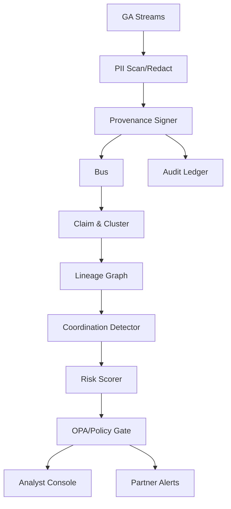

# Georgia Disinformation Defense Stack — Initial Response Plan

## 1. Mission Decomposition

- **Detection lead time**: Build streaming ingestion for GA-focused sources (local news, state agencies, campus channels, weather/emergency feeds) with near-real-time narrative clustering and alerting.
- **Attribution + coordination**: Extend entity/relationship graph (IntelGraph) with actor/channel provenance, synchronized posting heuristics, and paraphrase-invariant content hashes.
- **Response playbooks**: Codify prebunk/debunk flows, partner notification templates, and mitigation decision trees with compliance gates.
- **Audit + compliance**: Enforce provenance capture, PII scanning, chain-of-custody, and FOIA-ready evidence packaging.
- **Unit economics**: Optimize compute through adaptive sampling, model distillation for GA vernacular, and analyst-copilot workflows that reduce triage minutes.

## 2. Novelty Hunt Plan (Hypotheses)

- **Narrative Lineage Graph (NLG)** with mutation-aware paraphrase hashing across modalities yields earlier coordination signals (A/B against baseline clustering).
- **Place-aware NER + community lexicon adapter** improves GA coverage/recall on local entities versus generic NER.
- **Counterfactual diffusion + intervention planner** provides ranked, least-intrusive mitigations with predicted impact and uncertainty.
- **Provenance & Authenticity Ledger** couples ingest attestations with analyst actions for tamper-evident auditability.
- **Coordination fingerprinting** using synchronized burst detection and cross-platform reuse of assets reduces false positives on benign virality.

## 3. Prior-Art Shortlist (Delta Targets)

- C2PA verification pipelines (for authenticity checks) — extend with ingest-first attestation and ledger binding.
- Existing narrative clustering (e.g., generic semantic clustering) — add lineage graph + mutation tracking.
- Bot/coordination heuristics (temporal bursts, URL reuse) — augment with GA-local cadence baselines and cross-platform asset fingerprints.
- Place-aware NER research — specialize to GA to reduce locality misses.
- Public mis/disinformation benchmarks — create GA-specific benchmark with synthetic-but-safe coordination scenarios.

## 4. Architecture Sketch

- **Ingest**: Streaming collectors (public GA sources) → PII scanner/redactor → Provenance signer → Message bus.
- **Processing**: Claim extraction → Narrative clustering → Lineage graph builder → Coordination detector → Risk scorer.
- **Storage**: IntelGraph for entities/relations; content store with paraphrase/asset hashes; audit ledger for attestations.
- **Analytics**: Attribution service with calibration; intervention planner; policy engine (OPA/ABAC) for gating actions.
- **Interfaces**: Analyst console, partner-facing alerts, FOIA-ready evidence bundles.

## 5. Experiment Plan

- **Metrics**: TTD (median/p95), FPR at fixed recall, attribution Brier/ECE, coordination P/R, GA coverage score (localized entity recall), cost per incident.
- **Datasets**: GA narrative set (public sources), synthetic coordination scenarios, multilingual GA-relevant corpora (English/Spanish as available).
- **Ablations**: NLG on/off; place-aware NER vs base; coordination fingerprinting vs baseline; intervention planner vs control.
- **Configs**: Deterministic seeds; config-driven pipelines; logging to JSONL with OpenTelemetry traces.

## 6. Patent Angles (Candidate Claims)

- **Method**: Generating narrative lineage graphs with paraphrase-invariant multimodal hashing to detect coordinated mutations in region-specific streams.
- **System**: Integrated provenance-first pipeline that binds ingest attestations, lineage graph evolution, and policy-gated interventions for localized disinformation defense.
- **Dependent ideas**: GA-adaptive lexicon fine-tuning; coordinated burst fingerprinting; counterfactual diffusion for mitigation ranking; FOIA-ready evidence packaging with tamper-evident ledger links.

## 7. Commercialization Hooks

- **Units**: Cost per monitored source/day; cost per incident; analyst-minutes per alert; attribution confidence SLAs.
- **Targets**: GA state/local agencies, local media consortia, campus safety offices, election partners, NGOs.
- **Licensing**: Apache/MIT-friendly components; optional managed service with premium provenance and intervention modules.

## 8. Risks & Mitigations

- **Privacy/over-collection**: Enforce PII scanning/redaction at ingest; data minimization; retention policies.
- **Misclassification bias**: Calibration curves, human-in-loop escalation, localized evaluation sets.
- **False coordination flags**: Distinguish benign virality via baseline cadence modeling; include satire labeling.
- **Compliance drift**: Policy-as-code enforcement; immutable audit logs; periodic governance reviews.

## 9. Delivery Plan & Milestones (7-day sprint)

- **Day 1-2**: Source audit, config scaffolding, ingestion + provenance signer vertical slice; DoD: streaming ingest writes signed records to bus and ledger.
- **Day 3-4**: Narrative clustering + lineage graph prototype with GA lexicon adapter; DoD: alerts with lineage edges visible in console.
- **Day 5**: Coordination detector + calibration hooks; DoD: precision/recall baseline on synthetic scenarios.
- **Day 6**: Intervention planner + policy gates; DoD: ranked mitigations with uncertainty and policy approvals logged.
- **Day 7**: Benchmark pack + documentation (threat model, eval cards); DoD: reproducible run via `make bootstrap && make test && make run`.

> Defensive-only scope: no generation of persuasive/targeted disinformation; all synthetic narratives must be clearly labeled and benign.
