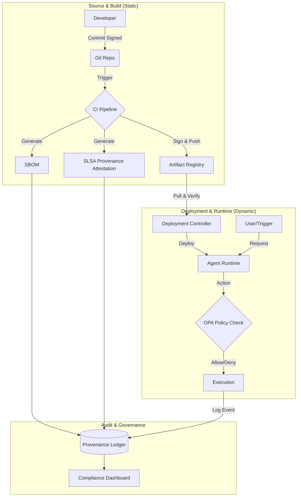

Owner: Governance
Last-Reviewed: 2026-01-14
Evidence-IDs: none
Status: active

# Provenance Data Lifecycle in Summit Ecosystem

**Status:** Draft
**Version:** 1.0
**Owner:** Governance & Security Architecture Team

---

## Executive Summary

This whitepaper details the **Provenance Architecture** for the Summit Ecosystem. It establishes a trusted chain of custody for all artifacts, code changes, and runtime behaviors. By integrating Supply Chain Levels for Software Artifacts (SLSA) standards, SBOM generation, and runtime observability, Summit ensures that every action—from a developer's commit to an agent's autonomous decision—is traceable, verifiable, and governed.

## 1. Problem Statement & Contextual Threats

In complex, multi-agent ecosystems like Summit, trust is not implicit; it must be cryptographically verified. Without a robust provenance architecture, the system faces significant risks:

- **Supply Chain Injection:** Malicious code introduced into dependencies or build artifacts without detection.
- **Unauthorized Agent Behavior:** Autonomous agents executing actions outside their governance mandates.
- **Loss of Accountability:** Inability to trace a specific production incident back to the responsible code change, configuration, or human approval.
- **Compliance Drift:** Failure to prove adherence to regulatory or internal policy standards during audits.

## 2. Provenance Architecture Overview

The Summit Provenance Architecture operates on three distinct layers:

1. **Build-Time Provenance (Static):** Verifies _what_ is running. Includes source code signatures, build environment attestation, and SBOM generation.
2. **Runtime Provenance (Dynamic):** Verifies _who_ (agent/user) is acting and _why_. Includes identity federation (SPIFFE/OIDC), request tracing (OpenTelemetry), and policy enforcement (OPA).
3. **Audit & Governance (Historical):** Verifies _what happened_. A tamper-evident ledger (IntelGraph) that links build artifacts to runtime events.

## 3. Layered Provenance Flows

### Diagram: The Provenance Pipeline

## 4. End-to-End Trace Path

The provenance lifecycle follows a linear progression, ensuring no gap in the chain of custody:

1. **User/Developer Action:**
   - **Input:** Code commit or configuration change.
   - **Control:** GPG signing of commits; branch protection rules.
   - **Evidence:** Git commit hash, committer identity.

2. **Build & Artifact Generation:**
   - **Process:** CI/CD pipeline executes build steps.
   - **Control:** Hermetic build environments.
   - **Evidence:**
     - **SBOM:** Complete inventory of dependencies (CycloneDX/SPDX).
     - **SLSA Predicate:** JSON document describing the builder, source, and parameters.
     - **Signature:** Artifacts signed by the CI identity (Cosign).

3. **Deployment & Admission:**
   - **Process:** Kubernetes/Runtime admission controller.
   - **Control:** Signature verification (Kyverno/Gatekeeper).
   - **Evidence:** Admission logs, verifying the artifact matches the signed digest.

4. **Runtime Execution:**
   - **Process:** Agent processes a request.
   - **Control:** OPA policies evaluate the request context against the agent's mandate.
   - **Evidence:** Distributed traces (traceID), audit logs containing the `provenance_id` of the code running.

5. **Audit & Analysis:**
   - **Process:** Security review or incident investigation.
   - **Control:** Read-only access to the Provenance Ledger.
   - **Evidence:** A unified graph linking the production error -> runtime trace -> specific build -> source commit -> author.

## 5. Alignment with Standards

### SLSA (Supply Chain Levels for Software Artifacts)

Summit targets **SLSA Level 3** compliance:

- **Build as Code:** Build definition is version controlled.
- **Authenticated Provenance:** Provenance is generated by the build service, not the user.
- **Verified History:** Revision history is retained.

### SBOM (Software Bill of Materials)

- **Format:** CycloneDX v1.4+
- **Scope:** Application dependencies, OS packages, and model weights (for AI agents).

### OPA (Open Policy Agent)

- **Role:** Enforces policies based on provenance data (e.g., "Only allow images signed by 'Release-Signer-Key' with SLSA level >= 2").

## 6. Sample Scenarios

### Scenario A: Supply Chain Breach Attempt

- **Event:** An attacker compromises a dependency `lib-malicious` and pushes a new version.
- **Detection:**
  1. The CI pipeline generates a new SBOM containing `lib-malicious`.
  2. The Vulnerability Scanner (Trivy) flags the new package during the build.
  3. **Block:** The pipeline fails; no artifact is signed. The provenance trail shows exactly when and how the bad dependency was introduced.

### Scenario B: Remediation Trace

- **Event:** A vulnerability is discovered in `lib-utils` v1.0 running in production.
- **Trace:**
  1. Query the **Provenance Ledger** for all running services containing `lib-utils` v1.0 (via SBOM data).
  2. Identify the specific build IDs and commit hashes.
  3. Automated tooling opens PRs to upgrade `lib-utils` in the identified repositories.
  4. New provenance attestations confirm the fix in the subsequent builds.
