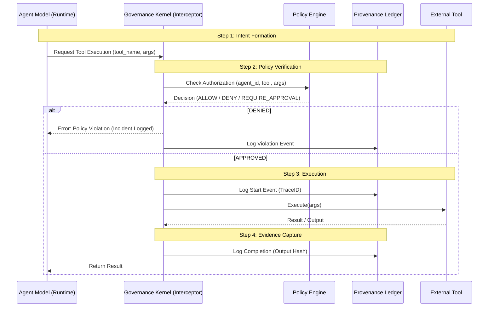

# Summit Governed Tool Loop Architecture

**Status:** Draft
**Owner:** Platform Engineering
**Compliance:** SLSA Level 3, SOC 2 Type II

## 1. Context & Motivation

Traditional AI agents operate in an unconstrained loop: `Model -> Output -> Tool Execution -> Result`.
In a regulated environment like Summit, this is unacceptable. An agent must not be able to execute code or access data without:
1.  **Identity Verification** (Is this really the approved agent?)
2.  **Policy Authorization** (Is this action allowed by the current policy?)
3.  **Provenance Logging** (Will we be able to prove this happened later?)

This document defines the **Governed Tool Loop**, a runtime wrapper that intercepts all agent actions.

## 2. The Governed Loop

The loop replaces direct execution with a **Request-Verify-Execute-Log** cycle.

### Architecture Diagram

## 3. Core Components

### 3.1 Governance Kernel (The Interceptor)
The Kernel is the only component with actual permissions to invoke tools. The Agent Model is sandboxed and has **zero** direct network or filesystem access. It can only emit structured JSON requests to the Kernel.

### 3.2 Policy Engine (OPA)
Before any tool is executed, the Kernel queries OPA with:
-   `input.agent.id` (from Manifest)
-   `input.tool.name` (e.g., `database_write`)
-   `input.args` (e.g., `DELETE FROM users`)
-   `input.context` (Environment, User Context)

Policies can enforce:
-   "No database writes on Fridays"
-   "Code Review Agent can only read files, not write"
-   "PII detection in arguments"

### 3.3 Provenance Ledger
Every step is appended to an append-only ledger (Postgres/Neo4j).
Evidence Artifacts produced:
-   `agent_run.json`: The full session transcript.
-   `decision.json`: The OPA decision proof.
-   `tool_trace.json`: Input/Output of the tool.

## 4. Implementation Requirements

### 4.1 Manifest Binding
The Governance Kernel initializes by loading the **Summit Agent Manifest** (`agent.yaml`). It verifies:
-   The running model matches the manifest.
-   The instruction hash matches the manifest.
-   The loaded tools match the allowlist.

### 4.2 Deterministic Replay
If `replay_mode: deterministic` is set, the Kernel must:
1.  Seed the random number generator.
2.  Record all tool outputs.
3.  In replay mode, *mock* the tool execution using the recorded outputs to verify the agent's logic hasn't drifted.

## 5. Security Guarantees

-   **Non-Repudiation**: The agent cannot deny it took an action; the Ledger has the signed trace.
-   **Fail-Closed**: If OPA is unreachable or the Ledger is down, the Kernel **blocks** execution.
-   **Least Privilege**: Agents only see the tools explicitly granted in their manifest.
