## Overview

ZIP Export & Certification provides a secure way to bundle IntelGraph data, reports, and artifacts with cryptographic verification. Each export is digitally signed and includes a tamper-evident manifest for integrity validation.

## Format Specification

### Archive Structure

```
export-2025-09-08-abc123.zip
├── manifest.json          # Signed manifest with metadata
├── data/                  # Exported data files
│   ├── entities.json     # Graph entities
│   ├── relationships.json # Graph relationships
│   └── metadata.json     # Export metadata
├── reports/              # Generated reports
│   ├── summary.pdf       # Executive summary
│   └── detailed.html     # Detailed analysis
├── certificates/         # Verification certificates
│   ├── signing-cert.pem  # Signing certificate
│   └── ca-chain.pem      # Certificate authority chain
└── signatures/           # Cryptographic signatures
    ├── manifest.sig      # Manifest signature
    └── content.sig       # Content signature
```

### Manifest Format

```json
{
  "version": "1.0",
  "export_id": "abc123def456",
  "timestamp": "2025-09-08T10:30:00Z",
  "requester": "analyst@organization.com",
  "certification_level": "confidential",
  "files": [
    {
      "path": "data/entities.json",
      "size": 1024576,
      "checksum": "sha256:e3b0c44298fc1c149afbf4c8996fb92427ae41e4649b934ca495991b7852b855"
    }
  ],
  "signatures": {
    "algorithm": "RSA-SHA256",
    "certificate_fingerprint": "12:34:56:78:90:ab:cd:ef",
    "signature": "base64-encoded-signature"
  }
}
```

## Creating ZIP Exports

### Using the Web Interface

1. Navigate to **Data Export** → **Create Archive**
2. Select data scope and date range
3. Choose certification level (public, confidential, secret)
4. Click **Generate Signed Export**
5. Download when processing completes

### Using the API

```bash
curl -X POST https://api.intelgraph.com/v2/exports \
  -H "Authorization: Bearer $TOKEN" \
  -H "Content-Type: application/json" \
  -d '{
    "scope": ["entities", "relationships", "reports"],
    "date_range": {
      "start": "2025-09-01T00:00:00Z",
      "end": "2025-09-08T23:59:59Z"
    },
    "certification_level": "confidential",
    "format": "zip",
    "include_signatures": true
  }'
```

### Using the CLI

```bash
# Create export
intelgraph export create \
  --scope entities,relationships \
  --date-range 2025-09-01:2025-09-08 \
  --cert-level confidential \
  --output export-$(date +%Y%m%d).zip

# Check export status
intelgraph export status abc123def456

# Download when ready
intelgraph export download abc123def456
```

## Sample Export

Here's a minimal sample export structure:

```json
// manifest.json
{
  "version": "1.0",
  "export_id": "sample123",
  "timestamp": "2025-09-08T10:30:00Z",
  "requester": "demo@example.com",
  "certification_level": "public",
  "files": [
    {
      "path": "data/sample-entities.json",
      "size": 2048,
      "checksum": "sha256:sample-hash"
    }
  ],
  "signatures": {
    "algorithm": "RSA-SHA256",
    "certificate_fingerprint": "sample:fingerprint",
    "signature": "sample-signature-base64"
  }
}
```

```json
// data/sample-entities.json
{
  "entities": [
    {
      "id": "ent_001",
      "type": "person",
      "properties": {
        "name": "Sample Entity",
        "created_at": "2025-09-08T10:00:00Z"
      }
    }
  ],
  "metadata": {
    "total_count": 1,
    "export_timestamp": "2025-09-08T10:30:00Z"
  }
}
```

## Verification Flow

### Automatic Verification

The system automatically verifies exports during creation and download:

```mermaid
flowchart TD
  A[User requests ZIP] --> B{Validate permissions}
  B -->|OK| C[Collect & bundle data]
  B -->|Denied| H[Return 403 error]
  C --> D[Generate manifest]
  D --> E[Sign manifest & content]
  E --> F[Create ZIP archive]
  F --> G[Store with metadata]
  G --> I[Return download link]

  J[User downloads ZIP] --> K[Verify signatures]
  K --> L{Signatures valid?}
  L -->|Yes| M[Extract & use]
  L -->|No| N[Reject + alert]
```



### Manual Verification

#### Verify Manifest Signature

```bash
# Extract manifest and signature
unzip -j export.zip manifest.json signatures/manifest.sig

# Verify signature using certificate
openssl dgst -sha256 -verify signing-cert.pem \
  -signature signatures/manifest.sig manifest.json
```

#### Verify File Checksums

```bash
# Check each file's checksum against manifest
while read -r path size checksum; do
  echo "Verifying $path..."
  actual=$(sha256sum "$(basename "$path")" | cut -d' ' -f1)
  expected=${checksum#sha256:}
  if [ "$actual" = "$expected" ]; then
    echo "✓ $path: OK"
  else
    echo "✗ $path: FAILED"
  fi
done < <(jq -r '.files[] | "\(.path) \(.size) \(.checksum)"' manifest.json)
```

#### Certificate Chain Validation

```bash
# Verify certificate chain
openssl verify -CAfile ca-chain.pem signing-cert.pem

# Check certificate validity period
openssl x509 -in signing-cert.pem -noout -dates
```

### Verification API

```bash
# Verify export programmatically
curl -X POST https://api.intelgraph.com/v2/exports/verify \
  -H "Content-Type: multipart/form-data" \
  -F "archive=@export.zip" \
  -F "verify_signatures=true" \
  -F "check_timestamps=true"
```

## Certification Levels

| Level            | Description        | Use Case             | Signature Requirements |
| ---------------- | ------------------ | -------------------- | ---------------------- |
| **Public**       | Non-sensitive data | Open research, demos | Standard RSA-2048      |
| **Confidential** | Sensitive data     | Internal analysis    | RSA-4096 + timestamp   |
| **Secret**       | Classified data    | Government/military  | Hardware HSM required  |

## Troubleshooting

### Common Issues

**Signature Verification Failed**

```bash
# Check certificate validity
openssl x509 -in certificates/signing-cert.pem -noout -dates

# Verify certificate chain
openssl verify -CAfile certificates/ca-chain.pem certificates/signing-cert.pem
```

**Checksum Mismatch**

- Archive may be corrupted during transfer
- Re-download the export
- Check network integrity

**Permission Denied**

- Verify user has export permissions for requested data
- Check certification level authorization
- Confirm API token validity

### Support Resources

- [Certificate Management](../security/certificate-management.md)
- [Export API Reference](../reference/api/export-endpoints.md)
- [Troubleshooting Guide](../support/troubleshooting.md)


