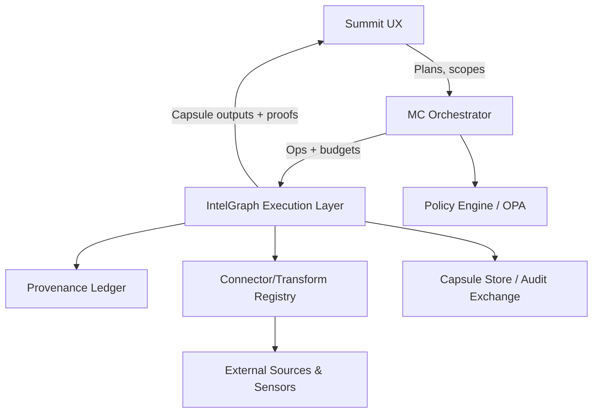

# Integrated Competitive Surpass Specification

## Purpose

This document consolidates the five competitive wedges (Graphika, Recorded Future, Palantir, Maltego, SpiderFoot) into a single Summit/IntelGraph platform specification with a shared investigation IR, capsule/proof format, orchestration model, and patent-claim skeletons suitable for filing. The goal is to sidestep-and-surpass each competitor by coupling provenance-first graph analytics (IntelGraph), deterministic orchestration (MC), and auditable analyst UX (Summit).

## Shared Investigation IR and Capsules

- **Core artifact:** `Investigation Capsule (IC)` = { `scope_token`, `policy_tokens[]`, `determinism_seed`, `graph_ir`, `transform_ir`, `proof_chain`, `rate_limit_proofs`, `redaction_plan`, `replay_token` }.
- **Graph IR (GIR):** typed graph over `Actor`, `Content`, `Infrastructure`, `EvidenceAtom`, `PolicyDecision`; edges carry `provenance_ref`, `policy_effect`, `timestamp`. GIR supports temporal windows and policy-scope projections.
- **Transform IR (TIR):** deterministic ops: `DETECT`, `SEGMENT`, `INFER`, `ENRICH`, `LINK`, `PIVOT`, `MATERIALIZE`, `EXPORT`; each op is annotated with `effects` (READ/WRITE/EXPORT), `budget`, `rate_limit`, `license_claims`, `pii_classes`.
- **Proof Chain:** per-op witness = `Hash(op, inputs_commit, outputs_commit, policy_decision_id, time_window)`; chain is stored in provenance ledger for replay.
- **Policy Envelope:** every capsule binds to `purpose`, `actor`, `data_handling` class; active actions require explicit `policy_token` and rate-limit proof.
- **Replayability:** `replay_token = Hash(IC, schema_version)` allows deterministic re-execution across IntelGraph/MC.

## Cross-Wedge Execution Model

1. **Compile:** Convert wedge-specific workflows into TIR; verify effects/licensing/policy; emit `plan_id` + `capsule_schema_version`.
2. **Execute:** MC orchestrates TIR with budgets, rate-limiters, and provenance capture; IntelGraph materializes outputs; Summit renders audit/evidence drawer with replay affordances.
3. **Verify/Share:** Capsules can be validated (`verify_capsule`) and exchanged (federated diff or attested bundle) without revealing raw data beyond policy scope.

## Service Architecture (shared for all wedges)

- **Summit:** Investigation recipes, evidence drawer (what/why/how/replay), partner mesh audit, counterfactual UI for risk.
- **MC:** Deterministic orchestration, verify-first guardrails, active-mode gating, counterfactual planning hooks.
- **IntelGraph:** Graph IR executor, factor-graph inference, typed diff engine, witness builder, capsule store.
- **Policy Engine:** purpose/policy enforcement, effects gating, license checks, export controls.
- **Provenance Ledger:** immutable proof chain; supports commitments for federated exchange.

## Unified APIs

- `POST /v1/plans/compile` → `{plan_id, tir, capsule_schema_version, effects}`
- `POST /v1/plans/run` → `{capsule_id, outputs, audit, replay_token}`
- `POST /v1/capsules/verify` → `{valid, reasons, policy_gaps}`
- `POST /v1/capsules/share` → `{attested_bundle, diff_proof?}`
- `POST /v1/risk/decompose` → `{risk_vector, support_set, counterfactuals, audit}`
- `POST /v1/narratives/run` → `{attribution_bundle, audit}`
- `POST /v1/mesh/publish_diff` / `apply_diff` / `resolve_conflict`

All APIs require `purpose`, `scope`, `budget` inputs and emit proof chains.

## Wedge-Specific Sidestep-to-Surpass Patterns

### Graphika → Narrative-to-Actor Attribution Compiler (NAAC)

- Compile narrative detection + community segmentation + coordination scoring into TIR with temporal bounds and evidence thresholds.
- Outputs attribution bundles (actors, narratives, coordination proof, pivots into cyber) with replay tokens and provenance.

### Recorded Future → Evidence-Dominant Risk Decomposition (EDRD)

- Factor-graph risk modeling; emits `RiskVector`, `MinimalEvidenceSet`, and `CounterfactualActions` with provenance-weighted inference.

### Palantir → Federated Ontology Diff Mesh (FODM)

- Share typed diffs + proofs across tenants; apply/resolve conflicts with schema-aware merge and policy tokens.

### Maltego → Transform Graph Compiler with Provenance Contracts (TGC-PC)

- Compile transform workflows into cacheable, policy-typed, reproducible plans; emit witness chains per op and materialize into IntelGraph.

### SpiderFoot → Purpose-Bound OSINT Scan Capsules (PBOSC)

- Default passive scans; active probing gated by explicit authorization; capsules carry target commitments, module manifests, redactions, and rate-limit proofs.

## Cross-Cutting Non-Functional Requirements

- **Determinism:** Seeds + snapshot ids recorded in capsules.
- **Safety:** verify-first ingestion; active actions require elevated policy token; export controls enforced by effects annotations.
- **Observability:** per-op metrics (latency, cache hits), traces across MC/IntelGraph, and audit-ready proof chains.
- **Performance:** windowed graph ops `O(E_w)`; factor-graph inference `O(|F| * iters)`; bounded search for minimal support sets.

## Draft Patent Claim Skeletons

Each wedge includes two independent claims (IC1/IC2) and eight dependent claims (DC1–DC8) structured for filing; claims assume the shared capsule/proof model above.

### Graphika / NAAC

- **IC1:** A method to compile narrative signals into a time-bounded attribution program that outputs an attribution bundle with provenance-bound replay tokens.
- **IC2:** A system executing compiled attribution DAGs with temporal constraints and emitting coordination proofs coupled to policy-scoped evidence.
- **DC1:** Requires temporal windowed community segmentation over actor-content graphs.
- **DC2:** Uses coordination scoring based on timing, lexical similarity, and shared-link signals with threshold gating.
- **DC3:** Generates pivots into cyber telemetry (domains, infra, identities) as structured outputs.
- **DC4:** Embeds provenance references per op and per-edge in the attribution bundle.
- **DC5:** Enforces budgets/rate-limits during attribution execution via MC orchestration.
- **DC6:** Provides replay tokens enabling deterministic re-execution of attribution programs.
- **DC7:** Supports capsule verification prior to pivoting into downstream investigations.
- **DC8:** Supports policy-based redaction of actor identities for regulated scopes.

### Recorded Future / EDRD

- **IC1:** A method constructing a provenance-weighted factor graph to compute a multi-component risk vector and a minimal supporting evidence set.
- **IC2:** A system generating counterfactual remediation actions with predicted delta-risk vectors using policy-scoped evidence capsules.
- **DC1:** Trust weights derived from source provenance and recency.
- **DC2:** Minimal evidence set computed via bounded search over factor contributions.
- **DC3:** Counterfactuals mapped to remediation catalogs with policy effects annotated.
- **DC4:** Emits replay tokens enabling deterministic recomputation under changed evidence.
- **DC5:** Supports export-controlled sharing of decomposed risk vectors without raw evidence.
- **DC6:** Captures per-factor witness hashes in the provenance ledger.
- **DC7:** Integrates with MC to simulate remediation sequences under budget constraints.
- **DC8:** Provides Summit UI affordances linking risk components to evidence atoms.

### Palantir / FODM

- **IC1:** A method for generating typed ontology diffs with embedded proofs and publishing them across federated tenants without sharing raw data.
- **IC2:** A system for validating and applying attested typed diffs with conflict resolution on keyed objects under policy control.
- **DC1:** Diffs include before/after hashes and change operations per object type.
- **DC2:** Proofs reference policy tokens and provenance commits for each diff segment.
- **DC3:** Conflict resolution based on schema-aware merge priorities and keyed-object semantics.
- **DC4:** Supports subscription-based receipt and validation of diffs.
- **DC5:** Provides replay tokens for deterministic reapplication of diff bundles.
- **DC6:** Exposes mesh interfaces (`publish_diff`, `apply_diff`, `resolve_conflict`) with audit trails.
- **DC7:** Allows selective redaction of fields in shared diffs per partner policy.
- **DC8:** Integrates with Summit to display partner exchange audit timelines.

### Maltego / TGC-PC

- **IC1:** A method compiling transform workflows into policy-typed, cache-aware execution plans with per-op provenance witnesses.
- **IC2:** A system executing compiled transform plans and materializing outputs into a provenance-bound graph store with replay tokens.
- **DC1:** Transform IR ops annotated with effects, budgets, licenses, and PII classes.
- **DC2:** Compile-time optimizations for deduplication, batching, and cache joins.
- **DC3:** Execution requires license and policy verification before external calls.
- **DC4:** Witnesses hash op, input/output commits, and policy decisions per step.
- **DC5:** Supports passive vs active modes with explicit authorization for active transforms.
- **DC6:** Materializes outputs directly into IntelGraph with provenance edges.
- **DC7:** Provides Summit UI session witness chains for analyst replay.
- **DC8:** Enables export-controlled bundles for partner sharing without full graph export.

### SpiderFoot / PBOSC

- **IC1:** A method generating purpose-bound OSINT scan capsules with default passive mode, redacted evidence atoms, and rate-limit proofs.
- **IC2:** A system orchestrating OSINT modules with policy-aware activation of active probes and emitting replayable capsules.
- **DC1:** Target commitments hashed with tenant-specific salting.
- **DC2:** Module manifests include versions and policy/ license claims.
- **DC3:** Active modules require explicit authorization tokens and elevated purposes.
- **DC4:** Rate-limit proofs attached per module execution.
- **DC5:** Evidence atoms redacted per data-handling class before storage.
- **DC6:** Capsules verified before ingestion into IntelGraph.
- **DC7:** Summit renders safe-mode toggles and capsule audits for compliance export.
- **DC8:** MC enforces budget caps and halting on policy violations during scans.

## Audit, Compliance, and Safety

- All capsules carry policy decisions, effects annotations, rate-limit proofs, and witness chains in the provenance ledger.
- Export-controlled operations require explicit `purpose` and `actor` claims; unverified capsules are blocked from downstream use.
- Compliance evidence: capsule manifests + ledger entries serve as audit artifacts; Summit can export bundles for review.

## Forward-Looking Enhancements

- **Causal graph inference** for coordination detection using intervention analysis.
- **Zero-knowledge diff proofs** for FODM so partners validate changes without seeing sensitive fields.
- **Adaptive cache arbitration** in TGC-PC to reuse safe transform outputs across tenants with license-aware caching.
- **Automated counterfactual simulators** for EDRD to recommend optimal remediation portfolios under budget.
