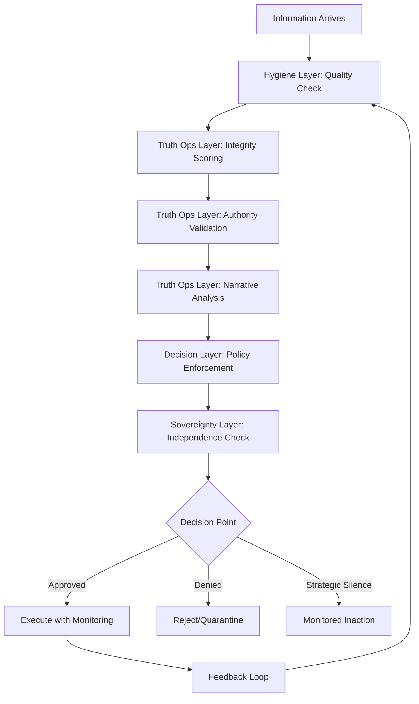

# Summit Integration Runtime

## The Unified Enforcement Engine

> **"Information hygiene, adversarial resistance, and epistemic sovereignty—enforced in real-time, as a single coherent system."**

## Executive Summary

The **Summit Integration Runtime** fuses four previously separate capability domains into a single, real-time enforcement engine:

1. **Information Supply Chain Hygiene** - Quality, provenance, metering
2. **Truth Operations** - Adversarial resistance, integrity scoring
3. **Decision Enforcement** - Policy-based governance
4. **Epistemic Sovereignty** - Independence preservation

This is not a collection of tools. This is a **unified cognitive defense system**.

---

## Architecture

### Layered Defense Model

```
┌─────────────────────────────────────────────────────────────┐
│                     APPLICATION LAYER                        │
│         (Agents, Services, Human Operators)                  │
└─────────────────────────────────────────────────────────────┘
                           ↓↑
┌─────────────────────────────────────────────────────────────┐
│                SUMMIT INTEGRATION RUNTIME                    │
│                                                              │
│  ┌──────────────────────────────────────────────────────┐  │
│  │  Epistemic Sovereignty Layer (Independence)          │  │
│  └──────────────────────────────────────────────────────┘  │
│                           ↓↑                                │
│  ┌──────────────────────────────────────────────────────┐  │
│  │  Decision Enforcement Layer (Policy & Governance)    │  │
│  └──────────────────────────────────────────────────────┘  │
│                           ↓↑                                │
│  ┌──────────────────────────────────────────────────────┐  │
│  │  Truth Operations Layer (Adversarial Defense)        │  │
│  └──────────────────────────────────────────────────────┘  │
│                           ↓↑                                │
│  ┌──────────────────────────────────────────────────────┐  │
│  │  Information Hygiene Layer (Quality & Provenance)    │  │
│  └──────────────────────────────────────────────────────┘  │
│                                                              │
└─────────────────────────────────────────────────────────────┘
                           ↓↑
┌─────────────────────────────────────────────────────────────┐
│               INFORMATION SOURCES                            │
│    (APIs, Databases, AI Models, Humans, Sensors)            │
└─────────────────────────────────────────────────────────────┘
```

### Information Flow



---

## Core Components

### Component 1: Unified Metadata Schema

**Purpose**: Single coherent metadata structure across all layers

```typescript
interface SummitInformationMetadata {
  // Core identification
  claim_id: string;
  timestamp: DateTime;
  content: string;
  source: SourceMetadata;

  // Layer 1: Information Hygiene
  hygiene: {
    quality_score: number;        // 0.0-1.0
    provenance_chain: ProvenanceLink[];
    certifications: Certification[];
    usage_metrics: UsageMetrics;
    lineage: LineageGraph;
  };

  // Layer 2: Truth Operations
  truth_ops: {
    confidence: number;           // Traditional metric
    integrity_score: number;      // Adversarial-aware
    integrity_breakdown: {
      source_volatility: number;
      correlation_independence: number;
      historical_adversarial_behavior: number;
      narrative_shift_velocity: number;
      verification_depth: number;
    };
    threat_assessment: ThreatAssessment;
    narrative_metadata?: NarrativeMetadata;
    temporal_metadata: TemporalMetadata;
    authority_metadata: AuthorityMetadata;
    containment_metadata?: ContainmentMetadata;
  };

  // Layer 3: Decision Enforcement
  policy: {
    compliant: boolean;
    violations: PolicyViolation[];
    required_actions: RequiredAction[];
    overrides: PolicyOverride[];
  };

  // Layer 4: Epistemic Sovereignty
  sovereignty: {
    ai_involvement_level: number; // 0.0 (none) to 1.0 (full AI)
    human_judgment_required: boolean;
    contributes_to_capture_risk: boolean;
    alternative_sources_required: number;
    independence_impact: number;  // Effect on independence score
  };

  // Cross-cutting
  audit_trail: AuditEntry[];
  enforcement_actions: EnforcementAction[];
}
```

### Component 2: Processing Pipeline

**Purpose**: Coordinated multi-layer processing

```python
class SummitProcessingPipeline:
    def __init__(self):
        self.hygiene_layer = InformationHygieneLayer()
        self.truth_ops_layer = TruthOperationsLayer()
        self.decision_layer = DecisionEnforcementLayer()
        self.sovereignty_layer = EpistemicSovereigntyLayer()

    async def process_information(self, raw_info: RawInformation) -> ProcessedInformation:
        """
        Process information through all four layers
        Returns: Enriched metadata + enforcement decision
        """

        # Layer 1: Hygiene
        hygiene_result = await self.hygiene_layer.assess(raw_info)
        if hygiene_result.reject:
            return ProcessedInformation(
                status='REJECTED',
                reason='Failed hygiene checks',
                metadata=hygiene_result.metadata
            )

        # Layer 2: Truth Operations
        truth_ops_result = await self.truth_ops_layer.assess(
            raw_info,
            hygiene_metadata=hygiene_result.metadata
        )

        # Check integrity
        if truth_ops_result.integrity_score < INTEGRITY_THRESHOLD:
            # Trigger containment
            containment = await self.truth_ops_layer.initiate_containment(
                raw_info,
                truth_ops_result
            )
            return ProcessedInformation(
                status='QUARANTINED',
                reason=f'Low integrity: {truth_ops_result.integrity_score}',
                metadata=truth_ops_result.metadata,
                containment=containment
            )

        # Layer 3: Decision Enforcement
        decision_result = await self.decision_layer.evaluate_policy(
            raw_info,
            hygiene_metadata=hygiene_result.metadata,
            truth_ops_metadata=truth_ops_result.metadata
        )

        if not decision_result.compliant:
            return ProcessedInformation(
                status='POLICY_VIOLATION',
                reason=decision_result.violation_summary,
                metadata=decision_result.metadata
            )

        # Layer 4: Epistemic Sovereignty
        sovereignty_result = await self.sovereignty_layer.assess_impact(
            raw_info,
            cumulative_metadata={
                'hygiene': hygiene_result.metadata,
                'truth_ops': truth_ops_result.metadata,
                'decision': decision_result.metadata
            }
        )

        # Check if this contributes to epistemic capture
        if sovereignty_result.independence_impact < INDEPENDENCE_THRESHOLD:
            return ProcessedInformation(
                status='SOVEREIGNTY_WARNING',
                reason='Contributes to epistemic capture risk',
                metadata=sovereignty_result.metadata,
                allow_with_warning=True
            )

        # All layers passed
        return ProcessedInformation(
            status='APPROVED',
            metadata=self._merge_metadata(
                hygiene_result,
                truth_ops_result,
                decision_result,
                sovereignty_result
            )
        )

    def _merge_metadata(self, *results) -> SummitInformationMetadata:
        """Combine metadata from all layers into unified structure"""
        return SummitInformationMetadata(
            hygiene=results[0].metadata,
            truth_ops=results[1].metadata,
            policy=results[2].metadata,
            sovereignty=results[3].metadata,
            audit_trail=self._build_audit_trail(*results)
        )
```

### Component 3: Real-Time Policy Engine

**Purpose**: Enforce all policies across all layers simultaneously

```python
class SummitPolicyEngine:
    def __init__(self):
        self.opa_client = OPAClient()  # Open Policy Agent
        self.policy_bundles = [
            'information-hygiene.rego',
            'truth-defense.rego',
            'decision-governance.rego',
            'epistemic-sovereignty.rego'
        ]

    async def evaluate(self, context: EvaluationContext) -> PolicyResult:
        """
        Evaluate information against all policy bundles
        Returns aggregated policy decision
        """

        results = []

        # Evaluate each policy bundle
        for bundle in self.policy_bundles:
            result = await self.opa_client.evaluate(
                bundle=bundle,
                input=context.to_opa_input()
            )
            results.append(result)

        # Aggregate results
        return self._aggregate_policy_results(results)

    def _aggregate_policy_results(self, results: List[OPAResult]) -> PolicyResult:
        """
        Combine policy decisions from all layers
        Most restrictive decision wins
        """

        # Collect all denials
        denials = []
        for result in results:
            denials.extend(result.deny)

        # If any layer denies, overall denial
        if denials:
            return PolicyResult(
                decision='DENY',
                reasons=denials,
                severity='CRITICAL'
            )

        # Collect all warnings
        warnings = []
        for result in results:
            warnings.extend(result.warn)

        if warnings:
            return PolicyResult(
                decision='WARN',
                reasons=warnings,
                severity='WARNING'
            )

        # All layers approve
        return PolicyResult(
            decision='ALLOW',
            reasons=['All policy checks passed'],
            severity='INFO'
        )
```

### Component 4: Cross-Layer Feedback System

**Purpose**: Ensure layers learn from each other

```python
class CrossLayerFeedback:
    def __init__(self):
        self.feedback_channels = {
            'hygiene_to_truth': HygieneToTruthFeedback(),
            'truth_to_decision': TruthToDecisionFeedback(),
            'decision_to_sovereignty': DecisionToSovereigntyFeedback(),
            'sovereignty_to_all': SovereigntyToAllFeedback()
        }

    async def propagate_feedback(self, event: FeedbackEvent):
        """
        When one layer detects an issue, inform other layers
        """

        if event.source_layer == 'truth_ops':
            # Truth ops detected integrity issue
            if event.event_type == 'low_integrity_detected':
                # Inform hygiene layer to scrutinize this source
                await self.feedback_channels['truth_to_hygiene'].increase_scrutiny(
                    source=event.source,
                    reason='Integrity degradation detected'
                )

                # Inform sovereignty layer (may contribute to dependency)
                await self.feedback_channels['truth_to_sovereignty'].track_source_reliability(
                    source=event.source,
                    reliability_change=-0.1
                )

        elif event.source_layer == 'sovereignty':
            # Sovereignty detected capture risk
            if event.event_type == 'capture_risk_elevated':
                # Inform decision layer to require diversity
                await self.feedback_channels['sovereignty_to_decision'].mandate_diversity(
                    domain=event.domain,
                    min_sources=3
                )

                # Inform truth ops to increase narrative vigilance
                await self.feedback_channels['sovereignty_to_truth'].increase_narrative_monitoring(
                    domain=event.domain
                )

        # Additional feedback paths...
```

---

## Integration Patterns

### Pattern 1: Information Arrival

```python
async def handle_information_arrival(info: RawInformation):
    """
    Standard pattern for all information entering Summit
    """

    # Process through pipeline
    result = await summit_pipeline.process_information(info)

    if result.status == 'APPROVED':
        # Make available for decisions
        await information_store.add(result.metadata)

        # Update metrics
        await metrics_tracker.record_approved(result)

        return InformationHandle(
            accessible=True,
            metadata=result.metadata
        )

    elif result.status == 'QUARANTINED':
        # Containment protocol
        await containment_system.quarantine(
            info=info,
            reason=result.reason,
            containment=result.containment
        )

        # Alert operators
        await alerting_system.notify(
            severity='HIGH',
            message=f'Information quarantined: {result.reason}'
        )

        return InformationHandle(
            accessible=False,
            quarantined=True
        )

    elif result.status == 'POLICY_VIOLATION':
        # Reject and log
        await audit_log.record_violation(
            info=info,
            violations=result.metadata.policy.violations
        )

        return InformationHandle(
            accessible=False,
            rejected=True
        )

    elif result.status == 'SOVEREIGNTY_WARNING':
        # Allow but flag
        await sovereignty_monitor.track_capture_contribution(
            info=info,
            impact=result.metadata.sovereignty.independence_impact
        )

        return InformationHandle(
            accessible=True,
            metadata=result.metadata,
            warning='Contributes to epistemic capture risk'
        )
```

### Pattern 2: Decision Making

```python
async def make_decision(context: DecisionContext):
    """
    Standard pattern for all decisions in Summit
    """

    # Gather information
    info_sources = await information_store.query(context.requirements)

    # Check sovereignty constraints
    sovereignty_check = await sovereignty_layer.check_constraints(
        context=context,
        sources=info_sources
    )

    if not sovereignty_check.allowed:
        # E.g., "AI quota exceeded, must decide without AI"
        return DecisionResult(
            denied=True,
            reason=sovereignty_check.reason
        )

    # Evaluate through truth operations
    truth_assessment = await truth_ops_layer.assess_decision_basis(
        sources=info_sources,
        context=context
    )

    if truth_assessment.integrity_insufficient:
        # High-stakes decision with low-integrity information
        if context.allow_strategic_silence:
            return DecisionResult(
                decision_type='STRATEGIC_SILENCE',
                reason='Insufficient integrity, waiting for better information',
                review_deadline=truth_assessment.expected_information_arrival
            )
        else:
            return DecisionResult(
                denied=True,
                reason='Insufficient information integrity for this decision'
            )

    # Check policy compliance
    policy_check = await policy_engine.evaluate(
        context=context,
        sources=info_sources,
        truth_assessment=truth_assessment
    )

    if policy_check.decision == 'DENY':
        return DecisionResult(
            denied=True,
            reason=policy_check.reasons
        )

    # All checks passed - execute decision
    decision = await execute_decision(
        context=context,
        sources=info_sources
    )

    # Record for feedback
    await cross_layer_feedback.record_decision(decision)

    # Update sovereignty metrics
    await sovereignty_monitor.record_decision(
        ai_assisted=context.ai_assisted,
        domain=context.domain
    )

    return DecisionResult(
        approved=True,
        decision=decision,
        metadata=assemble_decision_metadata(
            sovereignty_check,
            truth_assessment,
            policy_check
        )
    )
```

### Pattern 3: Continuous Monitoring

```python
class ContinuousMonitoring:
    def __init__(self):
        self.monitors = {
            'hygiene': HygieneMonitor(),
            'truth_ops': TruthOpsMonitor(),
            'policy': PolicyComplianceMonitor(),
            'sovereignty': SovereigntyMonitor()
        }

    async def continuous_health_check(self):
        """
        Runs continuously, checking all layers
        """
        while True:
            # Check each layer
            health = {}
            alerts = []

            for layer_name, monitor in self.monitors.items():
                layer_health = await monitor.check_health()
                health[layer_name] = layer_health

                if layer_health.status != 'HEALTHY':
                    alerts.append(Alert(
                        layer=layer_name,
                        severity=layer_health.severity,
                        message=layer_health.message
                    ))

            # Cross-layer consistency checks
            consistency = await self._check_cross_layer_consistency(health)
            if not consistency.consistent:
                alerts.append(Alert(
                    layer='CROSS_LAYER',
                    severity='HIGH',
                    message=f'Inconsistency detected: {consistency.issue}'
                ))

            # Emit health report
            await health_dashboard.update(
                health=health,
                alerts=alerts,
                timestamp=now()
            )

            # Act on critical alerts
            critical_alerts = [a for a in alerts if a.severity == 'CRITICAL']
            if critical_alerts:
                await self._handle_critical_alerts(critical_alerts)

            await asyncio.sleep(60)  # Check every minute
```

---

## Deployment Modes

### Mode 1: Full Enforcement (Production)

**All layers active, all policies enforced**

```yaml
summit_runtime:
  mode: FULL_ENFORCEMENT
  layers:
    information_hygiene: ENFORCING
    truth_operations: ENFORCING
    decision_enforcement: ENFORCING
    epistemic_sovereignty: ENFORCING
  policy_response:
    deny: BLOCK
    warn: ALERT_AND_LOG
  monitoring:
    enabled: true
    frequency: CONTINUOUS
```

### Mode 2: Monitoring Only (Staging)

**All layers active, violations logged but not blocked**

```yaml
summit_runtime:
  mode: MONITORING
  layers:
    information_hygiene: MONITORING
    truth_operations: MONITORING
    decision_enforcement: MONITORING
    epistemic_sovereignty: MONITORING
  policy_response:
    deny: LOG_ONLY
    warn: LOG_ONLY
  monitoring:
    enabled: true
    frequency: CONTINUOUS
  alerts:
    enabled: true
    destinations: [development_team]
```

### Mode 3: Selective Enforcement (Hybrid)

**Some layers enforcing, others monitoring**

```yaml
summit_runtime:
  mode: SELECTIVE
  layers:
    information_hygiene: ENFORCING
    truth_operations: ENFORCING
    decision_enforcement: MONITORING  # Not ready yet
    epistemic_sovereignty: MONITORING  # Gradual rollout
  policy_response:
    deny: BLOCK  # For enforcing layers
    warn: ALERT_AND_LOG
```

---

## Performance Considerations

### Latency Budget

| Layer | Target Latency | Maximum Tolerable |
|-------|---------------|-------------------|
| Hygiene | 10ms | 50ms |
| Truth Ops | 50ms | 200ms |
| Decision | 20ms | 100ms |
| Sovereignty | 30ms | 150ms |
| **Total** | **110ms** | **500ms** |

### Optimization Strategies

1. **Parallel Processing**: Layers that don't depend on each other run concurrently
2. **Caching**: Integrity scores, authority assessments cached with TTL
3. **Async Evaluation**: Non-blocking policy evaluation
4. **Tiered Scrutiny**: Quick checks first, deep analysis only if needed

---

## Observability

### Metrics Emitted

```python
# Per-layer metrics
summit.layer.hygiene.quality_score (gauge)
summit.layer.truth_ops.integrity_score (gauge)
summit.layer.truth_ops.threats_detected (counter)
summit.layer.policy.violations (counter)
summit.layer.sovereignty.independence_score (gauge)

# Cross-layer metrics
summit.pipeline.processing_time_ms (histogram)
summit.pipeline.approved_rate (gauge)
summit.pipeline.quarantined_rate (gauge)
summit.pipeline.denied_rate (gauge)

# Health metrics
summit.health.overall_status (gauge)
summit.health.layer_consistency (gauge)
```

### Dashboards

**Dashboard 1: Real-Time Health**
- Overall system status
- Per-layer health indicators
- Current alerts
- Processing throughput

**Dashboard 2: Integrity Trends**
- Average integrity scores over time
- Threat detections per hour
- Containment events
- False positive rate

**Dashboard 3: Sovereignty Metrics**
- Independence Score trend
- AI dependency ratio
- Judgment maintenance quotient
- Capture risk indicators

**Dashboard 4: Policy Compliance**
- Violation rate by policy
- Override frequency
- Approval/denial ratios

---

## Success Criteria

Runtime is functioning correctly when:

✓ All four layers processing all information
✓ Policy violations blocked in real-time
✓ Cross-layer feedback operational
✓ Processing latency < budget
✓ No layer consistency violations
✓ Health monitoring continuous
✓ Alerts actionable and accurate

---

## Conclusion

The Summit Integration Runtime is the **enforcement backbone** that makes Summit's advanced capabilities operational.

This is not aspirational. This is deployable.

**Information hygiene. Adversarial resistance. Policy enforcement. Epistemic sovereignty.**

**Four layers. One runtime. Real-time. Production-ready.**

This is how organizations govern information in hostile, AI-saturated environments.

---

**Document Status**: Canonical
**Last Updated**: 2026-01-01
**Owner**: Summit Integration Runtime Team
