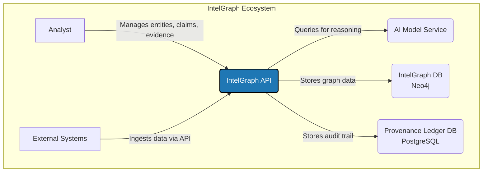
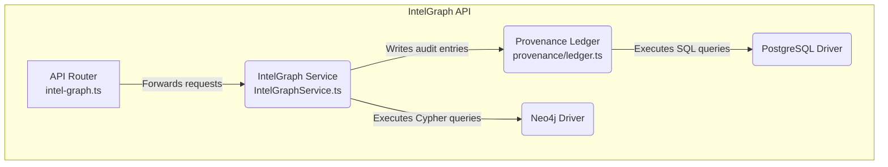
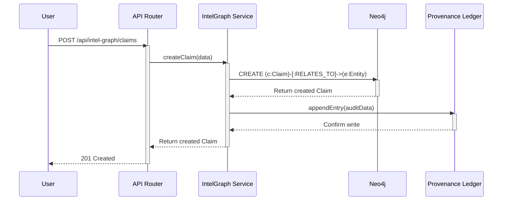
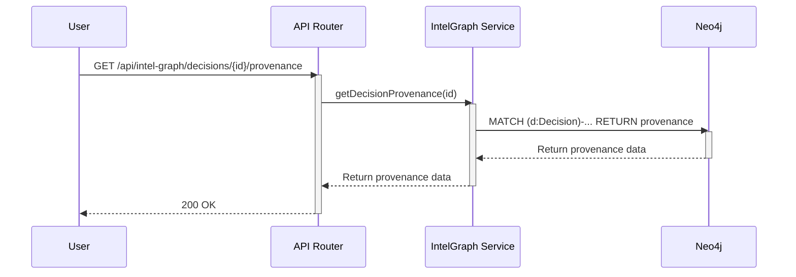

# IntelGraph Architecture

## 1. Overview

The IntelGraph system provides a robust framework for creating, managing, and querying a graph-based provenance trail. It is designed to track the lifecycle of intelligence—from raw evidence to claims, and finally to informed decisions. The system ensures that every piece of information is auditable, traceable, and governed by a clear set of policies.

This document outlines the architecture of the IntelGraph system using the C4 model for visualizing software architecture.

## 2. C4 Model

### Level 1: System Context

The System Context diagram shows how the IntelGraph system fits into its environment, including its users and key dependencies.



| Element                | Description                                                                                             |
| ---------------------- | ------------------------------------------------------------------------------------------------------- |
| **Analyst**            | A human user who interacts with the system via a UI (not pictured) to manage the provenance graph.      |
| **External Systems**   | Other automated systems or data feeds that push information into the IntelGraph via its API.            |
| **IntelGraph API**     | The core of the system; a Node.js/Express application providing a RESTful interface to the graph.       |
| **AI Model Service**   | An external service (real or mock) that provides advanced reasoning capabilities for decision analysis. |
| **IntelGraph DB**      | A Neo4j database that stores the graph of entities, claims, evidence, and their relationships.          |
| **Provenance Ledger DB**| A PostgreSQL database that stores an immutable, hash-chained audit log of all write operations.      |

---

### Level 2: Container Diagram

The Container diagram zooms into the IntelGraph system, showing the high-level technical containers that constitute the API and its data stores.

```mermaid
graph TD
    subgraph "IntelGraph System"
        A[IntelGraph API\nNode.js/Express] -->|Reads/Writes graph data\n(Cypher over Bolt)| B(IntelGraph DB\nNeo4j)
        A -->|Writes audit entries\n(SQL)| C(Provenance Ledger DB\nPostgreSQL)
        A -->|Executes analysis runs| D(Maestro Orchestrator)
    end

    style A fill:#1f77b4,stroke:#000,stroke-width:2px,color:#fff
```

| Container              | Description                                                                                       |
| ---------------------- | ------------------------------------------------------------------------------------------------- |
| **IntelGraph API**     | The main application that exposes the system's functionality via a REST API.                      |
| **IntelGraph DB**      | The primary graph database for storing the provenance data.                                       |
| **Provenance Ledger DB**| The relational database used for the immutable audit trail.                                     |
| **Maestro Orchestrator**| The subsystem responsible for running complex, multi-step workflows, such as the Decision Analysis Pipeline. |

---

### Level 3: Component Diagram

The Component diagram zooms into the **IntelGraph API** container, showing its key internal components.



| Component             | Description                                                                                                   |
| --------------------- | ------------------------------------------------------------------------------------------------------------- |
| **API Router**        | The Express router that defines the API endpoints, validates incoming requests, and calls the service layer.    |
| **IntelGraph Service**| The core business logic layer. It orchestrates all interactions with the databases and other components.      |
| **Provenance Ledger** | A singleton service that handles the creation of immutable, hash-chained audit log entries in PostgreSQL.     |
| **Neo4j Driver**      | The official Neo4j driver used to connect to and query the IntelGraph DB.                                     |
| **PostgreSQL Driver** | The `pg` library used to connect to and query the Provenance Ledger DB.                                       |

## 3. Data Flow Diagrams

### Ingestion Path (e.g., Create Claim)

This sequence diagram illustrates the flow of a request to create a new `Claim`.



### Query Path (e.g., Get Decision Provenance)

This sequence diagram illustrates the flow of a request to retrieve the provenance for a `Decision`.


