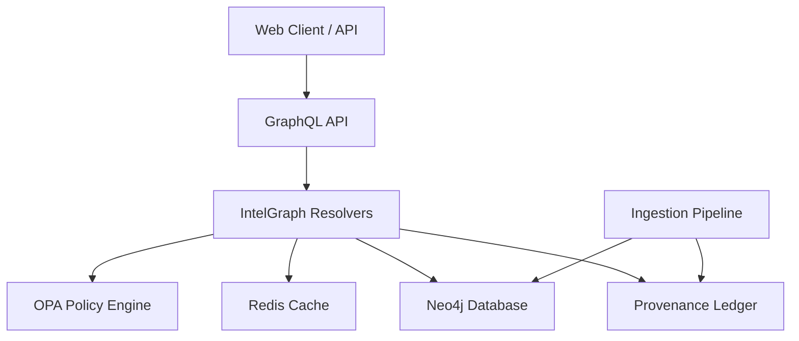

# IntelGraph API Overview

IntelGraph is the core knowledge graph platform for the application, providing entity resolution, relationship mapping, and provenance tracking. It is built on Neo4j and exposed via GraphQL.

## Architecture

IntelGraph sits at the intersection of data ingestion, analysis, and user interaction.



## Data Model

### Core Entities

-   **Entity**: The fundamental unit of the graph (Person, Organization, Location, etc.).
-   **Source**: Origin of the data (Document, API, User Input).
-   **Claim**: An assertion made about an entity or event.
-   **Evidence**: Artifacts supporting a claim or decision.
-   **Decision**: Analytical conclusion or action taken.

### Schema

See `server/src/graphql/intelgraph/schema.ts` for the full GraphQL schema definition.

## key GraphQL Queries

### `entityById(id: ID!)`
Retrieves a single entity by its unique ID.
-   **Policy**: Checks `intelgraph.abac.allow` for read access.
-   **PII**: Automatically redacts sensitive fields based on `intelgraph.abac.pii_redact`.
-   **Performance**: Cached for frequent access.

### `searchEntities(query: String!, ...)`
Full-text search across entity properties.
-   **Filters**: Type, Region, Purpose.
-   **Pagination**: Limit/Offset based.

### `pathBetween(fromId: ID!, toId: ID!, maxHops: Int)`
Finds the shortest path between two entities.
-   **Constraint**: `maxHops` limited to 3 to ensure p95 latency < 2s.

### `entityGraph(centerEntityId: ID!, depth: Int)`
Returns a subgraph centered on an entity for visualization.

## Usage Examples

### Fetching an Entity with Sources

```graphql
query GetEntity {
  entityById(id: "12345") {
    id
    name
    type
    degree
    sources {
      system
      collectedAt
    }
  }
}
```

### Finding a Connection

```graphql
query FindConnection {
  pathBetween(fromId: "person-a", toId: "org-b", maxHops: 2) {
    from
    to
    relType
    score
  }
}
```

## Performance & Caching

-   **Caching**: `entityById` and simple search queries are cached in Redis (TTL 60s).
-   **Connection Pooling**: Neo4j driver uses a connection pool (default max size: 100).
-   **Timeouts**: Queries have strict timeouts to prevent resource exhaustion.
