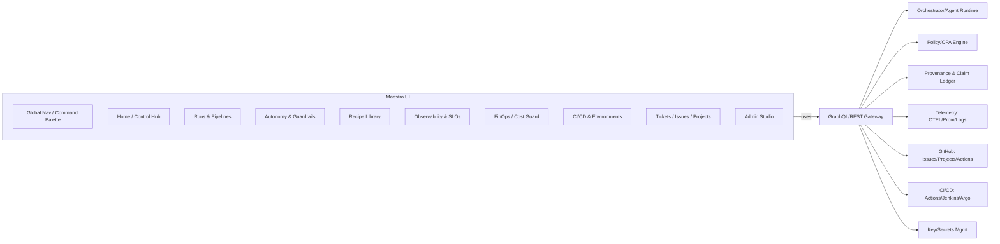
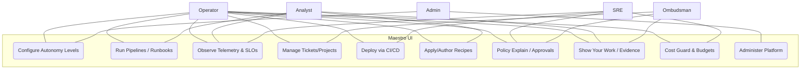
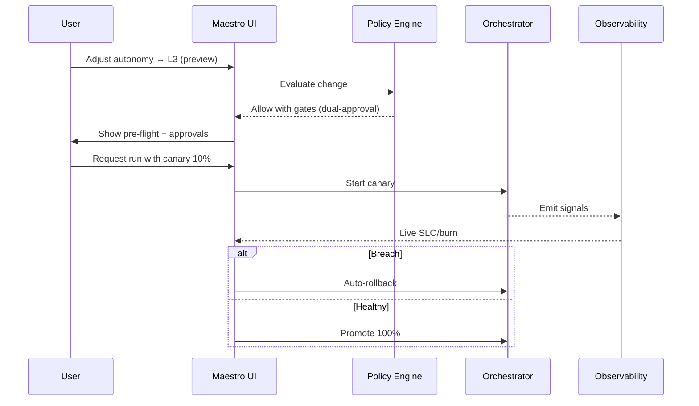
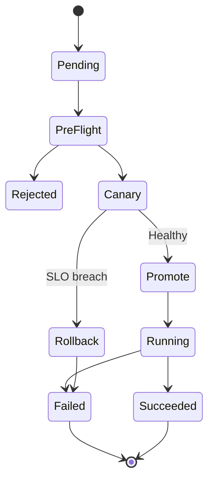

Maestro UI — World‑Class Control Plane (Overview)

Separation: Maestro builds IntelGraph; Maestro ≠ IntelGraph. This UI is a standalone control plane for orchestration, governance, observability, CI/CD, tickets, and evidence.

Information Architecture



Autonomy Model (L0–L5)

Controls: risk budget sliders, blast radius caps, windows, ceilings, approvals, canary ratio, rollback thresholds, with an Explain panel for rationale.

Core Screens (Wireframe Summaries)

- Home/Hub: Autonomy dial, risk budget, freeze, canary, rollback, quick actions, live cards.
- Runs & Pipelines: Filters + DAG view + side panel for Params/Logs/Metrics/Artifacts/Evidence/Policies.
- Autonomy & Guardrails: Level controls, ordered policies, simulation preview.
- Recipes: Filters + grid, right panel for schema/param form/preflight/versioning.
- Observability: Dashboards/Traces/Logs/Alerts/SLOs/Incidents.
- CI/CD: Environments, pipeline graph, controls, GitHub runs.
- Tickets: Table/Board/Roadmap; detail links to runs/PRs.
- Admin: Registry, connectors, flags, access, audit, jobs.

UML / Mermaid Diagrams

Use‑Case (Actors & Goals)



Component Diagram (Logical)

```mermaid
flowchart LR
  UI[Maestro Web UI (React/TS)] --> GQL[API Gateway (GraphQL/REST)]
  GQL --> ORCH[Agent Runtime / Orchestrator]
  GQL --> POL[Policy Engine (OPA/ABAC)]
  GQL --> PROV[Provenance & Evidence Ledger]
  GQL --> OBSV[Observability Stack (OTEL/Prom/Logs)]
  GQL --> GH[GitHub Adapter (Issues/Projects/Actions)]
  GQL --> CICD[CI/CD Adapter (Actions/Jenkins/Argo)]
  GQL --> SECR[Secrets/Key Mgmt]
  GQL --> STORE[Recipe/Config Store]
  ORCH --> RUNT[Run Logs & Artifacts]
  OBSV --> SLO[SLO Engine/Budgets]
```

Sequence — Live Tweak & Safe Apply



State — Run Lifecycle



Getting Started (Dev)

- Build/serve the existing conductor-ui frontend as-is.
- Open with `?ui=maestro` or path `/maestro` to load Maestro UI without affecting existing UI.
- The current data uses mock hooks in `conductor-ui/frontend/src/maestro/api.ts` and can be switched to live APIs.

Runtime Configuration

Inject endpoints at runtime (no rebuild) via a window global in `index.html` or a small script:

```html
<script>
  window.__MAESTRO_CFG__ = {
    gatewayBase: 'http://localhost:4000/api/maestro/v1',
    grafanaBase: 'http://localhost:3000',
    grafanaDashboards: {
      slo: 'maestro-slo',
      overview: 'maestro-overview',
      cost: 'maestro-cost',
    },
    authToken: '<optional bearer>',
  };
  // Navigate to /maestro
</script>
```

Frontend reads config from `conductor-ui/frontend/src/maestro/config.ts` and automatically enables:

- GET /runs, GET /runs/:id, GET /runs/:id/graph
- Logs SSE: GET /runs/:id/logs?stream=true
- PATCH /autonomy (preview + gates)
- GET/PUT /budgets
- POST /tickets
- POST /policies/explain
- Grafana deep links for SLO/overview/cost dashboards

Notes

- This UI is additive. No existing files or IntelGraph product UIs are overwritten.
- Meets separation requirement and aligns with GA P0 scaffolding: navigation, core screens, autonomy controls, and evidence-first surfaces.
