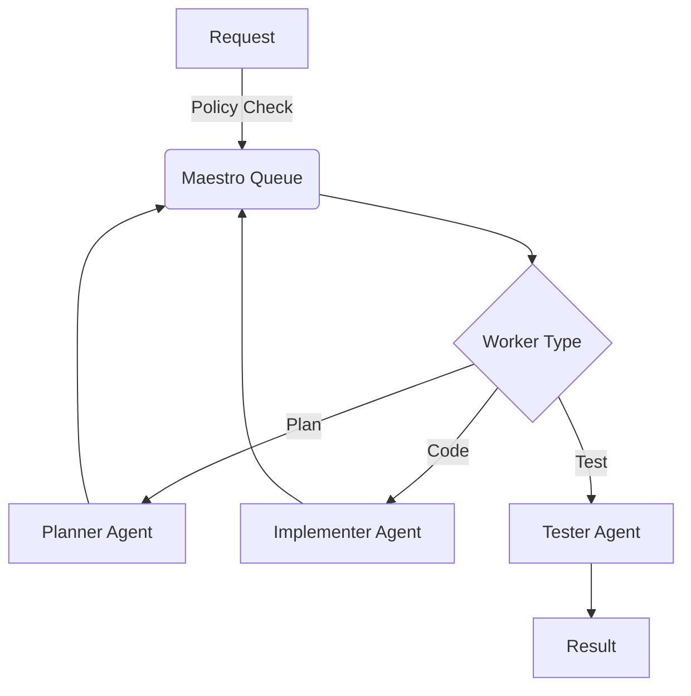

# Maestro / Conductor Overview

Maestro is the orchestration engine for the Summit platform, designed to manage complex workflows involving both AI agents and human operators. It enforces guardrails, manages budgets, and ensures consistent execution of tasks.

## Architecture

Maestro is built on top of [BullMQ](https://docs.bullmq.io/) and Redis, providing a robust, distributed task queue system.

### Key Components

1.  **MaestroOrchestrator** (`server/orchestrator/maestro.ts`): The central singleton that manages the lifecycle of tasks. It exposes methods to enqueue tasks and task chains.
2.  **Workers**: Specialized agents that process tasks.
    -   `planner`: Breaks down high-level goals into subtasks.
    -   `scaffolder`: Sets up project structure.
    -   `implementer`: Writes code.
    -   `tester`: Runs tests.
    -   `reviewer`: Reviews code for quality and security.
    -   `doc-writer`: Generates documentation.
3.  **PolicyGuard** (`server/orchestrator/policyGuard.ts`): A middleware layer that validates tasks against defined policies *before* execution.
4.  **Budget System**: Tracks and limits spending (Token usage/USD) per task and tenant.

## Workflow

A typical Maestro workflow follows this sequence:

## Policies

PolicyGuard enforces rules such as:
-   **Budget Limits**: Tasks cannot exceed defined cost thresholds.
-   **Security**: Checks for credential leakage in context/prompts.
-   **License Compliance**: Scans for restricted licenses.
-   **Resource Limits**: Prevents dangerous system calls or broad-scope operations.
-   **Data Residency**: Enforces geographic data constraints.

## Developer Integration

Maestro is integrated into the developer workflow via the CLI and Make commands.

-   `make maestro-smoke`: specific target to run smoke tests via the Maestro orchestrator.
-   `make check-pr`: Runs PolicyGuard checks on the current branch/changes.

## CI/CD Enforcement

Critical flows like Deployment and PR creation are monitored by Maestro.
-   **PR Creation**: Triggers a `review` task in Maestro.
-   **Deployment**: Requires a successful `test` task run within Maestro.
