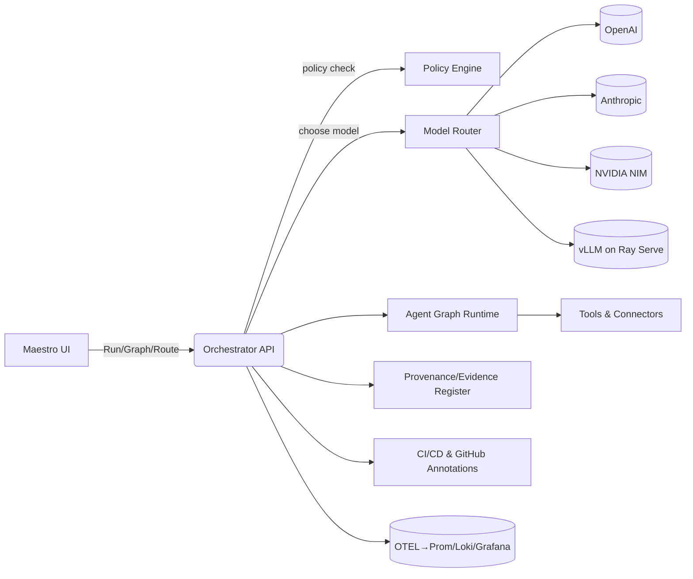
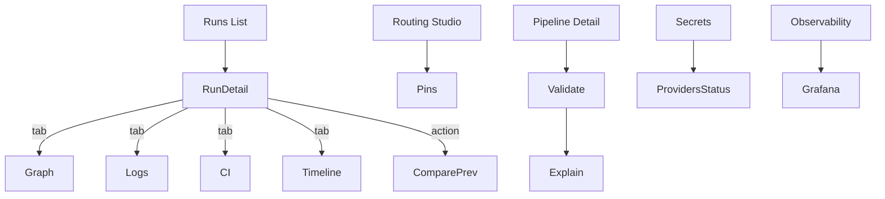

# PRD — Maestro “Autonomous Intelligence” Orchestrator (State‑of‑the‑Art)

**Document status:** Draft v1.0 (ready for grooming)  
**Owners:** Product (Brian Long), Platform Eng (☐), Runtime/Serving (☐), SRE/Observability (☐), Security (☐), DevEx (☐)  
**Last updated:** 2025‑09‑01  
**Scope:** Unified system that orchestrates heterogeneous models/agents, tools, and pipelines with evidence‑first UX, policy‑aware autonomy (L0–L5), multi‑objective routing, EvalOps, and progressive delivery — purpose‑built to exceed current industry practice in reliability, efficiency, explainability, and governance.

> **Positioning:** Maestro is a **standalone, provenance‑first orchestration plane** for AI + classical compute. It coordinates multi‑provider models (SaaS & self‑hosted), multi‑agent graphs, tools, dataflows, and CI/CD with **policy‑as‑code, cost/SLO budgets, and full explainability**. It is the control plane that shows its work, can be dialed from manual to fully autonomous, and remains safe to operate at scale.

---

## 1) Problem & Opportunity

- We must orchestrate **heterogeneous models and agents** (OpenAI/Anthropic/NIM/vLLM/others) alongside traditional services and data pipelines, **safely and cost‑effectively**.
- Existing platforms lack **tight governance** (PII/sovereignty), **EvalOps as a gate**, **multi‑objective routing**, and **progressive delivery** for prompts/agents.
- We need a **unified UX** (tri‑pane workbench + explainability) that lets humans supervise autonomy, trace decisions, and revert quickly.

**Opportunity:** Establish a new benchmark where **reliability, cost, security, and explainability** are baked into the runtime — not bolted on — and where autonomy is **earned** through metrics and evaluation.

---

## 2) Goals & Non‑Goals

**Goals**

1. **State‑of‑the‑art orchestration:** Multi‑agent graphs with persistent state, resumability, and human‑in‑the‑loop gates (L0–L5).
2. **Portfolio model router:** Multi‑objective routing (quality, p95 latency, $/1k tokens, reliability, sovereignty) with content‑aware selection and auto‑fallback.
3. **EvalOps by default:** Golden tasks, scorecards, and SLO‑aware gates for any change (models/prompts/agents).
4. **Serving efficiency:** vLLM + Ray Serve lane with continuous batching, KV cache reuse, and autoscaling; live utilization surfaced in UI.
5. **Progressive delivery:** Canary, analysis, and rollback for agents/prompts; change freeze windows and risk budgets.
6. **Evidence‑first UX:** Every action has inputs, policies hit, costs, and traces; “compare previous run,” timeline, node logs per node, GH annotations, routing pins, policy explain.
7. **Policy & sovereignty:** OPA/Rego enforced routing and data residency; dual‑control for L>3 autonomy.

**Non‑Goals**

- Building a novel inference engine from scratch (we integrate vLLM/NIM/etc.).
- Replacing enterprise ticketing/CI; we **integrate** with GitHub/CI/CD and surface annotations.

---

## 3) Users & Personas

- **Operators/SRE:** Need safe levers (risk budgets, canary, rollback), live SLOs/backpressure, and one‑click revert.
- **Developers/Prompt/Agent Authors:** Want quick iteration with scorecards, logs, artifacts, and explainable denials.
- **Release Managers/Compliance:** Demand traceable approvals, provenance, and jurisdiction‑aware routing.
- **Stakeholders/Analysts:** Need dashboards for cost, quality, and throughput trends.

---

## 4) Principles & Autonomy Model

- **Evidence‑first**; **Policy‑aware**; **Observability by default**; **Gradated autonomy**; **Operator quality of life**.

**Autonomy levels (L0–L5)**
| Level | Trigger | Safety Gates | Examples |
|---|---|---|---|
| L0 Manual | Human | N/A | One‑off drill |
| L1 Assisted | Human+Suggest | Pre‑flight checks | Guided runs |
| L2 Semi‑Auto | Scheduler | Pre‑flight + soft approval | Low‑risk maintenance |
| L3 Auto+Approvals | System w/ dual‑control | Policy allow + human approval | Higher‑impact ops |
| L4 Auto+Rollback | System | Canary + rollback + SLO guard | Continuous corrections |
| L5 Fully Auto | System | Risk budget + SLA contracts | Mature scenarios |

Controls: **risk budget sliders, blast radius, canary %, rollback thresholds, change freeze windows, time windows, jurisdiction tags**.

---

## 5) High‑Level Architecture



**Key planes**: (1) **Control** (UI/API), (2) **Policy** (OPA/Rego), (3) **Routing** (LiteLLM Router + policies), (4) **Serving** (vLLM/Ray), (5) **Agent Graph** (state, HITL), (6) **Observability** (OTEL+Prom+Grafana), (7) **Provenance** (evidence, manifests, signing).

---

## 6) Scenarios (Happy Paths)

1. **Planner‑Executor with HITL at L3**: Author selects recipe → preview cost/SLO → policy explain → run → Planner proposes → Critic approves → Execute with tools → Scorecard generates → Canary gate promotes.
2. **Routing with PII**: Step tagged `pii` → router restricted to sovereign models → fallback to local vLLM if SaaS outage → SLO intact, costs within budget → audit trail logged.
3. **Regressions blocked**: New prompt version fails hallucination threshold or $/task delta → PR blocked → automatic rollback of canary.

---

## 7) Functional Requirements

**F1. Agent Graphs**

- Patterns: planner‑executor, debate, critique‑improve, toolformer.
- **State persistence** with crash‑safe checkpoints; **resume** with ≤1 step replay.
- **HITL gates** with Approve/Edit/Block; latency <250ms p95.

**F2. Model Routing**

- **Objectives:** quality, p95 latency, $/1k tokens, reliability, sovereignty.
- Per‑step **hints** (draft/finalization) and **content tags** (PII/export‑ctrl).
- **Fallback chains**; circuit breakers; **routing pins** (UI + policy explain) with audit notes.

**F3. EvalOps**

- Golden tasks; A/B/C prompt tests; **scorecards** (accuracy, hallucination rate, tool success, cost).
- **Gates**: autonomy increases require scorecard pass + SLO burn forecast OK.

**F4. Serving Lane**

- vLLM with paged attention/KV reuse; Ray Serve autoscaling; health + spillover to Router.
- Metrics: queue depth, batch size, KV hit ratio, p50/p95.

**F5. Progressive Delivery**

- Canary steps (10%→50%...); analysis templates reading **Scorecards + SLO**; auto‑rollback.
- Change freeze windows; dual‑control for L>3.

**F6. Evidence‑First UI**

- Run detail: **DAG graph** with retries/compensation badges; **Timeline** (startMs); **Node logs filter**; **Artifacts**; **CI tab** with GH annotations; **Compare previous** view.
- **Routing Studio**: preview, policy explain, routing pins.
- **Pipelines**: Validate + Plan Explain; **Secrets**: Provider status & Test; **Obs**: Grafana embeds.

**F7. API/Gateway**

- `/runs/*` (graph, logs SSE with `nodeId`, compare/previous), `/routing/*` (preview, pins), `/policies/explain`, `/pipelines/:id/validate`, `/providers/*` (status, test), `/ci/annotations`.

---

## 8) Non‑Functional Requirements (SLOs)

- **Availability:** 99.9% control plane; 99.95% for read‑only APIs.
- **Latency:** router decision < **50ms p95** in‑cluster; HITL action < **250ms p95**; run create < **300ms p95**.
- **Throughput:** serving lane ≥ **2.5×** baseline; cost/request ↓ **≥20%**.
- **Fallback success:** **>98%** during synthetic brownouts.
- **Cost controls:** per‑step budget enforcement; $/task variance alerts.

**Security & Compliance**

- OPA/Rego policies for routing, cost, autonomy level; dual‑control for L>3; data residency tags.
- SBOM for components; Cosign signing; provenance for agent/prompt artifacts.
- Audit trail for all actions; tamper‑evident evidence register.

**Accessibility**

- WCAG 2.2 AA+ target; focus trap; ARIA landmarks/labels; keyboard coverage (palette, dialogs, tables).
- Dev‑only axe toggle to catch regressions.

---

## 9) UX Overview (Wireframes & States)



**Key UI Elements**

- Node Inspector → **View Node Logs** (filters `[nodeId]`).
- **Compare to previous** → deltas + (optional) graph diff with critical path.
- **Routing Pin Panel** → step/model + policy explain + audit note.
- **Validate/Explain** on pipelines; **Providers** table with test action.

---

## 10) Data & Telemetry

**Data**: `runs`, `nodes`, `artifacts`, `scorecards`, `policies`, `routing_pins`, `providers`.  
**Telemetry (OTEL)**: spans `maestro.route.choose`, `agent.node.run`, `tool.call`, `serve.vllm.request`; metrics for route decisions/sec, fallback rate, batch efficiency, cost/day.

---

## 11) APIs (Selected Contracts)

```http
GET /runs/:id/graph          → { nodes:[{id,startMs,retries,compensated}], edges:[] }
GET /runs/:id/logs?stream=1&nodeId=foo   → SSE { time, nodeId, line }
GET /runs/:id/compare/previous            → { durationDeltaMs, costDelta, nodes:[{id,changed,durationDeltaMs,costDelta,reason}], currentGraph?, previousGraph? }
POST /pipelines/:id/validate  → { valid, errors:[{path,msg}] }
POST /policies/explain        → { allow, reasons:[...], rules:[...] }
GET /routing/pins             → [{step?,model,reason,actor,createdAt}]
PUT /routing/pin              → 204
GET /providers                → [{id,name,status,latencyMs}]
POST /providers/:id/test      → { status, latencyMs, details? }
GET /ci/annotations           → [{runId,level,file,line,message,url,createdAt}]
```

---

## 12) Success Metrics & Acceptance Criteria

**Core metrics**

- **Quality:** scorecard ↑ ≥ **+5%** vs baseline on golden tasks; hallucination ≤ **1.0%**.
- **Efficiency:** cost/task ↓ **≥15%**; serving throughput ≥ **2.5×**.
- **Reliability:** fallback success during brownouts **>98%**; router decision p95 < **50ms**.
- **Velocity:** time‑to‑canary ↓ **≥30%**; MTTR with auto‑rollback **< 2 min**.
- **Governance:** 100% actions have evidence + policy rationale; 100% PII‑tagged steps remain in approved jurisdictions.

**Definition of Done (release)**

- All epics A–F feature‑complete with tests, dashboards, runbooks.
- SLOs met in staging and 7‑day canary; kill‑switch and rollback drills green.
- A11y smoke passes (axe dev), keyboard map documented.

---

## 13) Rollout Plan

1. **M1 (Weeks 1–2):** Router integration (shadow), OTEL wrappers, Eval runner skeleton.
2. **M2 (Weeks 3–4):** vLLM lane + telemetry panels, Scorecards UI, Router Decision panel.
3. **M3 (Weeks 5–6):** Canary + rollback, Alerts & budgets, Providers status/test.
4. **M4 (Weeks 7–8):** Agent Graphs + HITL, Autonomy gates, Chaos drills, Graph diff.

Cutover: 10%→50% canary governed by scorecards + SLO burn; full prod after 7 days stable.

---

## 14) Risks & Mitigations

- **Provider brownouts** → test fallbacks; multi‑region; on‑prem vLLM failover.
- **Cost spikes** → per‑step caps; auto downgrade of low‑value steps; alerts.
- **Quality drift** → nightly evals; block PRs on thresholds; regression diffs.
- **Policy gaps** → default‑deny for unknown tags; rapid policy explain; dual‑control.

---

## 15) Dependencies & Open Questions

**Dependencies:** GPU capacity for vLLM; Grafana/Prometheus/Loki; OPA bundles; CI permissions for GH annotations; secrets mgmt.  
**Open questions:**

- Which **quality signals** (ground truth vs. LLM‑as‑judge) are authoritative per task class?
- Where to store **routing objectives** (global vs project‑scoped overrides)?
- Final **jurisdiction taxonomy** and data‑class tagging.

---

## 16) Out of Scope (v1)

- Multi‑tenant billing portal; marketplace of third‑party tools; automated dataset labeling.

---

## 17) Appendix (Configs & Diagrams)

**Router example (LiteLLM)**

```yaml
model_list:
  - model_name: gpt-4o
    litellm_params: { model: openai/gpt-4o }
  - model_name: sonnet-3.7
    litellm_params: { model: anthropic/claude-3.7-sonnet }
  - model_name: ig-local-70b
    litellm_params: { model: vllm/Meta-Llama-3.1-70B-Instruct }
router:
  strategy: multi_objective
  objectives:
    [quality, p95_latency_ms, cost_per_1k_tokens, reliability, sovereignty]
  fallbacks:
    - primary: gpt-4o
      on_error: [sonnet-3.7, ig-local-70b]
```

**Policy (Rego) excerpt**

```rego
package maestro.routing

default allow = false

allow { input.step_tags[_] == "pii"; input.selected_model == "ig-local-70b" }
allow { not input.step_tags[_] == "pii" }
```

**OTEL traces**: `maestro.route.choose`, `agent.node.run`, `serve.vllm.request`, `tool.call`.

— End of PRD —
